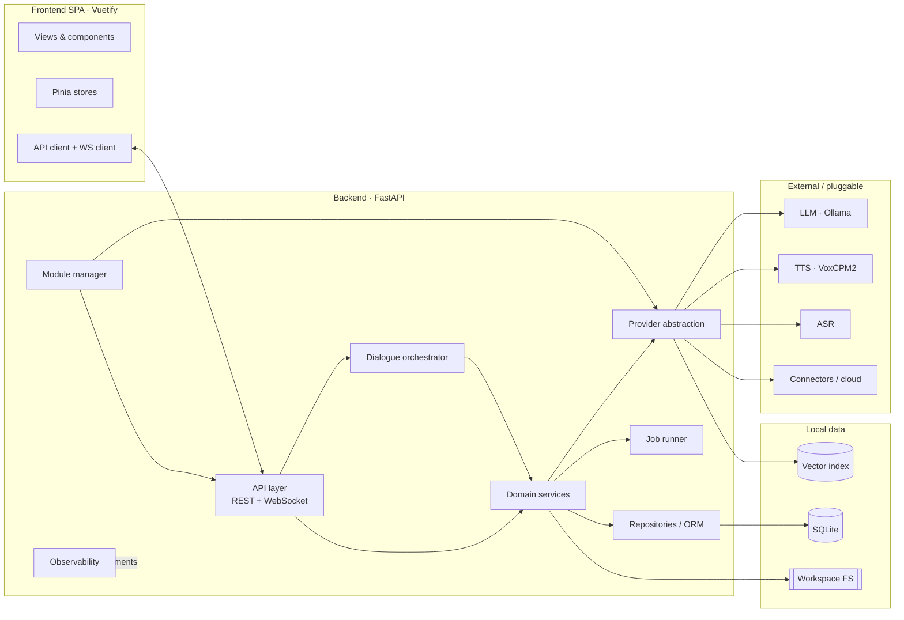
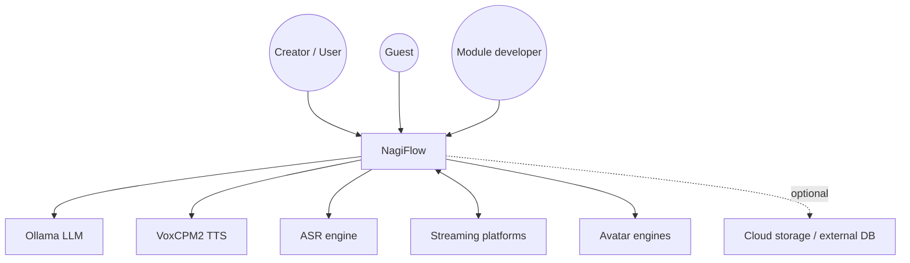
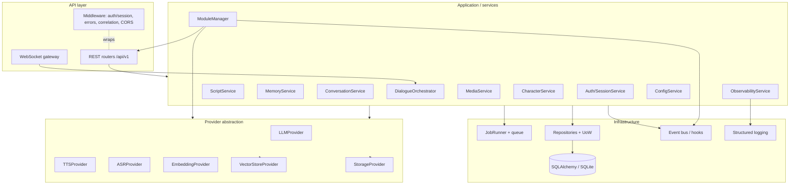
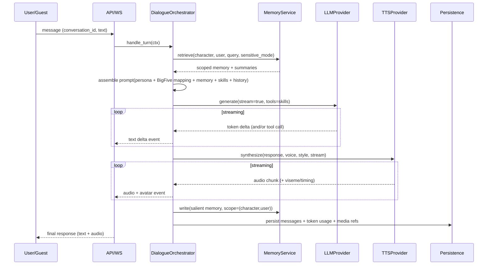
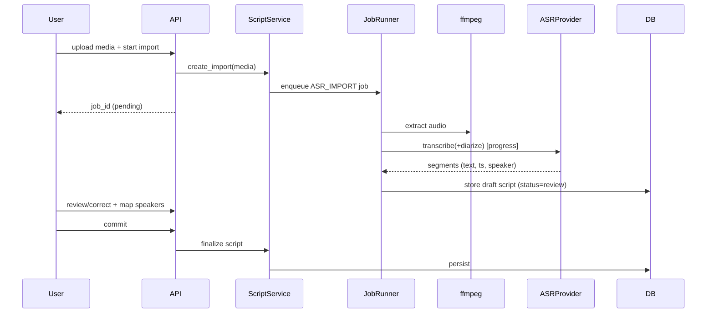
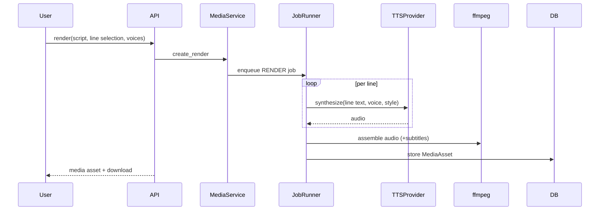
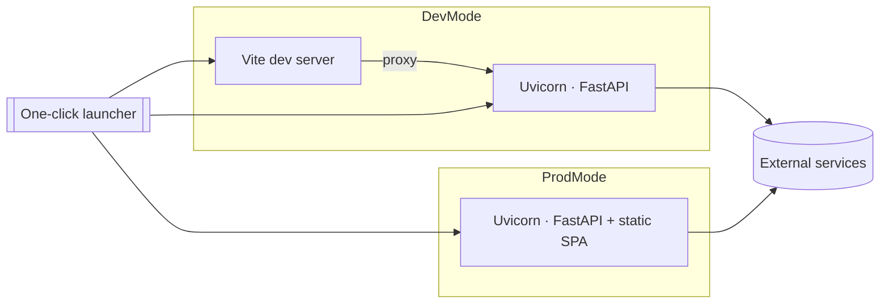

# 03 · System Architecture

| | |
|---|---|
| **Document** | System Architecture & Design |
| **Doc ID** | NF-03 |
| **Version** | 0.1 (Draft) |
| **Last updated** | 2026-05-30 |
| **Related** | [02 SRS](02-requirements-specification.md), [04 Data](04-data-model-and-storage.md), [05 API](05-api-specification.md), [06 Modules](06-module-and-extension-system.md), [10 Realtime](10-feature-realtime-and-media-generation.md), [12 Runtime](12-runtime-and-deployment.md) |

---

## 1. Architectural goals & principles

| Principle | Implication |
|---|---|
| **Local-first, lightweight default** | The base stack runs on one machine with no mandatory cloud; heavy/remote options are opt-in modules. |
| **Provider/adapter everywhere external** | LLM, TTS, ASR, embeddings, storage, and vector store are accessed only through interfaces; defaults are swappable. |
| **Modular monolith** | One deployable backend with clear internal module boundaries — simple to run, easy to evolve, no premature microservices. |
| **Extensible without forking** | A module system lets third parties add providers, Agent Skills, Connectors, hooks, and UI without touching core. |
| **Async by default** | ASGI/async I/O for concurrency; long work runs as background jobs; live work streams over WebSocket. |
| **Privacy by construction** | Memory scoping and sensitive mode are enforced in the data/retrieval layer, not just by prompt. |
| **Separation of concerns** | API ⟂ services ⟂ providers ⟂ persistence; each layer testable in isolation. |

## 2. Architecture style

NagiFlow is a **modular monolith** backend (**FastAPI**, ASGI) serving a **single-page application** (**Vuetify / Vue 3**). External AI/storage services are reached through a **provider abstraction layer**; functionality is extended through a **module system**. Persistence defaults to **SQLite** plus a **workspace folder** on local disk. Long-running work uses an in-process **job runner**; live interaction uses **WebSocket** streaming.



## 3. C4-style views

### 3.1 System context



### 3.2 Container view

| Container | Tech | Responsibility |
|---|---|---|
| **Frontend SPA** | Vue 3 + Vuetify + Pinia + Vite | All UI: authoring, characters, conversation/live, dashboard, settings, module UIs. Talks to backend via REST + WebSocket. |
| **Backend application** | Python + FastAPI (ASGI) | API, domain logic, orchestration, provider access, jobs, module hosting, observability. |
| **Relational DB** | SQLite (WAL) | Structured data (characters, scripts, users, conversations, memory metadata, modules, usage). |
| **Workspace filesystem** | Local FS | Binary/large assets: audio, media, voice models, vector indices, logs, config. |
| **Vector index** | Local (pluggable) | Embedding similarity search for memory retrieval. |
| **External services** | Ollama, VoxCPM2, ASR, connectors | Generation/transcription/integration; managed by user/official modules. |

In **production mode** the backend also **serves the built SPA's static assets**, so a single process serves both UI and API (see [12](12-runtime-and-deployment.md)).

### 3.3 Backend component view



**Component responsibilities**

- **API layer** — routing, request/response schemas (Pydantic), middleware (auth/session resolution, error envelope, correlation IDs, CORS), and the WebSocket gateway for live sessions.
- **Domain services** — encapsulate business rules per area; depend on providers and repositories, not on transport.
- **DialogueOrchestrator** — the conversational "brain" (see §4); assembles context, calls LLM/TTS, manages memory I/O, emits stream events.
- **ModuleManager** — discovers/loads modules, registers their contributions (providers, skills, connectors, routes, hooks, UI metadata), and enforces capabilities.
- **Provider abstraction** — typed interfaces with capability flags; concrete implementations (default + module-supplied) are selected via configuration.
- **Infrastructure** — `JobRunner` (background work), repositories + Unit-of-Work over SQLAlchemy, an event bus exposing lifecycle/domain hooks for modules, and structured logging.

## 4. Dialogue orchestration pipeline

The orchestrator turns an inbound message into a character's spoken response. It is provider-agnostic and identical for sync chat and live streaming (streaming simply emits incremental events).



**Stages**

1. **Resolve context** — character, user (or guest), conversation, sensitive-mode flag, active skills/connectors.
2. **Memory retrieval** — `MemoryService` returns scope-filtered entries (vector similarity + recency + importance); sensitive mode excludes other-user memory at this layer ([09](09-feature-multiuser-memory-and-privacy.md)).
3. **Prompt assembly** — persona + Big Five → behavior directives ([08 §3](08-feature-character-management.md)) + retrieved memory + recent history + tool/skill specifications + guardrails.
4. **LLM generation** — streaming tokens; tool/function calls dispatched to **Agent Skills** and results fed back.
5. **Speech synthesis** — `TTSProvider` renders the response with the character's voice and per-turn/line style; streamed chunks plus optional viseme/timing events.
6. **Memory write** — salient information summarized and stored under the correct scope per write policy.
7. **Persist & account** — messages, media references, and **token usage** recorded ([11](11-feature-observability.md)).

## 5. Cross-cutting concerns

| Concern | Approach |
|---|---|
| **Configuration** | Layered config (defaults → workspace config file → environment → runtime overrides) via `ConfigService`; provider selection and module settings live here. ([12 §config](12-runtime-and-deployment.md)) |
| **Dependency injection** | Services and providers resolved through a container/factory so implementations (incl. module-supplied) are swappable and testable. |
| **AuthN/Z** | Session-based: guest sessions auto-issued; local-account login upgrades capabilities. Authorization enforced in middleware/services against the permission matrix ([09](09-feature-multiuser-memory-and-privacy.md)). |
| **Error handling** | Consistent error envelope + stable codes ([05 §errors](05-api-specification.md)); provider failures isolated and surfaced. |
| **Background jobs** | `JobRunner` executes ASR import, batch TTS render, fine-tune, and other long tasks; jobs are persisted with status, progress, cancellation. |
| **Concurrency** | Async request handling; CPU/GPU-bound work offloaded to worker tasks/threads/processes to avoid blocking the event loop. |
| **Streaming** | WebSocket for live turns (bidirectional, event-typed); SSE optionally for one-way token streaming. |
| **Events / hooks** | An event bus exposes lifecycle and domain events (e.g. `conversation.turn`, `media.rendered`, `incoming.message`) that modules subscribe to. |
| **Observability** | Structured logs with correlation IDs; counters/metrics; token accounting; local-only by default ([11](11-feature-observability.md)). |
| **i18n** | Backend returns codes/keys; frontend localizes (zh-Hant / en). |

## 6. Provider abstraction (the external seams)

Every external capability is a typed interface with **capability flags** so the system and UI can adapt to what a provider supports (e.g. streaming, voice cloning, voice design, diarization).

```python
# Illustrative interfaces (Python, abridged)

class LLMProvider(Protocol):
    capabilities: LLMCaps  # streaming, tools, embeddings?, context_window
    async def generate(self, req: GenRequest) -> AsyncIterator[GenChunk]: ...
    async def list_models(self) -> list[ModelInfo]: ...

class TTSProvider(Protocol):
    capabilities: TTSCaps  # streaming, clone_from_audio, voice_design, sample_rate, languages
    async def synthesize(self, req: TTSRequest) -> AsyncIterator[AudioChunk]: ...
    async def design_voice(self, description: str) -> VoiceHandle | None: ...

class ASRProvider(Protocol):
    capabilities: ASRCaps  # timestamps, diarization, languages
    async def transcribe(self, audio: AudioRef, opts: ASROptions) -> Transcript: ...

class EmbeddingProvider(Protocol):
    async def embed(self, texts: list[str]) -> list[Vector]: ...

class VectorStoreProvider(Protocol):
    async def upsert(self, ns: str, items: list[VectorItem]) -> None: ...
    async def query(self, ns: str, vec: Vector, k: int, fil: Filter) -> list[Hit]: ...

class StorageProvider(Protocol):
    async def put(self, key: str, data: bytes | IO) -> StoredRef: ...
    async def get(self, key: str) -> IO: ...
    async def url_for(self, key: str) -> str | None: ...
```

- **Defaults** ship as **official modules**: `LLMProvider→Ollama`, `TTSProvider→VoxCPM2`, `ASRProvider→SenseVoice-class`, `EmbeddingProvider`/`VectorStoreProvider→local`, `StorageProvider→LocalFS`.
- **Selection** is configuration-driven; **fallback** order can be configured (e.g. local TTS → remote TTS on failure).
- See [06](06-module-and-extension-system.md) for how modules register these.

## 7. Key end-to-end flows

### 7.1 ASR script import (background job)



### 7.2 Batch media render



### 7.3 Live streaming turn — see [10](10-feature-realtime-and-media-generation.md) for the detailed protocol and §4 above for the orchestration sequence.

## 8. Technology stack & rationale

| Layer | Choice | Rationale |
|---|---|---|
| Backend framework | **FastAPI (ASGI)** | Async, first-class WebSocket/streaming, Pydantic validation, auto OpenAPI; project requirement. |
| ORM / DB | **SQLAlchemy + SQLite (WAL)** | Zero-setup local persistence; SQLAlchemy abstracts toward future external DBs. |
| Migrations | **Alembic** | Versioned schema evolution with startup application. |
| Jobs | **In-process JobRunner** (async tasks + worker offload) | Keeps the single-process local model; avoids mandatory broker. Pluggable toward a real queue later. |
| Frontend | **Vue 3 + Vuetify + Pinia + Vite** | Project requirement; Material UI, reactive state, fast builds, dynamic-import friendly for UI extensions. |
| Streaming | **WebSocket (+ optional SSE)** | Bidirectional live turns; token/audio/viseme events. |
| LLM (default) | **Ollama** | Local, lightweight, broad model support; project default. |
| TTS (default) | **VoxCPM2** | Local, high-quality, 48 kHz, voice design + controllable cloning, OpenAI-compatible server option; project default. |
| ASR (default) | **SenseVoice-class** | Local transcription; pairs naturally with the VoxCPM ecosystem. |
| Media tooling | **ffmpeg** | Ubiquitous audio extraction/assembly. |
| Vector store (default) | **Local embedded index** | Lightweight memory retrieval; pluggable. |

## 9. Deployment / runtime view

- **Dev mode:** Vite dev server (HMR) for the SPA, proxied to the FastAPI backend; both processes launched and log-multiplexed by the one-click launcher.
- **Prod (local) mode:** SPA is built to static assets and served by FastAPI; a single backend process serves UI + API.
- **Process management:** the launcher owns child processes (frontend in dev, backend) and shuts them down on exit, **without** stopping external services like Ollama ([12](12-runtime-and-deployment.md)).
- **Future:** containerized deployment and cloud storage/DB/provider modules — enabled by the existing abstractions, not requiring core changes.



## 10. Architecture Decision Records (summaries)

> Full ADRs would live alongside the code; these summaries capture the key decisions and trade-offs.

- **ADR-001 · Modular monolith over microservices.** *Decision:* single FastAPI deployable with internal boundaries. *Why:* local-first, single-machine simplicity; lower operational burden for a small team. *Trade-off:* scaling individual components requires later extraction — mitigated by clean service/provider seams.
- **ADR-002 · SQLite + workspace folder as default store.** *Decision:* SQLite for relational data, FS for binaries/indices. *Why:* zero-config, portable, backup-friendly. *Trade-off:* concurrency/scale limits — mitigated by WAL and pluggable DB/storage seams.
- **ADR-003 · Provider/adapter pattern for all external services.** *Decision:* typed interfaces + capability flags; defaults as modules. *Why:* swap any layer; defaults prove the extension model. *Trade-off:* abstraction overhead — justified by the product's extensibility goal.
- **ADR-004 · In-process job runner, no mandatory broker.** *Decision:* async job runner with persisted state. *Why:* keep local install lightweight. *Trade-off:* not distributed — pluggable toward a real queue if needed.
- **ADR-005 · Privacy enforced at the data/retrieval layer.** *Decision:* memory scoping + sensitive-mode filtering happen before prompt assembly. *Why:* prompt-only enforcement is unreliable; leakage must be structurally prevented. *Trade-off:* slightly more retrieval complexity — acceptable and required.
- **ADR-006 · Frontend serves from backend in prod.** *Decision:* FastAPI serves built SPA. *Why:* single process, single port, simplest local UX. *Trade-off:* separate scaling of FE/BE later — not a concern for local-first.
- **ADR-007 · WebSocket for live, REST for the rest.** *Decision:* REST CRUD + WebSocket streaming. *Why:* matches request/response vs continuous interaction; FastAPI supports both natively.

## 11. Scalability & evolution path

1. **Now (local):** single process, SQLite, in-process jobs, local providers.
2. **Heavier local:** GPU providers, caching, larger workspaces; storage seam used for big media.
3. **External services:** swap LLM/TTS/ASR/storage/DB to remote via modules; no core change.
4. **Multi-process / hosted (future):** extract job runner to a broker/worker; move state to external DB + object storage; front the API behind a gateway — all enabled by today's interface boundaries.

The architecture deliberately keeps these doors open while optimizing the default experience for a single creator on a single machine.
