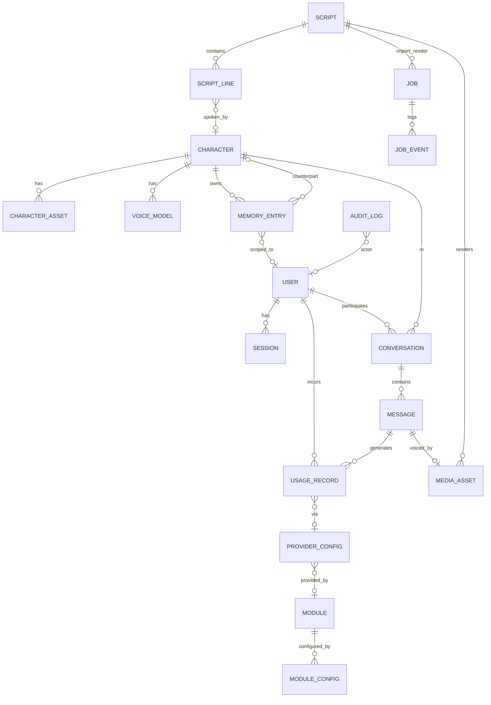

# 04 · Data Model & Storage

| | |
|---|---|
| **Document** | Data Model & Storage Design |
| **Doc ID** | NF-04 |
| **Version** | 0.1 (Draft) |
| **Last updated** | 2026-05-30 |
| **Related** | [03 Architecture](03-system-architecture.md), [08 Character](08-feature-character-management.md), [09 Memory/Privacy](09-feature-multiuser-memory-and-privacy.md), [05 API](05-api-specification.md) |

---

## 1. Storage philosophy

- **Local-first default:** a single **workspace folder** holds everything for an installation; structured data lives in a **SQLite** database, large/binary artifacts live on the **filesystem**, and vector indices live in a local store.
- **Pluggable seams:** a `StorageProvider` abstracts file I/O (local FS default → cloud later) and SQLAlchemy abstracts the relational layer (SQLite default → external DB later). Nothing in the domain code hard-codes a local path or SQLite specifics.
- **Portable & inspectable:** the workspace can be copied/backed up wholesale; characters can be exported as self-contained packages.

## 2. Workspace folder layout

```
<workspace>/
├── nagiflow.db                  # SQLite database (relational data)
├── config/
│   ├── app.toml                 # app/runtime config (non-secret)
│   └── providers.toml           # provider selection & settings (secrets via env/secret store)
├── characters/
│   └── <character_id>/
│       ├── portrait.*           # avatar/portrait
│       ├── assets/              # misc character assets
│       ├── model/               # avatar model: Live2D (default) or 3D model files
│       └── voice/
│           ├── reference/       # reference audio clips (cloning/voice design)
│           └── models/          # fine-tuned voice artifacts (versioned)
├── scripts/
│   └── <script_id>/
│       ├── sources/             # uploaded audio/video used for ASR import
│       └── line_audio/          # per-line reference/rendered audio (optional)
├── media/
│   └── <media_id>/              # produced media (audio, optional video) + subtitles
├── memory/
│   └── index/                   # vector index files (per namespace) + metadata cache
├── modules/
│   └── <module_id>/             # installed modules (backend code + optional FE bundle)
├── jobs/                        # transient job artifacts / scratch
├── exports/                     # generated character packages, dataset exports
├── backups/                     # pre-migration DB backups, user backups
└── logs/                        # structured logs (rotated)
```

**Conventions**

- IDs are opaque, URL-safe (e.g. ULID/UUID); the DB holds metadata while the FS holds bytes, joined by `<id>`.
- Binary references in the DB store a **storage key** (resolved by `StorageProvider`), never an absolute path, to keep workspaces relocatable and storage pluggable.
- Voice model artifacts are **versioned** under `voice/models/<version>/`.

## 3. Relational store

- **Engine:** SQLite in **WAL** mode (better read/write concurrency, resilience).
- **Access:** SQLAlchemy ORM with the **repository + unit-of-work** pattern; no raw paths/SQL in services.
- **Migrations:** Alembic; applied on startup after a safety backup of `nagiflow.db` into `backups/` ([12 §migrations](12-runtime-and-deployment.md)).
- **Integrity:** foreign keys enforced; timestamps (`created_at`/`updated_at`) on all rows; soft-delete where reversibility matters (e.g. characters, scripts) and hard-delete where privacy requires it (e.g. user data deletion).

## 4. Entity-relationship overview



## 5. Core entities

> Types are indicative (SQLite affinities); `JSON` denotes a JSON-encoded text column. All tables include `id`, `created_at`, `updated_at` unless noted.

### 5.1 Identity & sessions

**`user`**
| Field | Type | Notes |
|---|---|---|
| id | TEXT PK | |
| kind | TEXT | `guest` \| `local` |
| username | TEXT UNIQUE NULL | for local accounts |
| password_hash | TEXT NULL | local accounts; hashed+salted (never plaintext) |
| display_name | TEXT NULL | |
| status | TEXT | `active` \| `disabled` |
| prefs | JSON | UI/locale prefs |

> Guests may be represented as ephemeral `user` rows or as session-only principals; see [09](09-feature-multiuser-memory-and-privacy.md). Secrets handling per [14 §security](14-glossary.md).

**`session`**
| Field | Type | Notes |
|---|---|---|
| id | TEXT PK | |
| user_id | TEXT FK→user | |
| token_hash | TEXT | session token (hashed) |
| kind | TEXT | `guest` \| `user` |
| expires_at | DATETIME | |
| last_seen_at | DATETIME | |

### 5.2 Characters & voice

**`character`**
| Field | Type | Notes |
|---|---|---|
| id | TEXT PK | |
| name | TEXT | |
| aliases | JSON | list |
| description | TEXT | |
| persona | TEXT | system-prompt / behavioral description |
| big_five | JSON | `{openness, conscientiousness, extraversion, agreeableness, neuroticism}` 0–100 |
| default_language | TEXT | |
| default_voice_model_id | TEXT FK→voice_model NULL | |
| default_style | JSON | default pacing/emotion/style hints |
| portrait_key | TEXT NULL | storage key |
| avatar_model_key | TEXT NULL | storage key for the avatar model (Live2D model by default; 3D model if used) |
| avatar_renderer | TEXT NULL | preferred renderer, e.g. `live2d` (default) \| `3d` \| `external`; null = system default |
| guest_visible | INTEGER | 0/1 (FR-CM-12) |
| status | TEXT | `draft` \| `active` \| `archived` |
| tags | JSON | |

**`voice_model`**
| Field | Type | Notes |
|---|---|---|
| id | TEXT PK | |
| character_id | TEXT FK→character | |
| kind | TEXT | `zero_shot` \| `voice_design` \| `fine_tuned` |
| provider | TEXT | e.g. `voxcpm2` |
| version | INTEGER | |
| reference_keys | JSON | reference audio storage keys (cloning) |
| design_description | TEXT NULL | natural-language voice description |
| artifact_key | TEXT NULL | trained model artifact (fine-tune) |
| params | JSON | cfg/timesteps/etc. defaults |
| status | TEXT | `ready` \| `training` \| `failed` |
| is_default | INTEGER | 0/1 |

**`character_asset`**
| Field | Type | Notes |
|---|---|---|
| id | TEXT PK | |
| character_id | TEXT FK→character | |
| kind | TEXT | `portrait` \| `image` \| `audio` \| `live2d_model` \| `model_3d` \| `other` |
| storage_key | TEXT | |
| meta | JSON | |

### 5.3 Memory

**`memory_entry`** — the privacy-critical table (see [09](09-feature-multiuser-memory-and-privacy.md)).
| Field | Type | Notes |
|---|---|---|
| id | TEXT PK | |
| character_id | TEXT FK→character | owner character |
| scope | TEXT | `user_scoped` \| `character_general` \| `character_interaction` |
| user_id | TEXT FK→user NULL | set when `user_scoped` |
| counterpart_character_id | TEXT FK→character NULL | set when `character_interaction` |
| content | TEXT | the remembered fact/summary |
| kind | TEXT | `fact` \| `event` \| `preference` \| `summary` |
| importance | REAL | 0–1 score for retrieval/decay |
| embedding_ref | TEXT | reference into the vector index (namespace+id) |
| source_conversation_id | TEXT NULL | provenance |
| expires_at | DATETIME NULL | optional decay |

**Scoping rules** (enforced in `MemoryService`):
- `user_scoped` → retrievable only in conversations with that `user_id`.
- `character_general` → the character's own knowledge, user-agnostic.
- `character_interaction` → memories from interacting with `counterpart_character_id`.
- **Sensitive mode** excludes `user_scoped` entries belonging to *other* users (and filters `character_interaction` content that references other users).

### 5.4 Scripts

**`script`**
| Field | Type | Notes |
|---|---|---|
| id | TEXT PK | |
| title | TEXT | |
| description | TEXT | |
| language | TEXT | default language |
| status | TEXT | `draft` \| `review` (post-ASR) \| `ready` \| `archived` |
| origin | TEXT | `manual` \| `asr_import` |
| meta | JSON | |

**`script_line`**
| Field | Type | Notes |
|---|---|---|
| id | TEXT PK | |
| script_id | TEXT FK→script | |
| order_index | INTEGER | ordering |
| character_id | TEXT FK→character NULL | resolved speaker |
| speaker_name | TEXT NULL | free-text speaker (pre-mapping) |
| text | TEXT | dialogue |
| start_ts | REAL NULL | seconds |
| end_ts | REAL NULL | seconds |
| reference_audio_key | TEXT NULL | per-line reference |
| style_guidance | TEXT NULL | free-text/structured direction |
| speech_rate | REAL NULL | speed factor |
| language | TEXT NULL | per-line override |
| notes | TEXT NULL | |
| take | INTEGER | version/take (FR-SM-12) |
| confidence | REAL NULL | ASR confidence |

### 5.5 Conversations & messages

**`conversation`**
| Field | Type | Notes |
|---|---|---|
| id | TEXT PK | |
| character_id | TEXT FK→character | |
| user_id | TEXT FK→user | (guest user row or local) |
| mode | TEXT | `chat` \| `live` |
| sensitive_mode | INTEGER | 0/1 effective for this conversation |
| title | TEXT NULL | |
| status | TEXT | `active` \| `ended` |
| meta | JSON | live-session info, connector source, etc. |

**`message`**
| Field | Type | Notes |
|---|---|---|
| id | TEXT PK | |
| conversation_id | TEXT FK→conversation | |
| role | TEXT | `user` \| `character` \| `system` \| `tool` |
| content | TEXT | text |
| media_asset_id | TEXT FK→media_asset NULL | synthesized audio |
| meta | JSON | tool calls, viseme refs, etc. |

### 5.6 Media & jobs

**`media_asset`**
| Field | Type | Notes |
|---|---|---|
| id | TEXT PK | |
| kind | TEXT | `audio` \| `video` \| `subtitle` |
| storage_key | TEXT | |
| source_type | TEXT | `message` \| `script_render` |
| source_id | TEXT NULL | message_id or script_id |
| duration_ms | INTEGER NULL | |
| meta | JSON | sample rate, codec, line alignment |

**`job`** — generic long-running work (ASR import, render, fine-tune).
| Field | Type | Notes |
|---|---|---|
| id | TEXT PK | |
| type | TEXT | `asr_import` \| `render` \| `voice_finetune` \| `module_task` |
| status | TEXT | `pending` \| `running` \| `succeeded` \| `failed` \| `cancelled` |
| progress | REAL | 0–1 |
| input | JSON | parameters/refs |
| result | JSON NULL | outputs/refs |
| error | TEXT NULL | |
| related_id | TEXT NULL | script_id / character_id / etc. |

**`job_event`** — append-only progress/log lines for a job (`job_id`, `ts`, `level`, `message`, `data JSON`).

### 5.7 Modules & providers

**`module`**
| Field | Type | Notes |
|---|---|---|
| id | TEXT PK | manifest id |
| name | TEXT | |
| version | TEXT | |
| types | JSON | contribution types |
| enabled | INTEGER | 0/1 |
| permissions | JSON | declared/granted capabilities |
| source | TEXT | `official` \| `local` \| `registry` |
| manifest | JSON | full manifest snapshot |

**`module_config`** — per-module settings (`module_id`, `key`, `value JSON`). Secrets are referenced, not stored in plaintext where avoidable.

**`provider_config`**
| Field | Type | Notes |
|---|---|---|
| id | TEXT PK | |
| capability | TEXT | `llm` \| `tts` \| `asr` \| `embedding` \| `vector` \| `storage` |
| module_id | TEXT FK→module | implementing module |
| name | TEXT | display name |
| settings | JSON | model name, endpoint, params (non-secret) |
| is_default | INTEGER | 0/1 |
| fallback_order | INTEGER NULL | for fallback chains |

### 5.8 Usage, metrics & audit

**`usage_record`** — token/cost accounting ([11](11-feature-observability.md)).
| Field | Type | Notes |
|---|---|---|
| id | TEXT PK | |
| capability | TEXT | `llm` \| `embedding` \| `tts` (units differ) |
| provider_config_id | TEXT FK | |
| model | TEXT | |
| user_id | TEXT FK→user NULL | |
| character_id | TEXT FK→character NULL | |
| conversation_id | TEXT NULL | |
| prompt_tokens | INTEGER NULL | |
| completion_tokens | INTEGER NULL | |
| total_tokens | INTEGER NULL | |
| audio_seconds | REAL NULL | for TTS |
| est_cost | REAL NULL | for remote providers |
| occurred_at | DATETIME | |

**`metric_sample`** *(optional / may be ephemeral)* — periodic system/service samples (cpu/mem/gpu/disk, service health), retained briefly for charts.

**`audit_log`** — security-relevant actions (`actor_user_id`, `action`, `target`, `data JSON`, `ts`).

## 6. Memory / vector storage design

- **Embeddings:** generated via `EmbeddingProvider`; stored in a local **vector store** (default), namespaced per character (and per scope) to keep retrieval cheap and scoping clean.
- **Namespacing:** e.g. `mem:<character_id>:user:<user_id>`, `mem:<character_id>:general`, `mem:<character_id>:interaction:<counterpart_id>`. The relational `memory_entry` row holds metadata + `embedding_ref`; the vector index holds the vector + minimal filterable metadata.
- **Retrieval:** similarity search within the permitted namespaces, blended with **recency** and **importance**; sensitive mode restricts the namespace set ([09](09-feature-multiuser-memory-and-privacy.md)).
- **Write policy:** the orchestrator extracts salient items and summaries post-turn, scores importance, embeds, and upserts; periodic consolidation/summarization prevents unbounded growth.
- **Decay/eviction:** `importance` + `expires_at` + caps per namespace bound size; low-value entries are summarized or pruned.
- **Pluggability:** the vector store is a provider; a module can swap the local index for an external vector DB without touching `MemoryService`.

## 7. Character package (export/import)

A character exports as a self-contained bundle (`.nagichar`, a zip) for portability ([08 §6](08-feature-character-management.md)):

```
<name>.nagichar (zip)
├── manifest.json        # format version, character id/name, included parts, app compat
├── character.json       # profile, persona, big_five, default style, tags
├── voice/
│   ├── config.json      # voice model configs (kind, provider, params)
│   ├── reference/       # reference audio (optional)
│   └── models/          # fine-tuned artifacts (optional, large)
├── assets/              # portrait/images (optional)
└── memory.jsonl         # optional; user-linked memory EXCLUDED by default (privacy)
```

- **Privacy default:** `user_scoped` memory is excluded unless the user explicitly opts in; `character_general` may be included; secrets are never exported.
- **Import:** validates `manifest` compatibility, allocates new IDs, rehydrates files via `StorageProvider`, and reconciles voice/provider references (warning if a referenced provider/module is absent).

## 8. Data lifecycle, backup & deletion

- **Backups:** `backups/` holds pre-migration DB snapshots and user-initiated backups; the whole workspace is copy-safe when the app is stopped.
- **User deletion (privacy):** deleting a user **hard-deletes** their `user_scoped` memory across characters, their sessions, and anonymizes/removes their conversations per policy; audit logged.
- **Retention:** logs and `metric_sample` rotate; `job` artifacts in `jobs/` are transient.
- **Integrity:** all multi-row operations run in transactions via the unit-of-work; WAL provides crash resilience.

## 9. Indices & performance (illustrative)

- Indices on hot lookups: `script_line(script_id, order_index)`, `message(conversation_id)`, `memory_entry(character_id, scope, user_id)`, `usage_record(occurred_at)`, `usage_record(character_id)`, `job(status, type)`, `conversation(character_id, user_id)`.
- Large text/binary stays on the FS (referenced by storage key) to keep the DB small and fast.
- Vector search is delegated to the vector store, not SQLite.
