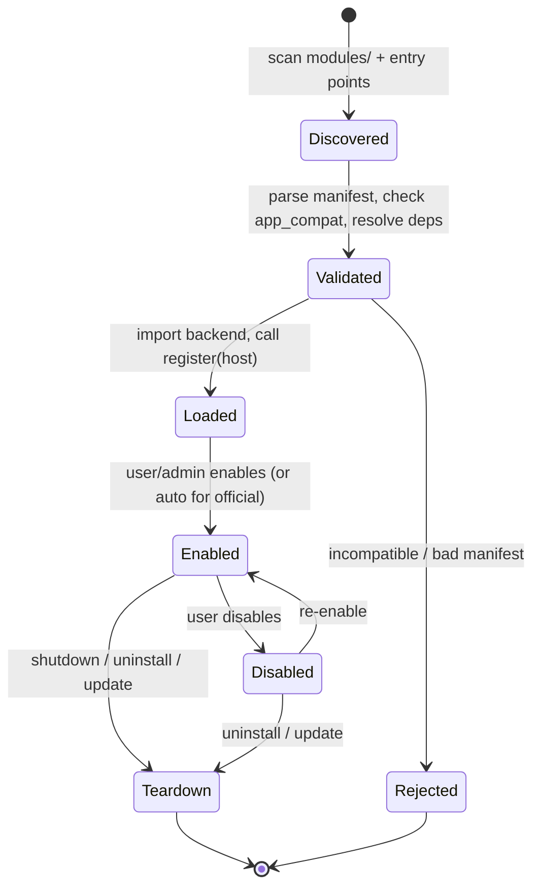

# 06 · Module & Extension System

| | |
|---|---|
| **Document** | Module & Extension System |
| **Doc ID** | NF-06 |
| **Version** | 0.1 (Draft) |
| **Last updated** | 2026-05-30 |
| **Related** | [03 Architecture](03-system-architecture.md), [05 API](05-api-specification.md), [08 Characters](08-feature-character-management.md), [11 Realtime](11-feature-realtime-and-media-generation.md) |
| **Traces** | FR-MOD-1 … FR-MOD-11, NFR-MAINT-1/2/3, NFR-SEC-1/2/4 |

---

## 1. Purpose & philosophy

Modularity is a first-class requirement, not an afterthought. NagiFlow ships a small, opinionated **core** and pushes everything that touches the outside world — LLMs, speech engines, storage, live-chat platforms — behind extension points. The same mechanism the core team uses to ship the default Ollama and VoxCPM integrations is the mechanism third-party developers use to add their own. There is no privileged "internal" API that modules cannot reach (FR-MOD-1/6).

Three goals drive the design:

1. **Parity** — official integrations are ordinary modules. If the extension system can express the defaults, it can express almost anything (FR-MOD-6).
2. **Safety** — a module declares what it needs; the host grants only that. A misbehaving or malicious module should be containable and, at minimum, auditable (NFR-SEC-1/2/4).
3. **Low ceremony** — a developer should be able to produce a working "Hello Skill" in minutes, in Python, without learning a bespoke build system (NFR-MAINT-1).

---

## 2. Module types

A single module package may contribute **one or more** of the following. Types are not mutually exclusive; a package can, for example, provide both a Connector and the Agent Skills that act on it.

| Type | Extends | Typical example | Primary doc |
|---|---|---|---|
| **Provider** | A capability interface (LLM, TTS, ASR, Embedding, VectorStore, Storage, AvatarRender) | "OpenAI-compatible TTS provider"; the default Ollama / VoxCPM / PNGTuber providers | [03 §6](03-system-architecture.md) |
| **Agent Skill** | The dialogue orchestrator's tool set | "Look up today's schedule"; "roll dice on stream" | §6 |
| **Connector** | External event sources / sinks | Twitch chat ingestion; Discord notifications; OBS scene switch | §7 |
| **UI Extension** | The Vuetify frontend | A custom character-tuning panel; a new dashboard widget | §8 |
| **Framework hook** | Lifecycle / event-bus subscribers | "On media render complete, post-process audio" | §9 |

These map directly to the requirement that developers can author Agent Skills (FR-MOD-2), Connectors (FR-MOD-3), and extend the framework and UI (FR-MOD-4), and that the default LLM and TTS integrations are delivered as official example modules / sub-projects (FR-MOD-6).

---

## 3. Anatomy of a module

A module is a directory (installed under `<workspace>/modules/<module-id>/`) or an installable Python distribution. Minimum contents:

```
my-cool-module/
├── nagiflow.module.json     # manifest (required)
├── pyproject.toml           # Python deps (optional, if it has backend code)
├── backend/
│   └── __init__.py          # exports a register(host) entrypoint
├── frontend/                # optional UI contributions (built assets or source)
│   └── dist/
├── skills/                  # optional agent-skill definitions
├── assets/                  # icons, schemas, sample data
└── README.md
```

### 3.1 Manifest schema (`nagiflow.module.json`)

The manifest is the contract. The host reads it **before** importing any code, so capability and permission decisions can be made up front (FR-MOD-7, NFR-SEC-1).

```json
{
  "$schema": "https://nagiflow.dev/schema/module/v1.json",
  "id": "io.nagiflow.voxcpm",
  "name": "VoxCPM Speech",
  "version": "0.1.0",
  "description": "Official VoxCPM text-to-speech and voice-cloning provider.",
  "author": "NagiFlow",
  "license": "Apache-2.0",
  "app_compat": ">=0.3.0 <0.5.0",
  "entrypoint": "backend:register",
  "types": ["provider"],
  "contributes": {
    "providers": [
      {
        "capability": "tts",
        "name": "voxcpm",
        "features": ["streaming", "voice_clone", "voice_design", "fine_tune"],
        "config_schema": "assets/tts.config.schema.json"
      }
    ]
  },
  "permissions": {
    "network": ["http://127.0.0.1:*"],
    "filesystem": ["workspace:characters/*/voice", "workspace:media/*"],
    "subprocess": ["ffmpeg"],
    "secrets": []
  },
  "dependencies": {
    "modules": [],
    "python": "see pyproject.toml"
  }
}
```

Field notes:

- **`id`** — reverse-DNS, globally unique, immutable across versions. Used as the install key and as the prefix for any names the module registers.
- **`version`** — the module's own SemVer (§10).
- **`app_compat`** — a SemVer range against the **host** version. Load is refused if the running NagiFlow falls outside it (FR-MOD-8). This is the primary defense against silent breakage when the core evolves.
- **`types`** / **`contributes`** — declarative list of what the module adds. The host can render a module's capabilities in the UI without executing it.
- **`permissions`** — see §11. Anything not listed is denied.
- **`entrypoint`** — `module:function` resolved against the module's backend package.

---

## 4. Lifecycle



| Phase | What happens | Failure handling |
|---|---|---|
| **Discover** | Host scans `<workspace>/modules/` and Python entry points in the `nagiflow.modules` group. | A directory without a valid manifest is skipped with a warning. |
| **Validate** | Manifest parsed against schema; `app_compat` checked; module dependencies resolved into a load order (topological). | On mismatch the module is marked **incompatible** and never imported (FR-MOD-8). |
| **Load** | Backend package imported; `register(host)` called; the module registers providers/skills/connectors/hooks against the host registry. | Import or registration errors quarantine the module; the rest of the app continues (NFR-REL-2). |
| **Enable / disable** | A module can be toggled at runtime via the API/UI without restarting the app where the contribution supports it (providers and skills do; some UI extensions may require a frontend reload). | Disabling unregisters contributions and runs the module's `teardown` if provided. |
| **Teardown** | On shutdown, uninstall, or upgrade: contributions removed, background tasks cancelled, open resources released. | Teardown errors are logged but do not block host shutdown. |

The host exposes lifecycle over the API (`/modules`, `/modules/{id}:enable`, `:disable` — see [05 §10](05-api-specification.md)) satisfying "discover / install / enable / disable / configure modules" (FR-MOD-8).

---

## 5. The host SDK (backend interfaces)

Modules receive a **`host`** object at registration. It is the only sanctioned surface; it mediates every privileged action so the permission layer can enforce the manifest.

```python
# nagiflow.sdk (illustrative)

class ModuleHost(Protocol):
    # identity / config
    module_id: str
    def get_config(self) -> dict: ...
    def on_config_change(self, cb: Callable[[dict], None]) -> None: ...
    def logger(self) -> Logger: ...                       # namespaced, redacted

    # registration
    def register_provider(self, capability: str, provider: "Provider") -> None: ...
    def register_skill(self, skill: "AgentSkill") -> None: ...
    def register_connector(self, connector: "Connector") -> None: ...
    def register_ui(self, contribution: "UIContribution") -> None: ...

    # event bus (framework hooks)
    def on(self, event: str, handler: Callable) -> "Subscription": ...
    def emit(self, event: str, payload: dict) -> None: ...   # gated to namespaced events

    # guarded resources (subject to manifest permissions)
    def http(self) -> "HttpClient": ...                   # honors network allowlist
    def workspace(self) -> "ScopedFs": ...                # honors filesystem allowlist
    def secret(self, key: str) -> str | None: ...         # only declared secrets
    def spawn(self, argv: list[str]) -> "Process": ...    # only declared subprocess bins
    def jobs(self) -> "JobApi": ...                       # submit long-running work
```

### 5.1 Provider interfaces

Providers implement the capability contracts defined in [03 §6](03-system-architecture.md). Each declares **capability flags** so the orchestrator can adapt (e.g. fall back to non-streaming TTS, or hide "voice design" when unsupported). Illustrative TTS contract:

```python
class TTSProvider(Protocol):
    name: str
    features: set[str]   # {"streaming","voice_clone","voice_design","fine_tune"}

    async def synthesize(self, *, text: str, voice: "VoiceRef",
                         style: str | None = None,
                         sample_rate: int = 48_000) -> "AudioResult": ...

    async def stream(self, *, text_iter: AsyncIterator[str], voice: "VoiceRef",
                     style: str | None = None) -> AsyncIterator["AudioChunk"]: ...

    # optional, only if "fine_tune" in features
    async def start_finetune(self, *, dataset: "DatasetRef",
                             base_voice: "VoiceRef") -> "JobRef": ...
```

The default VoxCPM provider advertises `{"streaming","voice_clone","voice_design","fine_tune"}`; a thin "OpenAI-compatible TTS" provider might advertise only `{"streaming"}`. The orchestrator never assumes a feature it has not seen advertised (NFR-MAINT-2).

---

## 6. Agent Skills

An **Agent Skill** is a capability the character can *invoke* during a conversation — the NagiFlow term for LLM tool / function calling. A skill declares a name, a human description (used by the model to decide when to call it), and a JSON-Schema parameter spec.

```python
from nagiflow.sdk import AgentSkill, skill_param

class RollDice(AgentSkill):
    name = "roll_dice"
    description = "Roll N dice with S sides and return the results. Use when a viewer asks for a dice roll."
    parameters = {
        "type": "object",
        "properties": {
            "count": {"type": "integer", "minimum": 1, "maximum": 20},
            "sides": {"type": "integer", "enum": [4, 6, 8, 10, 12, 20]}
        },
        "required": ["count", "sides"]
    }

    async def run(self, args, ctx) -> dict:
        import random
        rolls = [random.randint(1, args["sides"]) for _ in range(args["count"])]
        return {"rolls": rolls, "total": sum(rolls)}
```

- **Invocation** — the orchestrator advertises enabled skills to the LLM provider as tools; on a tool call it validates arguments against the schema, runs `run()`, and feeds the result back into the generation loop (see [11 §4](11-feature-realtime-and-media-generation.md)). This realizes FR-MOD-2.
- **Context** — `ctx` carries the current character, the acting user, the conversation id, and a scoped logger, so a skill can be user- and character-aware without reaching into globals.
- **Permissioning** — a skill that needs the network or filesystem inherits its package's manifest permissions; the host injects only the guarded clients.

### 6.1 Compatibility with the Agent-Skill Markdown convention

Some NagiFlow content (and the maintainer's other projects) describe skills as **Markdown "SKILL" documents** with front-matter. NagiFlow supports loading such files from a module's `skills/` directory: the front-matter supplies `name`, `description`, and a parameter schema, and the body is treated as the skill's instruction/prompt fragment. These "declarative skills" need no Python and are ideal for prompt-only behaviors; "code skills" (above) subclass `AgentSkill` when logic or I/O is required. Both register through the same path (FR-MOD-2).

---

## 7. Connectors

A **Connector** bridges NagiFlow to an external system as a **source** (events flow in), a **sink** (actions flow out), or both. Live-chat ingestion is the headline use case and is consumed by the realtime pipeline ([11 §6](11-feature-realtime-and-media-generation.md)).

```python
from nagiflow.sdk import Connector, ConnectorAction, ConnectorTrigger

class TwitchChat(Connector):
    name = "twitch_chat"
    triggers = [ConnectorTrigger("message", schema=...)]   # events emitted
    actions  = [ConnectorAction("send_message", schema=...)] # actions accepted

    async def start(self, ctx):
        # uses ctx.host.secret("twitch_oauth") — user-supplied, never auto-created
        async for msg in self._listen(ctx):
            ctx.emit("twitch_chat.message", {
                "author": msg.author, "text": msg.text, "platform": "twitch"
            })

    async def perform(self, action: str, args: dict, ctx):
        if action == "send_message":
            await self._post(args["text"], ctx)
```

- **Triggers → conversation** — the realtime layer can subscribe a character to a connector's `message` trigger so incoming chat becomes user input (after moderation), satisfying "subscribe to external events and route them" (FR-MOD-3, FR-RT-4).
- **Auth is the user's** — connectors that need credentials read them from declared secrets that the **user** supplies; NagiFlow never creates third-party accounts or performs password login on the user's behalf. OAuth/device-code flows are surfaced to the user to complete.
- **Sinks** — actions let a skill or hook push outward (e.g. "post the dice result to chat", "switch OBS scene").

---

## 8. UI extensions

The Vuetify frontend exposes **contribution points**; a UI extension supplies a component that mounts into one of them. The host screens these mount into are specified in [13 §9 (UI extension surface)](13-ui-ux-design.md).

| Contribution point | Where it appears |
|---|---|
| `dashboard.widget` | A card on the observability dashboard |
| `character.panel` | A tab/section in the character editor (e.g. a custom tuning panel) |
| `script.tool` | A tool button in the script editor |
| `nav.item` | A new left-nav destination + route |
| `settings.section` | A panel under settings |

```jsonc
// contributes.ui in the manifest
"ui": [
  { "point": "character.panel", "id": "vox-tuning",
    "title": "Voice Tuning", "entry": "frontend/dist/voxTuning.js" }
]
```

- **Loading** — built ES-module assets are served by the host and dynamically imported at runtime; the extension receives a constrained `nagiflowUI` bridge (current character/user, scoped API client, theme tokens) rather than free access to the host app's internals.
- **Isolation** — extensions render within the host's component boundaries and call the backend only through the same authenticated API as the core; they cannot escalate beyond the acting user's permissions. UI extensions satisfy FR-MOD-4 for the presentation layer.
- **Theming** — extensions consume the host theme (including the brand palette) so contributed UI stays visually consistent ([frontend conventions]).

---

## 9. Framework hooks & the event bus

Modules subscribe to lifecycle and domain events to extend behavior without modifying the core (FR-MOD-4).

Representative events:

| Event | Fired when | Common use |
|---|---|---|
| `app.startup` / `app.shutdown` | Host boot / graceful stop | Warm caches; release resources |
| `conversation.turn.pre` | Before prompt assembly | Inject extra context |
| `conversation.turn.post` | After a turn completes | Custom logging, analytics |
| `memory.write.pre` | Before a memory entry is persisted | Redact / classify |
| `media.render.complete` | Batch render finishes | Post-process audio, transcode video |
| `character.export.pre` | Before packaging a character | Strip or add custom assets |

Handlers are async, run within the emitting request's correlation context, and may veto or mutate the payload only where the event contract allows it. Errors in a hook are isolated to that hook (NFR-REL-2).

---

## 10. Versioning & compatibility

- **Modules** use **SemVer**; breaking changes to a module's own config or exported behavior bump the major.
- **Host compatibility** is expressed by each module's `app_compat` range and checked at validate time (FR-MOD-8). The host advertises a **module API version** distinct from the application version so the core UI/features can evolve faster than the stable extension contract.
- **Contract stability** — provider/skill/connector interfaces are part of the public module API; they follow a deprecation policy (mark deprecated → keep one minor cycle → remove) so module authors get a migration window (NFR-MAINT-2/3).

---

## 11. Security & the permission model

Modules are powerful, so the host applies **least privilege** driven entirely by the manifest (NFR-SEC-1/2/4; consolidated in [16 Security & Threat Model](16-security-and-threat-model.md)):

| Resource | Declared as | Enforcement |
|---|---|---|
| **Network** | `permissions.network` allowlist (hosts/ports/schemes) | `host.http()` rejects out-of-list requests; prevents data exfiltration to undeclared endpoints |
| **Filesystem** | `permissions.filesystem` (workspace-relative globs) | `host.workspace()` returns a **scoped** filesystem; paths outside the grant raise |
| **Subprocess** | `permissions.subprocess` (allowed binaries, e.g. `ffmpeg`) | `host.spawn()` refuses undeclared executables |
| **Secrets** | `permissions.secrets` (named keys) | `host.secret(k)` returns `None` for undeclared keys; values never logged |
| **Events** | namespaced (`<module-id>.*`) | a module may freely emit under its own namespace; emitting core events is restricted |

Additional safeguards:

- **Trust signaling** — the UI distinguishes **official** modules from third-party ones and surfaces the requested permission set at install/enable time so the operator consents knowingly.
- **Quarantine** — a module that throws during load/registration is disabled and reported rather than crashing the host (NFR-REL-2).
- **Auditing** — enable/disable/config changes and permission grants are written to the audit log ([04 §3](04-data-model-and-storage.md)).
- **No ambient authority** — there is no global singleton a module can import to bypass `host`; reviews and docs steer authors to the SDK only. (Python cannot perfectly sandbox in-process code; the model is *least-privilege-by-contract plus auditing*, with process isolation noted as a future hardening option — see [15 risks](15-roadmap-and-milestones.md).)
- **Trust boundary for shared instances (important).** Because the allowlists are advisory against *malicious* in-process code, a NagiFlow instance exposed to **guests/the public** must run **only official/trusted modules**; installing third-party modules is an **admin** action ([09 §3](09-feature-multiuser-memory-and-privacy.md)) and is intended for the operator's own machine. True isolation of untrusted modules (subprocess/WASM/container) is the planned hardening before any "run untrusted modules on a shared instance" use case ([15 risks](15-roadmap-and-milestones.md)).

---

## 12. Official modules (reference implementations)

These ship with NagiFlow and double as the canonical examples (FR-MOD-5/6):

| Module | Type | Capability |
|---|---|---|
| `nagiflow-ollama` | Provider | Default **LLM** via a local Ollama server (chat + tool calling + embeddings where the model supports it). |
| `nagiflow-voxcpm` | Provider | Default **TTS**: streaming synthesis, voice cloning, voice design, and fine-tune training (48 kHz). |
| `nagiflow-sensevoice` | Provider | Default **ASR** for script import and prompt transcription. |
| `nagiflow-sqlite-vec` *(or local index)* | Provider | Default **vector store** for the memory bank. |
| `nagiflow-localfs` | Provider | Default **storage** over the workspace folder. |
| `nagiflow-pngtuber` | Provider | Default **avatar renderer** (`AvatarRenderProvider`, `kind="pngtuber"`): drives a character's **layered-PNG sprite set** from audio-amplitude / viseme / expression events to produce video and a live avatar. Fully MIT, no proprietary runtime, no GPU required. |
| `nagiflow-live2d` *(optional)* | Provider | **Live2D** avatar renderer (`kind="live2d"`): drives a Cubism model from the same events. Ships separately because Live2D's Cubism SDK carries its own (non-MIT) licensing terms. A **3D renderer** (`kind="3d"`) and external-engine adapters are further optional modules. |
| `nagiflow-twitch` / `-youtube` / `-discord` | Connector | Reference live-chat sources/sinks. |

Each is a standalone sub-project that depends only on the public SDK — proof that the extension API is sufficient for real integrations, not just toys.

---

## 13. "Hello Skill" — end-to-end minimal example

**`nagiflow.module.json`**

```json
{
  "id": "dev.example.hello",
  "name": "Hello Skill",
  "version": "0.1.0",
  "app_compat": ">=0.3.0",
  "entrypoint": "backend:register",
  "types": ["skill"],
  "contributes": { "skills": ["greet"] },
  "permissions": { "network": [], "filesystem": [], "subprocess": [], "secrets": [] }
}
```

**`backend/__init__.py`**

```python
from nagiflow.sdk import AgentSkill

class Greet(AgentSkill):
    name = "greet"
    description = "Return a friendly greeting for a given name."
    parameters = {
        "type": "object",
        "properties": {"name": {"type": "string"}},
        "required": ["name"],
    }
    async def run(self, args, ctx):
        return {"message": f"Hello, {args['name']}! 👋"}

def register(host):
    host.register_skill(Greet())
    host.logger().info("Hello Skill registered")
```

Drop the folder into `<workspace>/modules/`, restart (or hot-load), enable it in **Settings → Modules**, and the character can now call `greet` mid-conversation. A provider skeleton follows the same shape but implements a capability contract from §5.1 and registers via `host.register_provider(...)`.

---

## 14. Requirements coverage

| Requirement | Where addressed |
|---|---|
| FR-MOD-1 (extend without modifying core) | §1, §2 |
| FR-MOD-2 (Agent Skills; incl. declarative Markdown) | §6, §6.1, §13 |
| FR-MOD-3 (Connectors) | §7 |
| FR-MOD-4 (framework hooks + UI extensions) | §8, §9 |
| FR-MOD-5 (provider implementations) | §5.1, §12 |
| FR-MOD-6 (defaults as official modules) | §1, §12 |
| FR-MOD-7 (declarative manifest) | §3.1 |
| FR-MOD-8 (discover/install/enable/disable/configure; namespaced routes; host-compat) | §3.1, §4, §10 |
| FR-MOD-9 (SDK / documented interfaces) | §5, §5.1 |
| FR-MOD-10 (declared permissions/capabilities gated) | §5.1, §11 |
| FR-MOD-11 (folder/archive distribution; registry future) | §3, §4 |
| NFR-SEC-1/2/4 | §11 |
| NFR-MAINT-1/2/3 | §1, §10 |
