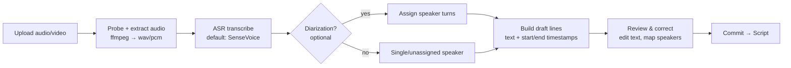

# 07 · Feature — Script Management

| | |
|---|---|
| **Document** | Feature Spec — Script Management |
| **Doc ID** | NF-07 |
| **Version** | 0.1 (Draft) |
| **Last updated** | 2026-05-30 |
| **Related** | [02 SRS](02-requirements-specification.md), [04 Data](04-data-model-and-storage.md), [08 Characters](08-feature-character-management.md), [11 Realtime/Media](11-feature-realtime-and-media-generation.md) |
| **Traces** | FR-SM-1 … FR-SM-12, FR-MOD-5, NFR-PERF-2 |

---

## 1. Overview

A **Script** is the unit of authored content in NagiFlow. It is an ordered set of **lines**, each spoken by a character, optionally timed, and annotated with voice direction. Scripts serve two downstream purposes (FR-SM-8/10):

1. **Production** — render the script into media (voice, and optionally video/subtitles). *(FR-SM-8)*
2. **Training data** — export aligned text + audio as a dataset to fine-tune a character's voice. *(FR-SM-10)*

Scripts can be **authored by hand** or **imported from existing audio/video** via speech recognition (FR-SM-5). This document specifies the data, the authoring experience, the import pipeline, and both export paths.

---

## 2. Concepts & data

(Schema defined authoritatively in [04 §5](04-data-model-and-storage.md); summarized here.)

### 2.1 `Script`

| Field | Notes |
|---|---|
| `id`, `title`, `description` | Identity and free-text summary. |
| `language` | Primary language tag (e.g. `zh-Hant`, `en`, `ja`); per-line override allowed. |
| `status` | `draft` → `review` (post-ASR, pre-commit) → `ready` → `archived`. |
| `source_kind` | `manual` or `imported` (from audio/video). |
| `default_character_id` | Optional default speaker for new lines. |
| `created_at` / `updated_at` | Timestamps. |

### 2.2 `ScriptLine`

A line is the spoken atom. It carries text, a speaker, optional timing, and **voice direction** (FR-SM-2/3):

| Field | Purpose |
|---|---|
| `order_index` | Position in the script (stable sort key). |
| `character_id` *(nullable)* | Speaker. May be null for narration or an unassigned imported line. |
| `character_name_raw` | Free-text name as written/recognized, before mapping to a character (useful on import). |
| `text` | The dialogue. |
| `start_ms` / `end_ms` *(nullable)* | **Timestamps** relative to script start. Present after import or after render alignment. |
| `reference_audio_key` *(nullable)* | A **reference audio** clip guiding delivery / voice for this line (FR-SM-3). |
| `style` *(nullable)* | **Style guidance** — natural-language direction ("cheerful, slightly breathy") consumed by the TTS provider. |
| `speech_rate` *(nullable)* | **Speech rate** multiplier (e.g. `0.8`–`1.4`); maps to provider params. |
| `pause_after_ms` *(nullable)* | Inserted silence after the line during assembly. |
| `notes` | Author notes, not rendered. |

> **Provider mapping.** `style`, `speech_rate`, and `reference_audio_key` are *intent*; each TTS provider maps them to its own controls (VoxCPM uses style text + reference clip; a simpler engine may ignore unsupported fields). The orchestrator only sends fields the provider advertises support for ([06 §5.1](06-module-and-extension-system.md)).

---

## 3. Manual authoring

### 3.1 Editing surfaces

Two synchronized views over the same lines (FR-SM-3/4):

- **List/script view** — a vertical list of lines: speaker selector, text field, and an expandable "direction" area (reference audio, style, speech rate, pause). Optimized for fast writing.
- **Timeline view** — lines laid out against a time axis once timestamps exist (after import or a render pass). Optimized for syncing and trimming.

### 3.2 Operations

| Operation | Detail | Trace |
|---|---|---|
| Add / edit / delete line | Inline; deletes are soft within the editing session, committed on save. | FR-SM-2/4 |
| **Reorder** | Drag to reorder; `order_index` recomputed. | FR-SM-4 |
| Assign speaker | Pick any character; multiple characters per script supported (multi-speaker dialogue). | FR-SM-2 |
| Per-line **overrides** | Set reference audio / style / speech rate / pause per line. | FR-SM-3 |
| Bulk actions | Set speaker or style across a selection; shift timestamps by an offset. | FR-SM-4 |
| Preview a line | Synthesize one line on demand to audition delivery (uses the line's speaker + direction). | FR-SM-8 |
| Validate | Run the validation rules (§8) and surface issues. | FR-SM-4 |

All edits autosave to the workspace DB; concurrent edits from a second client use last-write-wins at the line level with an `updated_at` guard.

---

## 4. Import: audio/video → script (ASR)

The flagship import capability turns an existing recording into an editable, timed script (FR-SM-5). It is a **job** (long-running, cancellable, progress-reported — [04 §6](04-data-model-and-storage.md), [05 §9](05-api-specification.md)) so large files do not block the UI (NFR-PERF-2).

### 4.1 Pipeline stages

1. **Ingest & probe** — accept common audio (`wav`, `mp3`, `flac`, `m4a`) and video (`mp4`, `mkv`, `mov`) containers. Probe with ffmpeg; extract a normalized mono PCM/WAV track at the ASR's expected sample rate. The original file is stored under `scripts/<id>/sources/` (storage key in DB).
2. **Transcribe (ASR)** — the **ASR provider** produces text segments with start/end timestamps. The default provider is **SenseVoice** (the recognizer used by the VoxCPM stack), pluggable to any ASR module ([06 §12](06-module-and-extension-system.md), FR-MOD-5). Language may be specified or auto-detected where the provider supports it.
3. **Diarization (optional)** — if the provider/module offers speaker diarization, segments are grouped into speaker turns and each turn gets a `character_name_raw` placeholder (e.g. "Speaker 1"). Otherwise all lines start unassigned (FR-SM-6).
4. **Draft assembly** — segments become `ScriptLine` drafts with `text`, `start_ms`, `end_ms`, and (if diarized) a raw speaker label. Segment boundaries can be merged/split heuristically (e.g. join very short adjacent segments).
5. **Review & correct** — the user opens the draft in the editor to fix recognition errors, merge/split lines, and **map raw speaker labels to NagiFlow characters** (FR-SM-6). Optionally retain the original clip slices as per-line `reference_audio` (handy for later voice training).
6. **Commit** — the reviewed draft is saved as a `Script` with `source_kind = imported`.

### 4.2 Progress, cancellation, failure

- Progress is reported per stage (`extracting`, `transcribing`, `assembling`) with a 0–100 estimate.
- Cancel stops the job and discards the partial draft.
- On failure (corrupt media, ASR provider down) the job ends `failed` with a typed error; the source upload is retained so the user can retry.

---

## 5. Production: script → media

Rendering is covered in depth in [11 §3](11-feature-realtime-and-media-generation.md); from the script's perspective (FR-SM-8):

- **Batch render** — synthesize every line with its speaker's voice + per-line direction, then assemble into a continuous track honoring timestamps and `pause_after_ms`.
- **Subtitle export** — because lines carry timing, NagiFlow can emit **SRT/VTT** subtitles alongside the audio (FR-SM-9).
- **Alignment write-back** — if a line lacked timing, the render can populate `start_ms`/`end_ms` from synthesized durations so the timeline view becomes usable (FR-SM-8).
- Output is a `MediaAsset` linked to the script ([04 §5](04-data-model-and-storage.md)).

---

## 6. Training data: script → dataset

A script (especially an imported one with original audio per line) is a natural **voice-training dataset** (FR-SM-10):

- **Export** produces aligned **(text, audio)** pairs: each line's `text` with its `reference_audio` slice (from import) or its rendered audio.
- Output format is a manifest (`dataset.jsonl`) plus an audio folder, suitable for the fine-tune pipeline in [08 §4](08-feature-character-management.md).
- Filters let the user exclude lines (e.g. drop low-confidence or cross-talk segments) and target a single speaker so a dataset is character-specific.
- Datasets are first-class enough to be referenced by a voice fine-tune job; they are stored under the workspace and can be re-exported as the script is corrected.

---

## 7. Import/export & interchange (text)

Beyond media and datasets, scripts interchange as **structured text** (FR-SM-9/11):

| Format | Direction | Use |
|---|---|---|
| **NagiFlow JSON** | in/out | Full-fidelity script (lines + all direction fields). Round-trips losslessly. |
| **SRT / VTT** | out (and in for timed text) | Subtitles; importing timed text yields lines with timestamps but no direction. |
| **Plain/markdown screenplay** | in (best-effort) | "Name: line" style parsed into speaker + text; timing absent. |
| **CSV** | in/out | Spreadsheet-friendly columns (order, speaker, text, start, end, style, rate). |

Importers map external speaker names to characters via the same mapping step as ASR import.

---

## 8. Validation rules

Surfaced in the editor and enforced before a script is marked `ready` (FR-SM-4):

- **Timing sanity** — `start_ms ≤ end_ms`; warn on overlapping lines from the *same* speaker; allow overlap across speakers.
- **Speaker coverage** — flag lines with no `character_id` (and no deliberate "narration"/unassigned marker) before render.
- **Reference availability** — if a line references audio or a character voice that no enabled provider can satisfy, warn (block render).
- **Empty/whitespace text** — flag empty lines.
- **Language tags** — warn if a line's language has no compatible voice for its speaker.

Validation produces a list of issues with severity (`error` blocks render/export; `warning` is advisory).

---

## 9. Permissions

Script management is an **advanced** capability: it requires an authenticated (non-guest) user (see [09 §3 permission matrix](09-feature-multiuser-memory-and-privacy.md)). Guests cannot create, import, render, or export scripts. Import jobs and renders run under the requesting user and are attributed in usage accounting ([12 §3](12-feature-observability.md)).

---

## 10. Edge cases & decisions

- **Very long media** — chunked extraction/transcription with periodic progress; memory-bounded streaming rather than loading whole files (NFR-PERF-2).
- **Mixed-language audio** — supported where the ASR provider supports it; otherwise transcribed in the declared language with a warning.
- **No diarization available** — import still works; everything lands as unassigned lines for manual speaker assignment (graceful degradation).
- **Re-import / re-transcribe** — keeping the source clip lets the user re-run ASR (e.g. after switching to a better ASR module) without re-uploading.
- **Provider absence** — with no ASR module enabled, import is disabled in the UI with an explanatory message; manual authoring remains fully available.

---

## 11. Requirements coverage

| Requirement | Where addressed |
|---|---|
| FR-SM-1 (CRUD/duplicate/list scripts) | §2.1, §3.2 |
| FR-SM-2 (lines: text/speaker/ordering) | §2.2, §3.2 |
| FR-SM-3 (per-line voice direction) | §2.2, §3.2 |
| FR-SM-4 (reorder/edit/validate fields) | §3.2, §8 |
| FR-SM-5 (ASR import from audio/video) | §4 |
| FR-SM-6 (diarization / speaker mapping) | §4.1 |
| FR-SM-7 (ASR tracked job + review/commit) | §4, §4.2 |
| FR-SM-8 (generate media + per-line preview) | §3.2, §5 |
| FR-SM-9 (subtitle export SRT/VTT) | §5, §7 |
| FR-SM-10 (training-data export) | §6 |
| FR-SM-11 (structured import/export JSON/SRT/CSV) | §7 |
| FR-SM-12 (line takes/versions) | §2.2 |
| FR-MOD-5 (pluggable ASR/TTS providers) | §4.1, §5 |
| NFR-PERF-2 (non-blocking long jobs) | §4, §10 |
