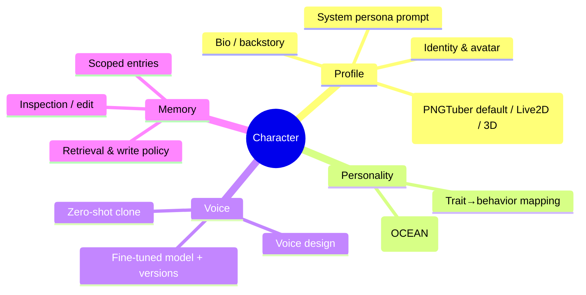
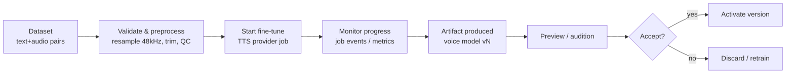

# 08 · Feature — Character Management

| | |
|---|---|
| **Document** | Feature Spec — Character Management |
| **Doc ID** | NF-08 |
| **Version** | 0.1 (Draft) |
| **Last updated** | 2026-05-30 |
| **Related** | [04 Data](04-data-model-and-storage.md), [06 Modules](06-module-and-extension-system.md), [07 Scripts](07-feature-script-management.md), [09 Privacy](09-feature-multiuser-memory-and-privacy.md), [11 Realtime/Media](11-feature-realtime-and-media-generation.md) |
| **Traces** | FR-CM-1 … FR-CM-12, FR-MOD-5, NFR-PRIV-2/3, NFR-MAINT-2 |

---

## 1. Overview

A **Character** is the central entity in NagiFlow — the AI VTuber itself. Character management is the single place to define everything that makes a character: who they are (profile), how they behave (Big Five personality), how they sound (a fine-tunable voice model), and what they remember (a personal memory bank). Characters are **portable**: they can be exported as a self-contained package and imported elsewhere (FR-CM-10/11).

This document specifies the four pillars — **Profile**, **Personality**, **Voice**, **Memory** — plus packaging and lifecycle.



---

## 2. Profile & persona

The profile is the descriptive core (FR-CM-1/2/3):

| Field | Purpose |
|---|---|
| `display_name`, `aliases` | Names the character goes by. |
| `avatar_key`, `portrait_key` | Images stored under `characters/<id>/` (storage keys in DB). |
| `avatar_bundle_key`, `avatar_renderer` | The character's **avatar bundle** for video/live rendering — a **PNGTuber sprite set by default**, or a **Live2D / 3D model** where used — plus the preferred renderer (`pngtuber` default, `live2d`, `3d`, or `external`). Consumed by the `AvatarRenderProvider` ([11 §5](11-feature-realtime-and-media-generation.md)). Optional; without it, rendering falls back to a static portrait. |
| `bio` / `backstory` | Lore and context the character "knows" about itself. |
| `persona_prompt` | The authored **system persona** — tone, speech quirks, do/don't, world rules. |
| `language_default` | Preferred language; affects prompt and voice selection. |
| `tags`, `status` | Organization; lifecycle (`active`/`draft`/`archived`). |

The **persona prompt** is combined at runtime with the personality mapping (§3) and retrieved memories (§5) by the Dialogue Orchestrator ([11 §4](11-feature-realtime-and-media-generation.md)) to produce the system context for each turn. Authors get a live **preview chat** to iterate on persona without leaving the editor.

---

## 3. Personality — Big Five (OCEAN)

Each character has a **Big Five** profile: five traits scored **0–100** (FR-CM-4). NagiFlow translates these abstract scores into concrete generation behavior so personality is *expressed*, not just stored (FR-CM-4).

### 3.1 The five traits

| Trait | Low (0) ⟷ High (100) |
|---|---|
| **Openness** | concrete, conventional ⟷ curious, imaginative, abstract |
| **Conscientiousness** | spontaneous, loose ⟷ precise, organized, careful |
| **Extraversion** | reserved, brief ⟷ talkative, energetic, expressive |
| **Agreeableness** | blunt, challenging ⟷ warm, accommodating, supportive |
| **Neuroticism** | calm, even ⟷ reactive, emotionally intense |

### 3.2 Trait → behavior mapping

The mapping has two channels: **prompt directives** (steer the LLM) and **generation/voice parameters** (steer style and delivery). The transform is transparent and editable — authors can view exactly what a given profile produces.

**Graded by score, not binary.** Each trait's 0–100 score is bucketed into **five bands** so the magnitude matters — a 95 reads differently from a 65, and the mid-range is an *active* "balanced" instruction, not silence:

| Band | Score | Meaning |
|---|---|---|
| **very low** | 0–19 | the low pole, strongly expressed |
| **low** | 20–39 | leans low |
| **moderate** | 40–59 | balanced / situational |
| **high** | 60–79 | leans high |
| **very high** | 80–100 | the high pole, strongly expressed |

Each (trait, band) pair yields one **directive** written at that intensity. Illustrative for Extraversion:

| Band | Directive |
|---|---|
| very high | "Be highly energetic and talkative; initiate topics, react vividly, keep momentum high." |
| high | "Be upbeat and sociable; engage warmly and volunteer a little extra." |
| moderate | "Be moderately engaged; match the user's energy." |
| low | "Be fairly reserved and concise; answer without volunteering much." |
| very low | "Be very reserved and brief; minimal words, no small talk." |

The other four traits follow the same five-band shape (tables live in code, surfaced read-only in the UI — NFR-MAINT-2).

**Scores travel into the prompt.** The assembled system context includes a structured personality block that states **both the number and its band**, so the LLM can calibrate, not just toggle:

```
Personality profile (Big Five, 0–100). Embody these in tone, length, and content:
- Openness 82/100 (very high): Be highly imaginative and exploratory; offer novel framings…
- Conscientiousness 35/100 (low): Be casual and flexible; don't over-organize or over-qualify.
- Extraversion 70/100 (high): Be upbeat and sociable; engage warmly and volunteer a little extra.
- Agreeableness 75/100 (high): Be friendly and cooperative; soften disagreement.
- Neuroticism 28/100 (low): Stay calm and even; keep emotions understated.
```

**Parameter channel (continuous).** Alongside the prompt, scores drive bounded, clamped generation/voice parameters that vary *smoothly* with the score:

| Parameter | Driven by | Behavior |
|---|---|---|
| `temperature` | Openness↑, Conscientiousness↓ | linear offset from a 0.7 base, clamped `[0.2, 1.2]` |
| `top_p` | Openness | linear, clamped `[0.7, 1.0]` |
| `verbosity` | Extraversion | banded label `minimal → brief → balanced → talkative → expansive` |
| `speech_rate` | Extraversion | linear `~0.85–1.15` |
| `expressiveness` | Neuroticism | banded `low → medium → high → very high` |
| `voice_style` | Extraversion / Agreeableness / Neuroticism | style tags (e.g. `energetic`, `warm`, `expressive`) emitted at the band extremes |

**Resolution model.** Each trait maps through a small, documented function to (a) a banded text directive appended to the persona (with the score) and (b) bounded parameter offsets clamped to safe ranges. Conflicting nudges combine and clamp (e.g. Conscientiousness↑ vs Openness↑ on temperature net out). Voice-style mapping only applies to providers that accept style guidance ([06 §5.1](06-module-and-extension-system.md)); the persona prompt always wins where it explicitly contradicts a trait directive (§9).

> **Design note.** Big Five is used as a *control surface*, not a psychological claim. The point is reproducible, tunable personality expression — two characters with different OCEAN profiles should feel reliably different in tone, length, and delivery.

---

## 4. Voice

A character has one or more **voice models**; one is marked **active**. NagiFlow supports three ways to give a character a voice, all delivered through the default **VoxCPM** provider and pluggable to others (FR-CM-5, FR-MOD-5):

| Kind (`voice_model.kind`) | How it's created | When to use |
|---|---|---|
| **`zero_shot`** | Provide a short **reference audio** clip; the provider clones the timbre on the fly (controllable voice cloning). | Fast setup; "sounds like this sample". |
| **`voice_design`** | Describe the voice in **natural language** (e.g. "a bright young female voice, slightly husky"); the provider designs it. | No reference available; craft a voice from scratch. |
| **`fine_tuned`** | Train a model from a **dataset** (text+audio pairs) for a durable, higher-fidelity custom voice. | A recurring character you'll reuse heavily. |

### 4.1 Fine-tune training pipeline

Producing a `fine_tuned` voice is a managed **job** (FR-CM-6):



1. **Dataset** — selected from a script export ([07 §6](07-feature-script-management.md)) or uploaded directly; must be reasonably clean and single-speaker.
2. **Validate & preprocess** — resample to the provider's rate (48 kHz for VoxCPM), trim silence, drop low-quality clips, report dataset stats and warnings.
3. **Train** — delegated to the provider's `start_finetune` ([06 §5.1](06-module-and-extension-system.md)); the job reports progress/metrics.
4. **Artifact & versioning** — the result is stored under `characters/<id>/voice/models/<version>/` and recorded as a new `voice_model` **version**. Older versions are retained for **rollback** (FR-CM-6).
5. **Preview & activate** — audition a fixed sample line with the new model; activate to make it the character's default, or discard.

### 4.2 Voice behavior at runtime

The active voice plus per-line/per-turn **style** and **speech rate** (from scripts §[07], or from personality mapping in live chat) are passed to the provider. If the active model is a `fine_tuned` artifact unavailable to the current provider, the orchestrator falls back to zero-shot from a stored reference (if any) and warns.

---

## 5. Memory bank

Every character owns a **memory bank** — durable, scoped memories that personalize interaction (FR-CM-8). The privacy-critical scoping model is specified fully in [09 §4](09-feature-multiuser-memory-and-privacy.md); the character-side view:

### 5.1 Scopes (summary)

| Scope | Keyed by | Meaning |
|---|---|---|
| `user_scoped` | character + **user** | What the character remembers about a specific user (most memories). |
| `character_general` | character | User-agnostic facts about the character/world (rarely user-specific). |
| `character_interaction` | character + **counterpart character** | What the character remembers from interacting with another character. |

This realizes "a character keeps per-user memories, and memories from interacting with other characters" (FR-CM-8, FR-MM-2/3).

### 5.2 Write policy

- After a turn (or a summarization pass), candidate memories are extracted and written with a `scope`, an `importance` score, and an embedding for retrieval.
- A `memory.write.pre` hook lets modules redact/classify before persistence ([06 §9](06-module-and-extension-system.md)).
- Caps and **decay** prevent unbounded growth: low-importance, stale entries are summarized or pruned per configurable limits.

### 5.3 Retrieval

At turn time the orchestrator retrieves the top-K relevant entries by **vector similarity + recency + importance**, filtered by the active **scopes** and by **sensitive mode** ([09 §5](09-feature-multiuser-memory-and-privacy.md)). Retrieved memories are injected into the prompt.

### 5.4 Inspection & editing

Authors can **view, search, edit, pin, and delete** a character's memories from the editor (FR-CM-9) — essential for debugging behavior and for honoring user data-deletion requests (delete a user's `user_scoped` memories; [09 §5.4](09-feature-multiuser-memory-and-privacy.md), NFR-PRIV-3). Memory inspection respects the viewer's permissions.

---

## 6. Packaging — export / import

Characters are portable as a **`.nagichar`** package (a zip), satisfying "export/import characters" (FR-CM-10/11).

### 6.1 Package layout

```
my-character.nagichar  (zip)
├── manifest.json        # package + app-compat metadata, checksums
├── character.json       # profile, persona, Big Five, voice-model descriptors
├── voice/
│   ├── reference/        # reference clips (zero-shot / design seeds)
│   └── models/<version>/ # fine-tuned artifacts (optional, can be large)
├── assets/               # avatar, portrait, extra images
├── avatar/               # avatar bundle: PNGTuber sprite set (default), or Live2D / 3D model files
└── memory.jsonl          # exported memory entries (see privacy default)
```

`manifest.json`:

```json
{
  "format": "nagichar/v1",
  "character_id_origin": "chr_…",
  "app_compat": ">=0.3.0",
  "exported_at": "2026-05-30T00:00:00Z",
  "includes": { "voice_models": true, "memory": "general_only" },
  "checksums": { "character.json": "sha256:…" }
}
```

### 6.2 Privacy defaults on export (important)

By default the export **excludes `user_scoped` memories** — those are other people's data and must not travel with a shared character (NFR-PRIV-2). The exporter offers explicit, clearly-labeled choices:

| Memory export option | Behavior |
|---|---|
| **General only** *(default)* | Only `character_general` entries; no per-user memories. |
| **None** | Strip all memory; ship a "fresh" character. |
| **Include user-scoped** *(guarded)* | Requires explicit confirmation; intended only for personal backup/migration, never for public sharing. Warns prominently. |

Large fine-tuned voice artifacts are optional in the package (toggle) to keep shareable files small.

### 6.3 Import

- The importer validates `manifest.json` (format + `app_compat`), verifies checksums, and previews what will be added (profile, voice models, how many memories).
- It assigns a **new local id** (no id collisions) and stores assets/voice into the workspace.
- Imported `user_scoped` memories (if present) are **quarantined**: NagiFlow cannot safely attribute them to local users, so by default they are dropped or held for explicit, manual mapping (NFR-PRIV-2).
- Importing never grants the package any elevated permissions; bundled references/assets are data, not code (character packages contain no executable modules).

---

## 7. Lifecycle & operations

| Operation | Detail | Trace |
|---|---|---|
| Create / edit / archive | Full CRUD on profile, personality, voice, memory. | FR-CM-1 |
| **Duplicate** | Clone a character (profile + personality + voice descriptors); memory copy follows the same privacy options as export. | FR-CM-1 |
| Activate voice version | Switch active model; rollback to a prior version. | FR-CM-6 |
| Preview | Live persona chat; voice audition. | FR-CM-7 |
| Export / import | `.nagichar` packaging (§6). | FR-CM-10/11 |
| Set guest visibility | Mark whether a character is available to guests (gates public chat — [09 §3](09-feature-multiuser-memory-and-privacy.md)). | FR-CM-12, FR-MM-7 |

---

## 8. Permissions

Creating and editing characters (profile, personality, voice training, memory editing, export/import) are **advanced** operations requiring an authenticated user ([09 §3](09-feature-multiuser-memory-and-privacy.md)). Guests may only *converse* with characters explicitly marked **guest-visible**, and never see or edit memory or character internals. Voice fine-tune and import jobs are attributed to the requesting user in usage accounting ([12 §3](12-feature-observability.md)).

---

## 9. Edge cases & decisions

- **No GPU / heavy provider absent** — `fine_tuned` training may be unavailable; zero-shot and voice-design remain usable on lighter setups; UI disables unsupported actions with explanation (graceful degradation, NFR-PORT-*).
- **Switching TTS providers** — voice descriptors are provider-aware; a character's `fine_tuned` artifact from one engine may not load in another, so the orchestrator falls back and warns (§4.2).
- **Memory growth** — decay/caps and summarization keep retrieval fast and storage bounded (§5.2).
- **Shared character hygiene** — export defaults protect against accidentally leaking user memories (§6.2); this is enforced, not merely documented.
- **Personality vs persona conflicts** — the persona prompt always wins where it explicitly contradicts a trait directive; the UI flags strong conflicts during preview.

---

## 10. Requirements coverage

| Requirement | Where addressed |
|---|---|
| FR-CM-1 (CRUD/duplicate/list characters) | §2, §7 |
| FR-CM-2 (basic info: name/avatar/lang/tags/status) | §2 |
| FR-CM-3 (editable persona) | §2 |
| FR-CM-4 (Big Five + behavior mapping) | §3 |
| FR-CM-5 (voice model: design/zero-shot) | §4 |
| FR-CM-6 (voice fine-tune + versioning/rollback) | §4.1 |
| FR-CM-7 (preview voice) | §4.2, §7 |
| FR-CM-8 (memory bank, scoped) | §5 |
| FR-CM-9 (memory inspection/edit) | §5.4 |
| FR-CM-10 (export/import portable package) | §6, §6.3 |
| FR-CM-11 (export privacy options) | §6.2 |
| FR-CM-12 (guest-visible flag) | §7 |
| FR-MOD-5 (pluggable TTS) | §4 |
| NFR-PRIV-2 (no leaking user data on export) | §6.2, §6.3 |
| NFR-PRIV-3 (user data deletion) | §5.4 |
| NFR-MAINT-2 (explainable mapping) | §3.2 |
