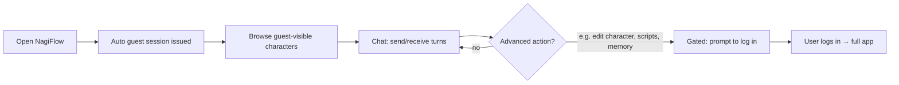
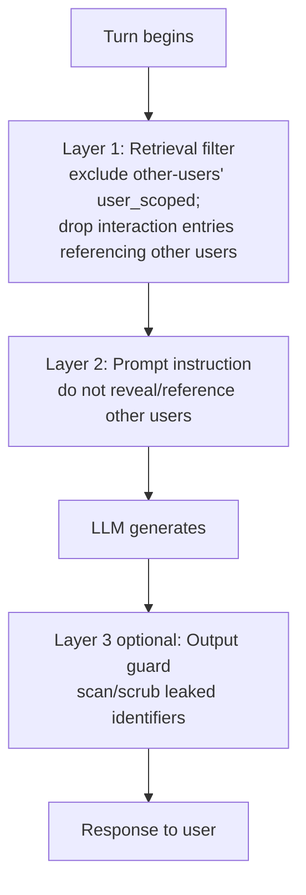

# 09 · Feature — Multi-User, Memory & Privacy

| | |
|---|---|
| **Document** | Feature Spec — Multi-User, Memory & Privacy |
| **Doc ID** | NF-09 |
| **Version** | 0.1 (Draft) |
| **Last updated** | 2026-05-30 |
| **Related** | [03 Architecture](03-system-architecture.md), [04 Data](04-data-model-and-storage.md), [05 API](05-api-specification.md), [08 Characters](08-feature-character-management.md), [10 Realtime](10-feature-realtime-and-media-generation.md) |
| **Traces** | FR-MM-1 … FR-MM-11, FR-CM-7, NFR-PRIV-1/2/3/4, NFR-SEC-1/2/3 |

---

## 1. Overview

NagiFlow is **multi-character and multi-user** (FR-MM-1). The same character interacts with many people, and it must remember each of them **separately** — without bleeding one person's information into a conversation with another. Three mechanisms make this safe and usable:

1. **User classes & a permission matrix** — guests get basic chat; authenticated users get the full app (FR-MM-7/8).
2. **Scoped memory** — every memory belongs to a scope that binds it to a user, the character itself, or a character-to-character relationship (FR-MM-2/3).
3. **Sensitive mode** — a character can be prevented from revealing or referencing other users, enforced where it matters: at retrieval, in the prompt, and (optionally) on output (FR-MM-4/5).

This is the most privacy-sensitive part of NagiFlow; the design favors **enforcement at the data layer** over relying on the model to "behave" (ADR-005, NFR-PRIV-1).

---

## 2. User classes

| Class | How obtained | Capabilities (summary) |
|---|---|---|
| **Guest** | Auto-issued session, **no login** (FR-MM-6) | Converse with **guest-visible** characters only; basic, read-only-ish interaction. No advanced operations. |
| **Local user** | Authenticated session (login) | Full feature set: scripts, character authoring, memory inspection, media, modules, observability. |
| **Developer/admin** | A local user with the admin flag | Everything a user can do plus module install/permissions and system-level settings. |

> NagiFlow **never creates accounts on a user's behalf** and never performs password login automatically (NFR-SEC-3). Guests are anonymous sessions; promoting to a user requires the person to register/log in themselves.

### 2.1 Guest experience flow (FR-MM-6)



The default landing state is a working **chat with a guest-visible character** — zero setup. Any attempt to reach an advanced operation is gated with a clear "log in to continue" path (FR-MM-8).

---

## 3. Permission matrix

Authorization is enforced **server-side** for every request and WebSocket action ([05 §2](05-api-specification.md), NFR-SEC-1). The matrix below is the source of truth; "guest-visible" is a per-character flag set by an owner ([08 §7](08-feature-character-management.md)).

| Operation | Guest | Local user | Admin |
|---|:---:|:---:|:---:|
| Start/own guest session | ✅ | — | — |
| Chat with **guest-visible** character | ✅ | ✅ | ✅ |
| Chat with **non-visible** character | ❌ | ✅ | ✅ |
| View character profile (public fields) | ✅ (visible chars) | ✅ | ✅ |
| **View/edit character memory** | ❌ | ✅ | ✅ |
| Create/edit/delete character | ❌ | ✅ | ✅ |
| Personality / voice training | ❌ | ✅ | ✅ |
| Export / import character | ❌ | ✅ | ✅ |
| Scripts (author/import/render/export) | ❌ | ✅ | ✅ |
| Media generation | ❌ | ✅ | ✅ |
| Observability dashboard | ❌ | ✅ | ✅ |
| Token/cost reports | ❌ | ✅ (own + aggregate per policy) | ✅ |
| Modules: enable/disable/configure | ❌ | ✅ (per policy) | ✅ |
| Modules: **install / permissions** | ❌ | ❌ | ✅ |
| System settings / providers config | ❌ | partial | ✅ |
| Toggle **sensitive mode** | ❌ | ✅ (chars they manage) | ✅ |
| Delete a user's data | ❌ | ✅ (self/own scope per policy) | ✅ |

Guests are confined to the first rows: **basic conversation only** (FR-MM-7/8). Everything that creates, reveals, or configures is user-gated.

---

## 4. Memory architecture & scoping

(Schema in [04 §5](04-data-model-and-storage.md); character-side view in [08 §5](08-feature-character-management.md).)

### 4.1 The three scopes (authoritative)

Every `memory_entry` has exactly one **scope**:

| Scope | Keying columns | Holds | Who may surface it |
|---|---|---|---|
| **`user_scoped`** | `character_id` + `user_id` | What the character knows **about a specific user** (the bulk of memories). | Only in a conversation **with that same user**. |
| **`character_general`** | `character_id` | User-agnostic self/world facts. | Any conversation (not user-specific). |
| **`character_interaction`** | `character_id` + `counterpart_character_id` | What the character recalls from **interacting with another character**. | Conversations involving that relationship; subject to sensitive-mode rules if it references users. |

This directly implements "a character keeps memories scoped to each user, and memories from interacting with other characters" (FR-MM-2/3, FR-CM-7).

### 4.2 Vector namespaces

Retrieval indexes are partitioned so a query physically cannot pull another user's entries:

```
mem:<character_id>:user:<user_id>          # user_scoped (per user)
mem:<character_id>:general                 # character_general
mem:<character_id>:interaction:<counterpart_character_id>
```

At turn time the orchestrator queries only the namespaces permitted for the **current (character, user)** pair (and relevant interaction namespaces), then applies sensitive-mode filtering (§5). Isolation is structural, not advisory (NFR-PRIV-1).

### 4.3 Write & read policy

- **Write** — after a turn / on summarization, candidate memories are classified into a scope, scored for `importance`, embedded, and stored. The default scope for things learned about the speaking user is `user_scoped` bound to that user.
- **Read (retrieval)** — top-K by **similarity + recency + importance**, restricted to permitted namespaces, then sensitive-mode-filtered.
- **Summarization** — periodic compaction turns many low-value entries into a few summaries to bound size and keep retrieval sharp (FR-MM-9).
- **Decay / caps** — per-scope limits with importance-weighted pruning prevent unbounded growth (FR-MM-9).

---

## 5. Sensitive mode

**Sensitive mode** prevents a character from **mentioning or revealing other users** during a conversation (FR-MM-4/5). It is the privacy guarantee that makes public, multi-viewer streaming safe.

### 5.1 Configuration scope

Sensitive mode can be set at three levels, most specific wins (FR-MM-5):

| Level | Use |
|---|---|
| **Global default** | Operator-wide baseline. **Recommended ON** for any public/streaming deployment. |
| **Per-character** | A character is always sensitive (or not). |
| **Per-conversation** | Override for a specific session (e.g. a private 1:1 where cross-user context is fine). |

### 5.2 Enforcement layers (defense in depth)



1. **Retrieval filter (primary).** The query simply **never returns** memories scoped to other users, and filters `character_interaction` entries whose content references other users. If the data isn't in the prompt, it cannot be leaked (NFR-PRIV-1). This is the load-bearing layer.
2. **Prompt instruction.** A system directive tells the model not to reveal or reference other users, reinforcing the data-layer filter for any incidental context.
3. **Output guard (optional).** A configurable post-generation pass can scan for and scrub known other-user identifiers; available as a hook/module for deployments that want belt-and-suspenders. Off by default to avoid latency unless enabled.

### 5.3 What sensitive mode does **not** do

It does not erase the character's memory of the current user, nor block `character_general` facts. It scopes **outward** disclosure of *other* users. With sensitive mode **off** (e.g. a trusted private session) the character may use cross-user context the operator has deemed acceptable.

### 5.4 Edge cases

- **Public stream = everyone is "another user".** When live-chat viewers are routed in as inputs ([10 §6](10-feature-realtime-and-media-generation.md)), each viewer is a distinct (often guest) user; sensitive mode ON ensures the character won't surface one viewer's info to another. This is why the global default is ON for streaming.
- **Same user, different session.** `user_scoped` memory persists across that user's sessions (continuity), independent of sensitive mode.
- **Counterpart references users.** An interaction memory that embeds another user's info is filtered under sensitive mode even though its scope is `character_interaction`.

---

## 6. Data lifecycle & user rights

- **Deletion (FR-MM-10, NFR-PRIV-3).** Deleting a user **hard-deletes** their `user_scoped` memories across characters and removes their vector namespace(s); the user's conversations/messages are deleted or anonymized per policy. `character_general` and unrelated data are untouched.
- **Export hygiene (NFR-PRIV-2).** Character export excludes `user_scoped` memory by default so sharing a character never ships other people's data ([08 §6.2](08-feature-character-management.md)).
- **Local-first (NFR-PRIV-4).** All user data lives in the local workspace by default; nothing is sent to external services except what a configured provider/connector explicitly transmits to do its job, and that surface is visible in observability ([11](11-feature-observability.md)).
- **Auditability (NFR-SEC-2).** Sensitive operations — permission changes, sensitive-mode toggles, memory deletions, module permission grants — are written to the audit log ([04 §3](04-data-model-and-storage.md)).

---

## 7. Threat considerations (privacy-focused)

| Concern | Mitigation |
|---|---|
| Cross-user memory leak | Structural namespace isolation + retrieval filter (§4.2, §5.2). |
| Guest escalation | Server-side permission matrix on every request/WS action (§3, NFR-SEC-1). |
| Account creation/credential misuse | NagiFlow never creates accounts or auto-logs-in; user supplies all credentials (NFR-SEC-3). |
| Leaking via shared character file | Export excludes user-scoped memory by default; import quarantines stray user memory (§6, [08 §6](08-feature-character-management.md)). |
| Prompt-injection coaxing disclosure | Primary defense is data exclusion (the info isn't present); prompt + optional output guard add depth. |
| Module exfiltration | Module permission model gates network/secret access ([06 §11](06-module-and-extension-system.md)). |

---

## 8. Requirements coverage

| Requirement | Where addressed |
|---|---|
| FR-MM-1 (multi-character/multi-user) | §1, §2 |
| FR-MM-2 (per-user memory) | §4.1 |
| FR-MM-3 (character-interaction memory) | §4.1 |
| FR-MM-4 (sensitive mode) | §5 |
| FR-MM-5 (sensitive-mode scope/levels) | §5.1 |
| FR-MM-6 (guest, no-login default) | §2, §2.1 |
| FR-MM-7 (guest limited to basics) | §2, §3 |
| FR-MM-8 (advanced ops gated to users) | §2.1, §3 |
| FR-MM-9 (summarization/decay/caps) | §4.3 |
| FR-MM-10 (user data deletion) | §6 |
| FR-MM-11 (per-user continuity across sessions) | §5.4, §4.3 |
| FR-CM-7 (memory bank scoping) | §4 |
| NFR-PRIV-1 (enforce at data layer) | §4.2, §5.2 |
| NFR-PRIV-2 (no leak on export) | §6 |
| NFR-PRIV-3 (deletion) | §6 |
| NFR-PRIV-4 (local-first) | §6 |
| NFR-SEC-1/2/3 | §3, §6, §7 |
