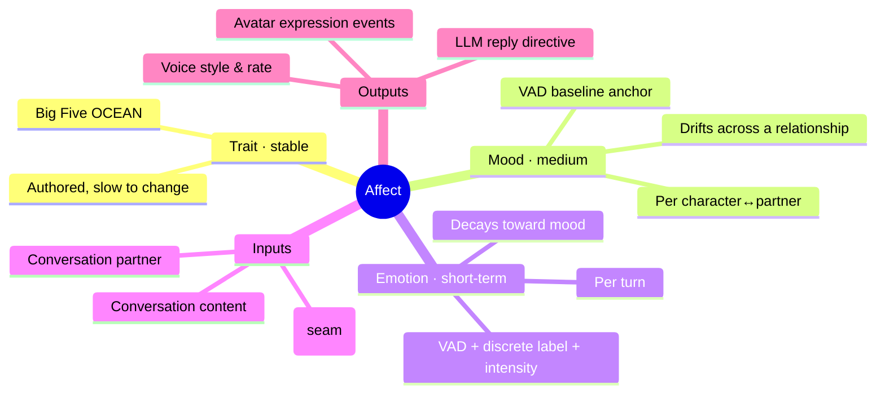
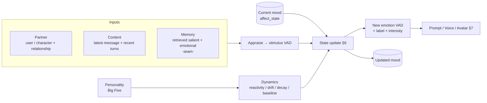

# 10 · Feature — Emotion & Affect

| | |
|---|---|
| **Document** | Feature Spec — Emotion & Affect |
| **Doc ID** | NF-10 |
| **Version** | 0.1 (Draft) |
| **Last updated** | 2026-05-31 |
| **Related** | [02 SRS](02-requirements-specification.md), [03 Architecture](03-system-architecture.md), [04 Data](04-data-model-and-storage.md), [05 API](05-api-specification.md), [08 Characters](08-feature-character-management.md), [09 Privacy](09-feature-multiuser-memory-and-privacy.md), [11 Realtime/Media](11-feature-realtime-and-media-generation.md) |
| **Traces** | FR-EMO-1 … FR-EMO-9, FR-CM-4, FR-RT-3, NFR-MAINT-2, NFR-PERF-2 |

---

## 1. Overview

A character's **personality** (Big Five — [08 §3](08-feature-character-management.md)) is **stable**: it defines who the character *is*. But a believable character is not a fixed function of its traits — the *same* character is warmer to a friend than to a stranger, brightens at good news, and tenses when provoked. The **Emotion & Affect** system adds that missing layer: a **short-term emotional state** that forms from *who* the character is talking to, *what* is being said, and *what it remembers*, and then **colors** the character's reply, voice, and on-screen expression.

The design goal is **variation within character**, not randomness. Emotion is a *modulation* on top of personality, never a replacement: a calm (low-Neuroticism) character still swings less than a volatile one, because personality governs **how** emotion forms and fades.



### 1.1 Three layers of affect

| Layer | Timescale | Scope | Source | Stored |
|---|---|---|---|---|
| **Trait** (personality) | stable / authored | the character | Big Five, set by author ([08 §3](08-feature-character-management.md)) | `character.big_five` |
| **Mood** | a conversation / relationship | per **(character, partner)** | drifts slowly toward recent emotion; decays toward a personality **baseline anchor** | `affect_state` ([04 §5.9](04-data-model-and-storage.md)) |
| **Emotion** | a single turn | the current turn | **appraisal** of partner + content + memory, launched from the current mood | `message.meta.affect` (snapshot) + `affect_state.emotion` (current) |

> **Why a separate mood layer?** Without it, emotion would reset to neutral every turn and the character would feel amnesiac about how the conversation has been going. Mood is the slow integrator that makes a conversation *cumulatively* tense or warm; emotion is the fast reaction on top of it. Personality is the attractor both relax toward.

---

## 2. Affect representation

Affect is represented in a continuous **VAD** space plus a **discrete label** derived from it. Two representations because the consumers need different things: continuous values drive *smooth* voice/animation parameters; discrete labels drive *prompt wording* and UI.

### 2.1 VAD vector (continuous)

| Dimension | Range | Meaning |
|---|---|---|
| **Valence** (V) | `[-1, 1]` | unpleasant ⟷ pleasant |
| **Arousal** (A) | `[-1, 1]` | calm/sleepy ⟷ excited/activated |
| **Dominance** (D) | `[-1, 1]` | submissive/controlled ⟷ in-control/assertive |

VAD (a.k.a. PAD — Pleasure/Arousal/Dominance) is used as a **control surface**, not a psychological claim — the same stance as Big Five in [08 §3](08-feature-character-management.md). All components are clamped to `[-1, 1]`.

### 2.2 Discrete labels (derived)

A small, renderer- and prompt-friendly emotion set, each with a VAD **centroid**. The active label is the **nearest centroid** to the current emotion VAD; **intensity** is the vector magnitude `‖(V,A,D)‖ / √3` clamped to `[0,1]` (distance from neutral). Below a `neutral_radius` (default `0.15`) the label is forced to `neutral`.

| Label | V | A | D | Typical trigger |
|---|---:|---:|---:|---|
| `neutral` | 0.0 | 0.0 | 0.0 | baseline / unremarkable turn |
| `joy` | 0.8 | 0.5 | 0.3 | good news, success, praise |
| `affection` | 0.7 | 0.2 | 0.1 | warmth toward a liked partner |
| `curiosity` | 0.4 | 0.4 | 0.1 | novel/interesting topic |
| `surprise` | 0.1 | 0.7 | -0.1 | unexpected information |
| `sadness` | -0.7 | -0.4 | -0.3 | loss, disappointment, bad news |
| `anger` | -0.6 | 0.6 | 0.4 | provocation, unfairness |
| `fear` | -0.6 | 0.6 | -0.5 | threat, danger, dread |
| `disgust` | -0.6 | 0.2 | 0.1 | something repellent |

The set is a **documented default** (constants in code, surfaced read-only in the UI — NFR-MAINT-2); a richer set is forward-compatible (add centroids; consumers fall back to nearest). Labels map onward to **voice styles** (§7.2) and **avatar expressions** (§7.3).

---

## 3. The appraisal pipeline

Each turn, before the reply is generated, the **AffectService** computes the new emotional state from the turn's stimulus. This is the **appraisal** step.



### 3.1 Appraisal inputs

| Input | What it contributes | P1 status |
|---|---|---|
| **Conversation partner** | *who* the character is reacting to — identity and the **relationship mood** carried in `affect_state` keyed to this partner. Reacting to a trusted partner differs from a stranger. | ✅ |
| **Conversation content** | the latest message plus a short window of recent turns — the primary stimulus the appraiser reads. | ✅ |
| **Retrieved memory** | salient/emotional memories ([09 §4.3.1](09-feature-multiuser-memory-and-privacy.md) `emotional_intensity`) that bias appraisal — e.g. recalling a past slight. | **seam** — wired to recent-history now; switches to `MemoryService` retrieval when memory lands (see [15 Roadmap](15-roadmap-and-milestones.md)). |

### 3.2 Hybrid appraisal engine

Appraisal is **hybrid** so it is both expressive and **always available offline** (NFR-PORT-*, mirrors the silent-TTS / echo-LLM fallback philosophy in [06 §12](06-module-and-extension-system.md)):

1. **LLM appraisal (primary).** A **cheap, separate** structured call to the active `LLMProvider`: a compact prompt summarizing partner + recent content + memory hints, asking for strict JSON `{valence, arousal, dominance, primary_emotion, intensity, rationale}`. Low temperature, small `max_tokens`. The result is validated (range-clamped, label checked against the known set); a parse/validation failure falls through to (2).
2. **Deterministic fallback.** When no LLM is available (offline / `echo` provider), the call fails, or JSON is unparseable: a lightweight **lexicon + heuristic** appraiser. A small affect lexicon scores valence/arousal from keywords; punctuation and capitalization nudge arousal; negation flips valence. With no signal it returns **neutral**. Fully deterministic and dependency-free, so chat (and tests) run with no model.

> The appraisal call is **off the reply's critical path for latency** where it matters: in live streaming it MAY run concurrently with memory retrieval and is bounded by a short timeout, falling back to (2) on timeout so it never delays first-audio (NFR-PERF-2, [11 §4.3](11-feature-realtime-and-media-generation.md)). In synchronous chat it runs inline.

---

## 4. Personality governs the dynamics

Personality does not set the emotion directly — it sets **how emotion behaves**. The Big Five map to four dynamics parameters (the transform is documented and surfaced read-only, like the trait→behavior mapping — NFR-MAINT-2):

| Dynamic | Driven by | Effect |
|---|---|---|
| **Reactivity** `r` ∈ `[0.25, 0.9]` | **Neuroticism ↑** | how far emotion jumps from mood toward the stimulus. High N = big swings; low N = damped. |
| **Mood drift** `d` ∈ `[0.05, 0.3]` | **Neuroticism ↑**, **Conscientiousness ↓** | how quickly mood integrates recent emotion. |
| **Decay** `λ` ∈ `[0.2, 0.7]` per turn | **Neuroticism ↓**, **Conscientiousness ↑** | how fast emotion relaxes back toward mood between turns. High self-regulation = faster return to baseline; high N = lingering feelings. |
| **Baseline anchor** `b` (VAD) | **Agreeableness/Extraversion → V**, **Extraversion → A**, **Conscientiousness/(low N) → D** | the personality "resting mood" that mood slowly decays toward. A warm, sociable character rests at mildly positive valence. |

This is what keeps emotion **in character**: identical stimuli produce a sharp spike on a high-Neuroticism character and a small ripple on a stable one, and each character drifts home to a *different* baseline.

---

## 5. Worked example

A high-Neuroticism (N=85), high-Agreeableness (A=80) character; partner is a liked user; mood currently mildly warm `(0.3, 0.1, 0.0)`.

1. Partner sends an insult. **Appraisal** → stimulus `(-0.6, 0.6, 0.2)` (anger-ish).
2. Personality → `r≈0.85`, `d≈0.25`, `λ≈0.3`, baseline `b≈(0.35, 0.2, 0.05)` (warm, sociable).
3. **Emotion** — at a settled mood the decayed residue equals the mood, so the reaction starts from mood: `= mood + r·(stimulus − mood) = (0.3,0.1,0) + 0.85·((-0.6,0.6,0.2)−(0.3,0.1,0)) ≈ (-0.47, 0.53, 0.17)` → label **anger**, intensity ≈ 0.43.
4. **Mood** `= mood + d·(emotion − mood) ≈ (0.11, 0.21, 0.04)` — the relationship sours slightly.
5. Outputs: prompt gets an *"you feel hurt/angry"* directive; voice gets a tenser style; avatar emits an `angry` expression.
6. Next calm turn: emotion **decays** by `λ` toward the (now slightly cooler) mood; mood slowly decays toward the warm baseline `b` — the character forgives over time, true to high Agreeableness.

A low-Neuroticism character given the *same* insult barely moves (`r≈0.3`) and recovers next turn — same event, different character.

---

## 6. State update model

Per turn, given current `mood`, appraised `stimulus`, and personality-derived `(r, d, λ, b)`:

```
# 1. last turn's emotion decays toward mood — this is the reaction's starting point (residue)
residue ← lerp(emotion_prev, mood, λ)

# 2. emotion reacts: jump from that residue toward the stimulus
emotion ← clamp( residue + r · (stimulus − residue) )

# 3. mood integrates the new emotion (slow)
mood    ← clamp( mood + d · (emotion − mood) )

# 4. mood relaxes toward the personality baseline (very slow)
mood    ← clamp( lerp(mood, b, μ) )          # μ small, e.g. 0.05

label, intensity ← discretize(emotion)        # nearest centroid + magnitude (§2.2)
```

All ops are vector ops in VAD, `clamp` per-component to `[-1,1]`. `lerp(x,y,t)=x+t·(y−x)`. The constants `r,d,λ,b,μ,neutral_radius` are **tunable defaults** exposed via config and a `spec()` endpoint (like personality — [08 §3.2](08-feature-character-management.md)), not a fixed contract.

---

## 7. Consumers — how emotion changes output

Emotion is computed once per turn and fans out to three consumers. **Personality still applies**; emotion is layered on top and **never overrides the persona** where they conflict (the persona prompt wins — [08 §9](08-feature-character-management.md)).

### 7.1 LLM reply (prompt directive)

The orchestrator appends a compact **affect block** after the personality block ([03 §4](03-system-architecture.md) step 3):

```
Current emotional state (a passing mood, not your stable personality):
- Feeling: anger (intensity 0.43). Valence -0.47, arousal 0.53, dominance 0.17.
- Let this color your tone, word choice, and length right now — but stay in character;
  do not narrate the emotion unless it is natural to.
```

Stating both the label and the VAD lets the model calibrate magnitude, not just toggle (same rationale as carrying Big Five scores into the prompt — [08 §3](08-feature-character-management.md)).

### 7.2 Voice (style & delivery)

Emotion maps to **style tags** plus bounded **speech-rate / energy** nudges, *merged* with the personality voice-style ([08 §3.2](08-feature-character-management.md)) and passed via `VoiceRef` to the TTS provider ([11 §2](11-feature-realtime-and-media-generation.md)). Continuous VAD drives the continuous knobs; the label adds a tag. Illustrative defaults:

| Emotion | Voice style tag | Rate nudge | Energy |
|---|---|---|---|
| joy | `cheerful` | +0.05 | ↑ (arousal) |
| affection | `warm` | −0.02 | soft |
| curiosity | `bright` | +0.03 | ↑ |
| surprise | `surprised` | +0.04 | ↑↑ |
| sadness | `soft` | −0.08 | ↓ |
| anger | `intense` | +0.05 | ↑↑ |
| fear | `tense` | +0.03 | ↑ |
| disgust | `flat` | −0.02 | ↓ |

Speech-rate nudges combine with the personality `speech_rate` and clamp to the same `[0.85, 1.15]` band. Providers that ignore `style` simply receive the rate change; capability-gated like all style guidance ([06 §5.1](06-module-and-extension-system.md)).

### 7.3 Avatar (expression events)

The current emotion label maps to an **`expression` event** ([11 §5.1](11-feature-realtime-and-media-generation.md)) — formalizing the doc's note that "`expression` events come from the turn's emotion/style hints". The renderer-agnostic expression name is emitted with the turn; the PNGTuber default maps it to an expression layer via `pngtuber.json.expressions` ([11 §5.3](11-feature-realtime-and-media-generation.md)).

| Emotion | Expression event |
|---|---|
| neutral | `neutral` |
| joy / affection | `happy` |
| curiosity | `neutral` (slight) |
| surprise | `surprised` |
| sadness | `sad` |
| anger | `angry` |
| fear | `surprised` (tense) |
| disgust | `disgust` |

Unmapped or renderer-unknown expressions fall back to `neutral` (forward-compatible — [11 §5.3](11-feature-realtime-and-media-generation.md)).

---

## 8. Persistence & data model

(Schema in [04 §5.9](04-data-model-and-storage.md).)

- **`affect_state`** — one row per **(character_id, user_id)** relationship (and per counterpart for character↔character), holding the current **mood** VAD, the last **emotion** VAD + label + intensity, and `updated_at`. This is what makes mood persist across a relationship and decay over real time.
- **`message.meta.affect`** — a per-message **snapshot** `{ vad:{v,a,d}, label, intensity, source }` written on each character reply, so history, inspection, and the UI can show *what the character felt* on each turn (FR-EMO-9). `source` is `llm` or `fallback`.
- No large/binary data — affect is tiny JSON/REAL columns; well within the SQLite-light philosophy ([04 §1](04-data-model-and-storage.md)).

Mood **decay over wall-clock idle** (not just per turn) uses `updated_at`: on the next turn the elapsed time scales an extra relaxation of mood toward baseline, so a character that hasn't talked to someone in a long while returns toward its resting state.

---

## 9. API surface

Emotion is not a separate resource to CRUD; it is **carried on the chat reply** and **inspectable**:

- `POST /conversations/{id}/messages` — the reply's `meta.affect` includes the character's current `{label, intensity, vad}` ([05 §4.3](05-api-specification.md)). The WS `turn.end` event likewise carries affect, and an `expression` event is emitted during the turn ([05 §5](05-api-specification.md), [11 §5](11-feature-realtime-and-media-generation.md)).
- `GET /conversations/{id}` — current relationship affect surfaced for the UI mood indicator (later phase; in P1 the indicator reads the latest reply's `meta.affect`).
- `GET /characters/{id}/affect:spec` — the tunable mapping/dynamics spec, served once so the UI renders the explainability view client-side (NFR-MAINT-2), mirroring the personality `spec()` (later phase).

The frontend chat view shows a small **mood/emotion indicator** (label + intensity), driven in P1 by the latest reply's `meta.affect`, per the [13 UI/UX](13-ui-ux-design.md) chat screen.

---

## 10. Privacy & safety

- Affect is **derived data** about a *(character, partner)* relationship. The partner-keyed `affect_state` is part of that user's data and is **hard-deleted with the user / reaped with a guest** along the same path as `user_scoped` memory ([09 §6](09-feature-multiuser-memory-and-privacy.md), [04 §8](04-data-model-and-storage.md)).
- Affect **does not** carry another user's content; it is a numeric state. It is **excluded from character export** by default along with user-scoped data ([08 §6.2](08-feature-character-management.md)).
- Sensitive mode is unaffected — affect is a scalar state, not retrieved cross-user content; the load-bearing privacy layer remains memory retrieval filtering ([09 §5](09-feature-multiuser-memory-and-privacy.md)).
- The optional LLM appraisal call sends the same turn context already sent to the reply LLM — no new external surface beyond the configured provider (NFR-PRIV-4); it is counted in usage accounting ([12 §3](12-feature-observability.md)).

---

## 11. Phasing

| Capability | Phase |
|---|---|
| VAD + discrete model, 3-layer trait→mood→emotion, hybrid appraisal, prompt directive, `affect_state` + message snapshot, mood persistence/decay, chat-reply affect + UI indicator | **P1** (this slice) |
| Memory-fed appraisal (real `MemoryService` retrieval as an input) | with memory (P3) |
| Emotion-driven **voice style** end-to-end and **avatar expression** events in the live pipeline | P1 voice path now; full live wiring **P5** ([11 §4–5](11-feature-realtime-and-media-generation.md)) |
| Character↔character relationship affect in multi-character casts | P5 (with the turn director — [11 §4.5](11-feature-realtime-and-media-generation.md)) |

The P1 slice deliberately uses **dialogue + personality** only (memory as a seam) so it ships with the chat MVP without waiting on the memory subsystem.

---

## 12. Edge cases & decisions

- **No LLM / offline.** Deterministic lexicon/neutral fallback keeps chat fully functional; emotion still varies coarsely from content cues (§3.2).
- **Appraisal disagrees with persona.** Persona always wins; the affect directive is explicitly framed as a *passing mood* the model may temper (§7.1, [08 §9](08-feature-character-management.md)).
- **Runaway mood.** All ops clamp to `[-1,1]`; baseline relaxation (`b`, `μ`) and decay (`λ`) guarantee mood returns toward the personality resting state, preventing permanent drift to an extreme.
- **Cold start.** A first-ever turn starts mood at the personality **baseline anchor** `b`, not neutral, so a sunny character is mildly sunny from the first message.
- **Latency.** Appraisal is bounded and fallback-on-timeout so it never blocks first-audio in live mode (§3.2, NFR-PERF-2).
- **Determinism for tests.** With the deterministic engine selected, appraisal is reproducible — same inputs ⇒ same VAD, enabling unit tests of the update math and mappings.

---

## 13. Requirements coverage

| Requirement | Where addressed |
|---|---|
| FR-EMO-1 (short-term emotion from partner + content + memory) | §1, §3 |
| FR-EMO-2 (three-layer trait→mood→emotion; VAD + discrete) | §1.1, §2 |
| FR-EMO-3 (personality governs emotion dynamics) | §4, §5 |
| FR-EMO-4 (emotion influences the LLM reply) | §7.1 |
| FR-EMO-5 (emotion drives voice style/rate) | §7.2 |
| FR-EMO-6 (emotion drives avatar expression events) | §7.3, [11 §5.1](11-feature-realtime-and-media-generation.md) |
| FR-EMO-7 (mood persistence + decay per relationship) | §1.1, §6, §8 |
| FR-EMO-8 (hybrid appraisal with deterministic offline fallback) | §3.2 |
| FR-EMO-9 (emotion inspection/transparency) | §8, §9 |
| FR-CM-4 (personality as the stable substrate) | §1, §4 |
| FR-RT-3 (expression among avatar-driving events) | §7.3 |
| NFR-MAINT-2 (explainable mapping) | §2.2, §4, §9 |
| NFR-PERF-2 (off-path / bounded so latency is unaffected) | §3.2, §12 |
| NFR-PRIV-4 (local-first; no new external surface) | §10 |
