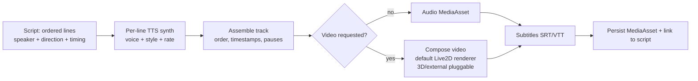
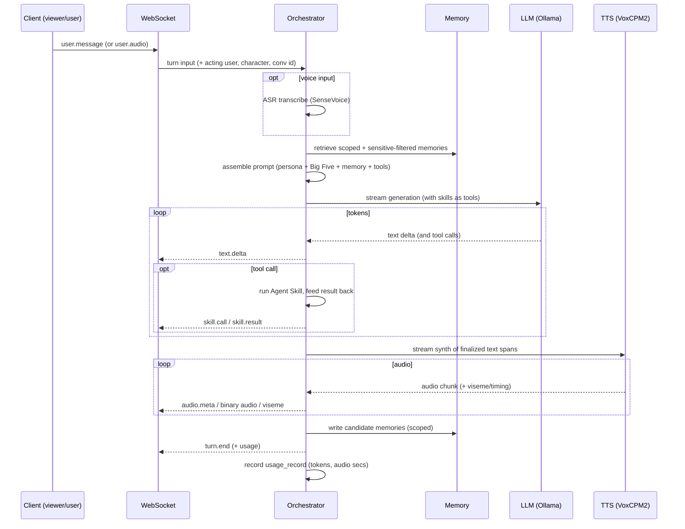
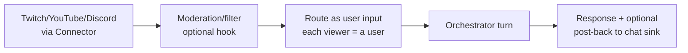

# 10 · Feature — Realtime Interaction & Media Generation

| | |
|---|---|
| **Document** | Feature Spec — Realtime Interaction & Media Generation |
| **Doc ID** | NF-10 |
| **Version** | 0.1 (Draft) |
| **Last updated** | 2026-05-30 |
| **Related** | [03 Architecture](03-system-architecture.md), [05 API](05-api-specification.md), [06 Modules](06-module-and-extension-system.md), [07 Scripts](07-feature-script-management.md), [08 Characters](08-feature-character-management.md), [09 Privacy](09-feature-multiuser-memory-and-privacy.md) |
| **Traces** | FR-RT-1 … FR-RT-8, FR-SM-7, FR-MOD-2/5, NFR-PERF-1/3 |

---

## 1. Overview

NagiFlow produces character output in **two modes** that share the same character, voice, and personality stack:

| Mode | Trigger | Latency profile | Output |
|---|---|---|---|
| **A — Media generation (offline/batch)** | Render a **script** | Throughput-oriented; runs as a job | A `MediaAsset` (audio, optional video) + subtitles |
| **B — Realtime interaction (live)** | A **conversation** over WebSocket | Latency-oriented; streaming | Streamed text + audio + viseme/timing events, turn by turn |

Mode A is "make a finished clip from a written script." Mode B is "the character talks live with viewers/users." Both call the same providers ([06](06-module-and-extension-system.md)); they differ in scheduling (batch job vs. streaming turn) and in latency targets.

---

## 2. Shared foundations

- **Providers** — LLM (default Ollama), TTS (default VoxCPM2, 48 kHz), ASR (default SenseVoice for inbound voice). All pluggable ([06 §5.1](06-module-and-extension-system.md), FR-MOD-5).
- **Character context** — persona + Big Five mapping ([08 §3](08-feature-character-management.md)) + scoped memory retrieval ([09 §4](09-feature-multiuser-memory-and-privacy.md)).
- **Audio format** — internal working audio is PCM/WAV at the provider's native rate (48 kHz for VoxCPM2); assembly/transcode via ffmpeg.
- **Avatar/video** — NagiFlow ships a **default Live2D renderer** behind an `AvatarRenderProvider` capability ([06 §5.1](06-module-and-extension-system.md)): the core emits **viseme/timing/expression events**, and the renderer drives a character's **Live2D model** to produce video (Mode A) or a live animated avatar (Mode B). The renderer is **pluggable** — **3D-model renderers** and **external engines** (OBS, VTube Studio) plug in through the same capability and via Connectors (§5, §7). Heavy 3D rendering is therefore an extension, not a core dependency.

---

## 3. Mode A — Media generation from scripts

Rendering turns a `Script` ([07](07-feature-script-management.md)) into finished media. It is a **job** (cancellable, progress-reported — [04 §6](04-data-model-and-storage.md), [05 §9](05-api-specification.md)) so long renders never block the UI (NFR-PERF-3).

### 3.1 Stages

1. **Per-line synthesis** — for each line, synthesize with the speaker's **active voice** and the line's `style` / `speech_rate` / `reference_audio` ([07 §2.2](07-feature-script-management.md)). Lines are independent → synthesis can be parallelized within resource limits.
2. **Assembly** — concatenate in `order_index`, honoring `start_ms`/`end_ms` where present and inserting `pause_after_ms` silences; normalize levels. If lines lacked timing, derive it from synthesized durations and **write back** so the timeline view becomes usable (FR-SM-7).
3. **Subtitles** — emit **SRT/VTT** from line text + timing (FR-RT-5, FR-SM-9).
4. **Video (optional)** — if requested, compose a video track. By **default** this uses the built-in **Live2D renderer**: the character's **Live2D model** is animated from the turn's viseme/timing/expression stream and rendered to frames, then muxed with the assembled audio via ffmpeg. A **3D-model renderer** or an **external engine** can be selected instead via the `AvatarRenderProvider` capability (§5). If a character has no avatar model, NagiFlow falls back to a static/portrait visual.
5. **Persist** — store output under `media/<id>/` and record a `MediaAsset` linked to the script, with format/duration metadata.

### 3.2 Controls & outputs

- **Selectable scope** — render the whole script or a line range; re-render a single line.
- **Formats** — audio (`wav`/`mp3`/`flac`), optional video container, sidecar subtitles.
- **Determinism** — same script + same voice version ⇒ reproducible audio (subject to provider determinism), aiding iteration.

---

## 4. Mode B — Realtime conversation pipeline

A live turn runs over the WebSocket protocol defined in [05 §8](05-api-specification.md). The **Dialogue Orchestrator** is the brain ([03 §5](03-system-architecture.md)).

### 4.1 Turn steps

1. **Resolve context** — identify acting user, character, conversation; load conversation state.
2. **Input** — text input is used directly; **voice input** is transcribed via ASR first (FR-RT-2).
3. **Memory retrieval** — scoped + sensitive-mode-filtered ([09 §5](09-feature-multiuser-memory-and-privacy.md)).
4. **Prompt assembly** — persona + Big Five directives/params + retrieved memories + enabled Agent Skills as tools ([06 §6](06-module-and-extension-system.md)).
5. **LLM streaming** — tokens stream out as `text.delta`; tool/skill calls are executed mid-stream and results fed back (FR-RT-1, FR-MOD-1).
6. **TTS streaming** — finalized text spans are streamed to TTS; **audio chunks** stream to the client as they're produced, with **viseme/timing** events for lip-sync (FR-RT-3/4). Low-latency streaming keeps perceived latency down (NFR-PERF-1).
7. **Memory write** — candidate memories extracted and stored with scope/importance ([09 §4.3](09-feature-multiuser-memory-and-privacy.md)).
8. **Persist & account** — append messages; write a `usage_record` (tokens, audio seconds, est. cost — [11 §3](11-feature-observability.md)).

### 4.2 Barge-in & interruption (FR-RT-6)

A `control.interrupt` from the client (or a higher-priority input) **cancels** in-flight generation and synthesis for the current turn: streaming stops promptly, partial audio is truncated, and the orchestrator is ready for the next input. Essential for natural live interaction.

### 4.3 Latency budget (target, not contractual)

| Segment | Target |
|---|---|
| Input received → memory+prompt ready | tens of ms (local DB/vector) |
| → first LLM token | model/hardware-dependent |
| First token → first audio chunk | low hundreds of ms (streaming TTS) |
| Steady-state | audio keeps pace with speech in real time (RTF < 1 on adequate hardware) |

Targets degrade gracefully on weaker hardware; NagiFlow surfaces latency in observability ([11 §2](11-feature-observability.md)).

### 4.4 Reconnection & resilience (FR-RT-7)

- Heartbeats (`control.ping`) detect dead sockets; clients reconnect and resume the conversation by id (state is server-side).
- A provider error mid-turn ends the turn with a typed `error` event; the conversation remains usable for the next turn (NFR-REL-2).

---

## 5. Avatar rendering (default Live2D), viseme & timing

- The core computes/forwards **viseme** (mouth-shape), **timing**, and lightweight **expression** events alongside audio (FR-RT-4). These are renderer-agnostic.
- **Default renderer — Live2D.** NagiFlow ships an official **Live2D `AvatarRenderProvider`** ([06 §5.1, §12](06-module-and-extension-system.md)) that animates a character's **Live2D model** from those events to produce video (Mode A) or a live animated avatar surface (Mode B). This is the out-of-the-box path: a character with a Live2D model needs no external software to appear on screen.
- **Pluggable — 3D and external engines.** The same `AvatarRenderProvider` capability accepts alternative renderers: a **3D-model renderer** (e.g. glTF/VRM-class, as a module) for spatial/3D avatars, or a thin adapter that forwards events to an **external engine** (OBS, VTube Studio) via a **Connector** ([06 §7](06-module-and-extension-system.md), FR-RT-8). NagiFlow emits the same visemes/timing/expression regardless of renderer, so characters are portable across them.
- **Selection & fallback** — the active renderer is chosen per character/conversation by configuration; if a character has no avatar model, NagiFlow falls back to a static/portrait visual (Mode A) or audio-only (Mode B).

---

## 6. Live-chat ingestion (streaming sources)

To VTube against a real audience, NagiFlow ingests platform chat through **Connectors** (FR-RT-6, FR-MOD-2):

- Incoming messages become **turn inputs**; an optional moderation hook can filter/transform first.
- **Each viewer is a distinct (usually guest) user.** Therefore **sensitive mode defaults ON** for public streaming so the character never reveals one viewer's info to another ([09 §5.4](09-feature-multiuser-memory-and-privacy.md)) — a hard privacy requirement for this mode.
- Sinks let the character (or a skill) post back to chat or trigger scene changes via Connector actions.

---

## 7. Fallbacks & degradation

| Condition | Behavior |
|---|---|
| No GPU / limited hardware | Smaller local models; non-streaming TTS if the provider lacks streaming; longer latency, clearly indicated. |
| TTS lacks streaming | Synthesize per utterance then play; UI shows "buffering". |
| ASR module absent | Voice input disabled; text input still works. |
| No avatar model / renderer disabled | Default **Live2D** renderer used when a model is present; otherwise stills for batch video, audio-only live. 3D/external renderers used if selected. |
| Provider outage mid-turn | Typed error event; turn ends; conversation continues. |

Graceful degradation across hardware tiers supports the local-first, broad-portability goals (NFR-PORT-*).

---

## 8. Permissions

- **Live chat** with a **guest-visible** character is available to guests ([09 §3](09-feature-multiuser-memory-and-privacy.md)); chatting with non-visible characters and all of Mode A (media generation) require an authenticated user.
- Renders and live turns are attributed to the requesting user in usage accounting ([11 §3](11-feature-observability.md)).
- Configuring live-chat Connectors (credentials) is a user/admin action; NagiFlow never supplies third-party credentials itself ([09 §6](09-feature-multiuser-memory-and-privacy.md)).

---

## 9. Requirements coverage

| Requirement | Where addressed |
|---|---|
| FR-RT-1 (streaming LLM turn) | §4 |
| FR-RT-2 (voice input via ASR) | §4.1 |
| FR-RT-3 (streaming TTS audio) | §4.1, §4.3 |
| FR-RT-4 (viseme/timing for lip-sync) | §4.1, §5 |
| FR-RT-5 (subtitles on render) | §3.1 |
| FR-RT-6 (barge-in + live-chat ingestion) | §4.2, §6 |
| FR-RT-7 (reconnection/resilience) | §4.4 |
| FR-RT-8 (default Live2D avatar render; 3D & external engines pluggable) | §5 |
| FR-SM-7 (script → media) | §3 |
| FR-MOD-2 (connectors as event sources/sinks) | §6 |
| FR-MOD-5 (pluggable LLM/TTS/ASR) | §2 |
| NFR-PERF-1 (low live latency) | §4.1, §4.3 |
| NFR-PERF-3 (non-blocking batch render) | §3 |
