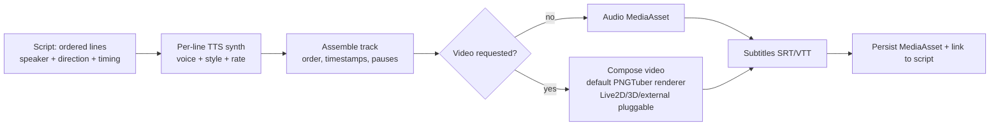
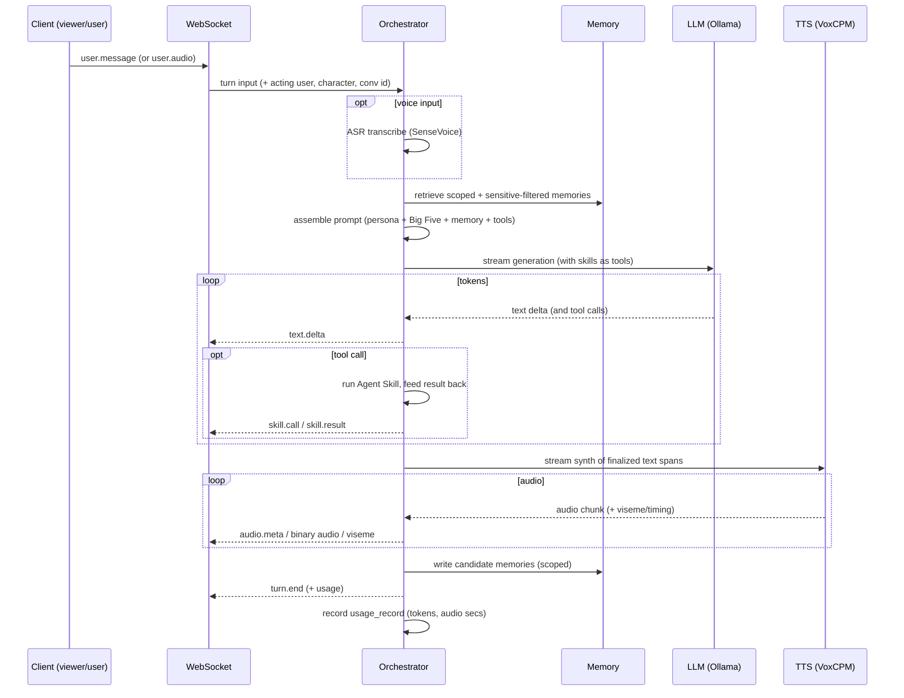
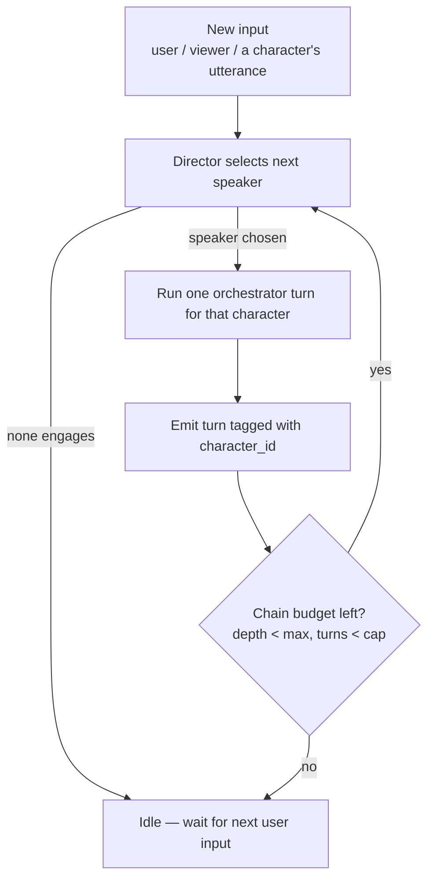
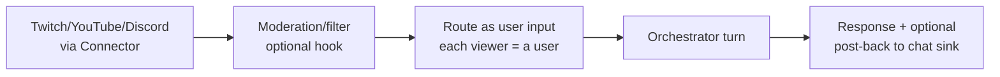

# 11 · Feature — Realtime Interaction & Media Generation

| | |
|---|---|
| **Document** | Feature Spec — Realtime Interaction & Media Generation |
| **Doc ID** | NF-11 |
| **Version** | 0.1 (Draft) |
| **Last updated** | 2026-05-30 |
| **Related** | [03 Architecture](03-system-architecture.md), [05 API](05-api-specification.md), [06 Modules](06-module-and-extension-system.md), [07 Scripts](07-feature-script-management.md), [08 Characters](08-feature-character-management.md), [09 Privacy](09-feature-multiuser-memory-and-privacy.md) |
| **Traces** | FR-RT-1 … FR-RT-11, FR-SM-8/9, FR-MOD-3/5, NFR-PERF-1/3 |

---

## 1. Overview

NagiFlow produces character output in **two modes** that share the same character, voice, and personality stack:

| Mode | Trigger | Latency profile | Output |
|---|---|---|---|
| **A — Media generation (offline/batch)** | Render a **script** | Throughput-oriented; runs as a job | A `MediaAsset` (audio, optional video) + subtitles |
| **B — Realtime interaction (live)** | A **conversation** over WebSocket | Latency-oriented; streaming | Streamed text + audio + viseme/timing events, turn by turn |

Mode A is "make a finished clip from a written script." Mode B is "the character talks live with viewers/users." Both call the same providers ([06](06-module-and-extension-system.md)); they differ in scheduling (batch job vs. streaming turn) and in latency targets.

---

## 2. Shared foundations

- **Providers** — LLM (default Ollama), TTS (default VoxCPM, 48 kHz), ASR (default SenseVoice for inbound voice). All pluggable ([06 §5.1](06-module-and-extension-system.md), FR-MOD-5).
- **Character context** — persona + Big Five mapping ([08 §3](08-feature-character-management.md)) + scoped memory retrieval ([09 §4](09-feature-multiuser-memory-and-privacy.md)).
- **Audio format** — internal working audio is PCM/WAV at the provider's native rate (48 kHz for VoxCPM); assembly/transcode via ffmpeg.
- **Avatar/video** — NagiFlow ships a **default PNGTuber renderer** behind an `AvatarRenderProvider` capability ([06 §5.1](06-module-and-extension-system.md)): the core emits **amplitude/viseme/timing/expression events**, and the renderer drives a character's **layered-PNG sprite set** to produce video (Mode A) or a live animated avatar (Mode B). The renderer is **pluggable** — **Live2D**, **3D-model renderers**, and **external engines** (OBS, VTube Studio) plug in through the same capability and via Connectors (§5, §7). Heavier rigged 2D/3D rendering is therefore an extension, not a core dependency.

---

## 3. Mode A — Media generation from scripts

Rendering turns a `Script` ([07](07-feature-script-management.md)) into finished media. It is a **job** (cancellable, progress-reported — [04 §6](04-data-model-and-storage.md), [05 §9](05-api-specification.md)) so long renders never block the UI (NFR-PERF-3).



### 3.1 Stages

1. **Per-line synthesis** — for each line, synthesize with the speaker's **active voice** and the line's `style` / `speech_rate` / `reference_audio` ([07 §2.2](07-feature-script-management.md)). Lines are independent → synthesis can be parallelized within resource limits.
2. **Assembly** — concatenate in `order_index`, honoring `start_ms`/`end_ms` where present and inserting `pause_after_ms` silences; normalize levels. If lines lacked timing, derive it from synthesized durations and **write back** so the timeline view becomes usable (FR-SM-8).
3. **Subtitles** — emit **SRT/VTT** from line text + timing (FR-RT-5, FR-SM-9).
4. **Video (optional)** — if requested, compose a video track. By **default** this uses the built-in **PNGTuber renderer**: the character's **sprite set** is animated from the turn's amplitude/viseme/timing/expression stream and rendered to frames, then muxed with the assembled audio via ffmpeg. A **Live2D**, **3D-model**, or **external-engine** renderer can be selected instead via the `AvatarRenderProvider` capability (§5). If a character has no avatar bundle, NagiFlow falls back to a static/portrait visual.
5. **Persist** — store output under `media/<id>/` and record a `MediaAsset` linked to the script, with format/duration metadata.

### 3.2 Controls & outputs

- **Selectable scope** — render the whole script or a line range; re-render a single line.
- **Formats** — audio (`wav`/`mp3`/`flac`), optional video container, sidecar subtitles.
- **Determinism** — same script + same voice version ⇒ reproducible audio (subject to provider determinism), aiding iteration.

---

## 4. Mode B — Realtime conversation pipeline

A live turn runs over the WebSocket protocol defined in [05 §8](05-api-specification.md). The **Dialogue Orchestrator** is the brain ([03 §5](03-system-architecture.md)).



### 4.1 Turn steps

1. **Resolve context** — identify acting user, character, conversation; load conversation state.
2. **Input** — text input is used directly; **voice input** is transcribed via ASR first (FR-RT-7).
3. **Memory retrieval** — scoped + sensitive-mode-filtered ([09 §5](09-feature-multiuser-memory-and-privacy.md)).
4. **Prompt assembly** — persona + Big Five directives/params + retrieved memories + enabled Agent Skills as tools ([06 §6](06-module-and-extension-system.md)).
5. **LLM streaming** — tokens stream out as `text.delta`; tool/skill calls are executed mid-stream and results fed back (FR-RT-2, FR-MOD-2).
6. **TTS streaming** — finalized text spans are streamed to TTS; **audio chunks** stream to the client as they're produced, with **amplitude/viseme/timing** events for lip-sync (FR-RT-2/3). Low-latency streaming keeps perceived latency down (NFR-PERF-1).
7. **Memory write** — candidate memories extracted and stored with scope/importance ([09 §4.3](09-feature-multiuser-memory-and-privacy.md)).
8. **Persist & account** — append messages; write a `usage_record` (tokens, audio seconds, est. cost — [12 §3](12-feature-observability.md)).

### 4.2 Barge-in & interruption (FR-RT-8)

A `control.interrupt` from the client (or a higher-priority input) **cancels** in-flight generation and synthesis for the current turn: streaming stops promptly, partial audio is truncated, and the orchestrator is ready for the next input. Essential for natural live interaction.

### 4.3 Latency budget (target, not contractual)

| Segment | Target |
|---|---|
| Input received → memory+prompt ready | tens of ms (local DB/vector) |
| → first LLM token | model/hardware-dependent |
| First token → first audio chunk | low hundreds of ms (streaming TTS) |
| Steady-state | audio keeps pace with speech in real time (RTF < 1 on adequate hardware) |

Targets degrade gracefully on weaker hardware; NagiFlow surfaces latency in observability ([12 §2](12-feature-observability.md)).

### 4.4 Reconnection & resilience (FR-RT-8)

- Heartbeats (`control.ping`) detect dead sockets; clients reconnect and resume the conversation by id (state is server-side).
- A provider error mid-turn ends the turn with a typed `error` event; the conversation remains usable for the next turn (NFR-REL-2).

### 4.5 Multi-character live sessions & the turn director (FR-RT-10/11)

A **live** session may include **more than one character** — a *cast* selected when the session starts. Cast members respond to the user/viewers **and** to one another, so a session can feel like a hosted show rather than a 1:1 chat. Without coordination this degrades fast: every character answering every message produces **overlapping audio**, and two characters replying to each other produces an **infinite A↔B loop**. The **TurnDirector** prevents both.



**Director rules (all configurable via `conversation.director_config` — [04 §5.5](04-data-model-and-storage.md)):**

1. **One speaker at a time.** Turns are serialized through a queue; no two characters synthesize simultaneously. Every emitted event carries the speaker's `character_id` ([05 §5](05-api-specification.md)).
2. **User message → a single responder.** The director picks **one** character to answer — by explicit **@-mention/addressing**, else a relevance score, else round-robin — not all of them.
3. **Bounded character→character chains.** A character utterance may trigger at most `max_chain_depth` follow-up character turns (default 2) before control must return to the user. A per-input cap `max_character_turns_per_input` bounds total spawned turns.
4. **No immediate ping-pong.** A character cannot reply to the character that just addressed it beyond the depth budget; a short `cooldown` prevents A↔B oscillation.
5. **Engage-or-pass.** For each candidate follow-up the director asks for a cheap **engage/pass** decision (a lightweight scoring or a "should I respond?" check); characters with nothing to add **pass**, ending the chain early and naturally.
6. **Interrupt-aware.** A new user/viewer message (or `control.interrupt`) preempts an in-progress character→character chain — the audience always takes priority.

**Memory.** When character A responds to character B, the salient content is written as a `character_interaction` memory on A keyed to counterpart B (and vice-versa) — this is the origin of that scope ([09 §4.1](09-feature-multiuser-memory-and-privacy.md)). **Sensitive mode** still filters user-referencing content in these exchanges.

Single-character sessions are simply the degenerate case (cast of one): the director always selects that character and never starts a chain.

**Responder selection (illustrative default).** For an input not explicitly addressed, the director scores each eligible cast member and picks the max above a threshold, else falls back to round-robin:

```
score(c) = w_addr · addressed(c)        # 1 if @-mention / name match, else 0
         + w_rel  · relevance(c, input) # cosine(persona+recent-memory embedding, input embedding)
         + w_fair · fairness(c)          # ↑ for members who spoke least recently (anti-hogging)
         − w_cool · cooldown(c)          # ↓ if c just spoke / would ping-pong
# defaults: w_addr 1.0 (hard win), w_rel 0.5, w_fair 0.2, w_cool 0.3; engage threshold 0.35
```

Default `director_config`: `max_chain_depth = 2`, `max_character_turns_per_input = 3`, `cooldown_turns = 1`, `selection = "addressed→relevance→round_robin"`. Weights/thresholds are **tunable defaults**, surfaced in the live console ([13 §7.6](13-ui-ux-design.md)); the relevance term reuses the same embedding provider as memory ([04 §6](04-data-model-and-storage.md)). The cheap **engage/pass** gate (rule 5) is a final yes/no so a high-scoring-but-nothing-to-add character still declines.

### 4.6 Synchronous (non-streaming) turn — the P1 slice

Before the streaming pipeline (§4.1) lands in P5, P1 ships a **synchronous** form of the same turn over plain REST, so a character can be *heard* without the WebSocket machinery. `POST /conversations/{id}/messages` ([05 §4.3](05-api-specification.md)) runs the shared orchestration ([03 §4](03-system-architecture.md)) — persona + Big Five + the turn's affect directive ([10 §7.1](10-feature-emotion-and-affect.md)) → LLM reply text — and then, in the same request:

1. **Resolve voice.** The character's **default voice model** ([08 §4](08-feature-character-management.md)) is resolved to a `VoiceRef`; if none exists the provider's design default is used. The synthesis **style/rate** merges the character's `default_style` with the turn's affect voice-style tag + speech-rate nudge ([10 §7.2](10-feature-emotion-and-affect.md)), clamped to the personality rate band.
2. **Synthesize.** The full reply text is rendered to a complete WAV by the active `TTSProvider` ([06 §5.1](06-module-and-extension-system.md)) — no streaming, no visemes. The offline `silent` default emits a short tone so the path is demonstrable without VoxCPM.
3. **Persist.** The audio is stored under `media/<id>/` and recorded as an audio **`MediaAsset`** (`source_type = message`, [04 §5.6](04-data-model-and-storage.md)); `message.media_asset_id` links it.
4. **Return.** The reply carries `media_asset_id`; the client fetches the bytes from `GET /media/{id}:download` ([05 §4.6](05-api-specification.md)) and plays them.

Synthesis is **best-effort and non-blocking-of-text**: a TTS failure (provider down, no voice) is logged and the turn still returns its text reply with `media_asset_id = null`. It can be disabled wholesale via `synthesize_replies = false` (config). **Streaming audio, amplitude/viseme/timing events, and barge-in (§4.1–4.2, §5) remain P5** — this slice produces one finished audio asset per turn, not a live stream.

---

## 5. Avatar rendering (default PNGTuber), viseme & timing

### 5.1 Where avatar-driving events come from (the pipeline)

The core emits **renderer-agnostic** avatar events (FR-RT-3) — `amplitude`, `viseme` (mouth-shape), `timing`, and lightweight `expression` — derived as follows, in falling order of fidelity:

1. **Phoneme timing from TTS** — if the TTS provider advertises phoneme/word timestamps, the core maps phonemes → visemes via a small **phoneme→viseme table** and forwards them with timing. Best lip-sync.
2. **Forced alignment (optional)** — if only text + audio are available, an optional aligner module produces phoneme timing; same mapping then applies.
3. **Amplitude envelope (always available, PNGTuber default)** — the core computes an **RMS amplitude envelope** from the audio stream and emits a coarse mouth-open level (closed / half / open). This is the classic PNGTuber drive and needs no phoneme data — so lip-flap works with *any* TTS provider.

`expression` events come from the turn's emotion/style hints (persona + Big Five + per-line style — [08 §3](08-feature-character-management.md)); `blink`/idle motion is generated by the renderer itself.

**Phoneme → viseme groups (default table).** When phoneme timing exists, phonemes collapse into a small, renderer-agnostic viseme set (Preston-Blair-style). PNGTuber maps each viseme to a mouth sprite; richer renderers map to their own morphs. Illustrative default:

| Viseme | Example phonemes | PNGTuber mouth (default) |
|---|---|---|
| `sil` | (silence) | closed |
| `PP` | p, b, m | closed/pressed |
| `FF` | f, v | teeth-on-lip |
| `TH` | th, dh | tongue-tip |
| `DD` | t, d, n, l | half, tongue |
| `kk` | k, g, ŋ | half |
| `CH` | ʧ, ʤ, ʃ, ʒ | rounded-small |
| `SS` | s, z | narrow |
| `nn` | n, ŋ | half |
| `RR` | r, ɹ | rounded-mid |
| `aa` | ɑ, a | open-wide |
| `E` | ɛ, e | mid-open |
| `I` | i, ɪ | wide-narrow |
| `O` | ɔ, o | rounded-open |
| `U` | u, ʊ | rounded-tight |

Renderers that only have **3 mouth states** (closed / half / open — the minimal PNGTuber kit) collapse the right-hand column to those three; the table degrades gracefully. When no phoneme timing is available, the amplitude envelope (path 3) drives the same 3-state mouth directly.

### 5.2 Renderers

- **Default — PNGTuber.** NagiFlow ships an official **PNGTuber `AvatarRenderProvider`** (`kind="pngtuber"`, [06 §5.1, §12](06-module-and-extension-system.md)) that animates a character's **layered-PNG sprite set** (mouth states + expression layers + optional blink/sway) from the events above, producing video (Mode A) or a live avatar surface (Mode B). Fully MIT, no proprietary runtime, no GPU — the out-of-the-box path: a character with a sprite set needs no external software to appear on screen.
- **Pluggable — Live2D, 3D, external engines.** The same capability accepts alternative renderers: a **Live2D** renderer (`kind="live2d"`, optional module; ships separately due to Cubism SDK licensing), a **3D-model renderer** (glTF/VRM-class), or a thin adapter forwarding events to an **external engine** (OBS, VTube Studio) via a **Connector** ([06 §7](06-module-and-extension-system.md), FR-RT-9). NagiFlow emits the same events regardless of renderer, so characters are portable across them.
- **Selection & fallback** — the active renderer is chosen per character/conversation by configuration; if a character has no avatar bundle, NagiFlow falls back to a static/portrait visual (Mode A) or audio-only (Mode B).

### 5.3 PNGTuber sprite-set descriptor (`pngtuber.json`)

A PNGTuber avatar bundle is a directory (the `avatar_bundle_key` target — [04 §5.2](04-data-model-and-storage.md)) containing PNG layers + a `pngtuber.json` descriptor. The descriptor maps the renderer-agnostic events (§5.1) to image layers and defines idle behavior. It is the **portable, MIT-clean default format**; all art is user-supplied.

```jsonc
{
  "format": "pngtuber/v1",
  "name": "Nagi default",
  "canvas": { "width": 1080, "height": 1080, "fps": 30 },
  "anchor": { "x": 540, "y": 720 },          // pivot for sway/bob, in canvas px
  "layers": [                                  // drawn back→front
    { "id": "body",      "image": "body.png" },
    { "id": "eyes_open", "image": "eyes_open.png",   "group": "eyes", "default": true },
    { "id": "eyes_blink","image": "eyes_blink.png",  "group": "eyes" },
    { "id": "mouth",     "image": null, "group": "mouth", "driven_by": "viseme" }
  ],
  "mouth": {                                   // viseme/level → sprite
    "mode": "states",                          // "states" (3-state) | "visemes" (full table §5.1)
    "states": {
      "closed": "mouth_closed.png",
      "half":   "mouth_half.png",
      "open":   "mouth_open.png"
    },
    "visemes": {                               // optional, used when mode="visemes"
      "aa": "mouth_aa.png", "O": "mouth_o.png", "E": "mouth_e.png", "PP": "mouth_closed.png"
      /* …any subset; unmapped visemes fall back to nearest state… */
    },
    "amplitude_thresholds": { "half": 0.15, "open": 0.45 }  // RMS 0–1 cutoffs for state mode
  },
  "expressions": {                             // expression event → layer overrides
    "neutral": {},
    "happy":   { "eyes": "eyes_open", "overlay": "blush.png" },
    "sad":     { "eyes": "eyes_sad" },
    "surprised": { "eyes": "eyes_wide", "mouth_bias": "open" }
  },
  "idle": {
    "blink": { "every_ms": [2000, 6000], "hold_ms": 90 },   // randomized interval range
    "sway":  { "amplitude_px": 6, "period_ms": 3200 },       // gentle bob; disabled if reduced-motion
    "talk_bounce": { "amplitude_px": 3 }                     // tiny bounce while speaking
  }
}
```

Rules: every `layers[].group` has exactly one active member at a time; `default: true` marks the resting member. The renderer **validates** the descriptor on load (missing images, unknown groups) and reports a clear error; a malformed bundle falls back to the static portrait (§5.2). `idle.sway`/`talk_bounce` honor `prefers-reduced-motion` ([13 §10](13-ui-ux-design.md)). Fields a future renderer doesn't understand are ignored — **forward-compatible extension space**.

---

## 6. Live-chat ingestion (streaming sources)

To VTube against a real audience, NagiFlow ingests platform chat through **Connectors** (FR-RT-4, FR-MOD-3):



- Incoming messages become **turn inputs**; an optional moderation hook can filter/transform first.
- **Each viewer is a distinct (usually guest) user.** Therefore **sensitive mode defaults ON** for public streaming so the character never reveals one viewer's info to another ([09 §5.4](09-feature-multiuser-memory-and-privacy.md)) — a hard privacy requirement for this mode.
- Sinks let the character (or a skill) post back to chat or trigger scene changes via Connector actions.

---

## 7. Fallbacks & degradation

| Condition | Behavior |
|---|---|
| No GPU / limited hardware | Smaller local models; non-streaming TTS if the provider lacks streaming; longer latency, clearly indicated. |
| TTS lacks streaming | Synthesize per utterance then play; UI shows "buffering". |
| ASR module absent | Voice input disabled; text input still works. |
| No avatar bundle / renderer disabled | Default **PNGTuber** renderer used when a sprite set is present; otherwise stills for batch video, audio-only live. Live2D/3D/external renderers used if selected. |
| Provider outage mid-turn | Typed error event; turn ends; conversation continues. |

Graceful degradation across hardware tiers supports the local-first, broad-portability goals (NFR-PORT-*).

---

## 8. Permissions

- **Live chat** with a **guest-visible** character is available to guests ([09 §3](09-feature-multiuser-memory-and-privacy.md)); chatting with non-visible characters and all of Mode A (media generation) require an authenticated user.
- Renders and live turns are attributed to the requesting user in usage accounting ([12 §3](12-feature-observability.md)).
- Configuring live-chat Connectors (credentials) is a user/admin action; NagiFlow never supplies third-party credentials itself ([09 §6](09-feature-multiuser-memory-and-privacy.md)).

---

## 9. Requirements coverage

| Requirement | Where addressed |
|---|---|
| FR-RT-1 (conversation: text + voice) | §4 |
| FR-RT-2 (real-time WebSocket streaming) | §4, §4.1 |
| FR-RT-3 (avatar-driving events: amplitude/viseme/timing/expression) | §4.1, §5 |
| FR-RT-4 (live-chat ingestion via connectors) | §6 |
| FR-RT-5 (offline/batch media from scripts) | §3 |
| FR-RT-6 (media stored as assets, downloadable, tracked) | §3.1, §3.2 |
| FR-RT-7 (voice input via ASR) | §4.1 |
| FR-RT-8 (barge-in + reconnection) | §4.2, §4.4 |
| FR-RT-9 (built-in renderer; default PNGTuber; Live2D/3D/external pluggable) | §5 |
| FR-RT-10 (multi-character cast) | §4.5 |
| FR-RT-11 (turn-arbitration director) | §4.5 |
| FR-SM-8 (script → media) | §3 |
| FR-SM-9 (subtitles on render) | §3.1 |
| FR-MOD-3 (connectors as event sources/sinks) | §6 |
| FR-MOD-5 (pluggable LLM/TTS/ASR) | §2 |
| NFR-PERF-1 (low live latency) | §4.1, §4.3 |
| NFR-PERF-3 (non-blocking batch render) | §3 |
