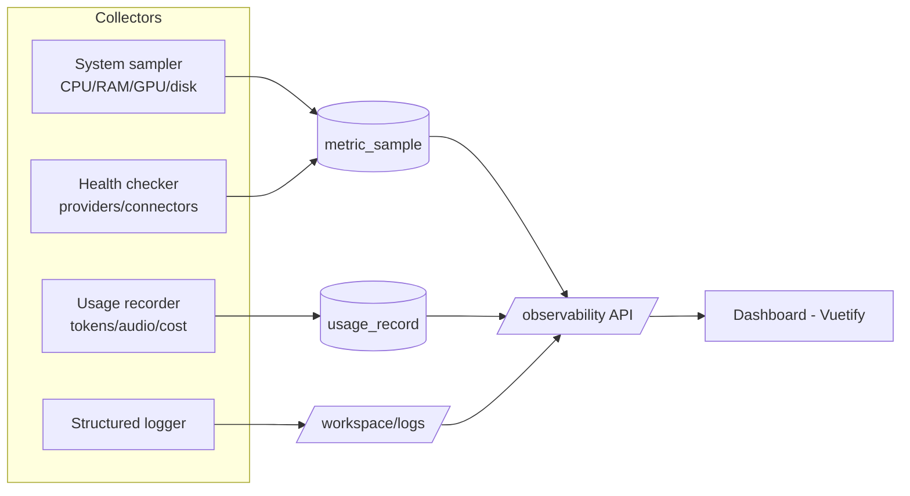

# 12 · Feature — Observability (Monitoring & Logging)

| | |
|---|---|
| **Document** | Feature Spec — Observability |
| **Doc ID** | NF-12 |
| **Version** | 0.1 (Draft) |
| **Last updated** | 2026-05-30 |
| **Related** | [03 Architecture](03-system-architecture.md), [04 Data](04-data-model-and-storage.md), [05 API](05-api-specification.md), [06 Modules](06-module-and-extension-system.md), [11 Realtime](11-feature-realtime-and-media-generation.md) |
| **Traces** | FR-OBS-1 … FR-OBS-6, NFR-OBS-1, NFR-PRIV-4, NFR-SEC-2 |

---

## 1. Overview

NagiFlow gives the operator a clear, **local** view of three things (FR-OBS-1/2/3):

1. **System resources** — is the machine coping (CPU, RAM, GPU, disk)?
2. **External service health** — are Ollama, the TTS/ASR engines, storage, and connectors reachable and responsive?
3. **Token & cost accounting** — how much is being spent, by whom, on which character/conversation?

Plus **structured logging** for diagnosis. Everything is local by default; nothing is shipped to a third party unless an operator configures it (NFR-PRIV-4). The dashboard is a user/admin feature (not exposed to guests — [09 §3](09-feature-multiuser-memory-and-privacy.md)).

---

## 2. System resource & service health

### 2.1 Local system resources (FR-OBS-1)

| Metric | Source (illustrative) |
|---|---|
| CPU utilization, load | `psutil` |
| RAM used/available | `psutil` |
| **GPU** utilization, VRAM, temperature | `pynvml` / `nvidia-smi` where available (degrades gracefully if absent) |
| Disk free / workspace size | `psutil` / filesystem |
| Process info (NagiFlow backend, child procs) | `psutil` |

Sampled on an interval, exposed live (poll or WS push) and retained briefly as `metric_sample` rows for short-term trends ([04 §5](04-data-model-and-storage.md)). GPU panels appear only when a GPU is detected.

### 2.2 External service health (FR-OBS-2)

The health checker probes each configured provider/connector and reports status + latency:

| Target | Check |
|---|---|
| **Ollama (LLM)** | Reachability; **loaded/available models**; sample latency. |
| **TTS (VoxCPM)** | Reachable/ready; advertised features; sample latency. |
| **ASR (SenseVoice)** | Reachable/ready. |
| **Vector store / storage** | Reachable; basic read. |
| **Connectors** | Connected/authorized state (no secrets shown). |

Each shows `up` / `degraded` / `down` with last-checked time and a short error if down. Because providers are modules, health surfaces uniformly via the capability layer ([06 §5](06-module-and-extension-system.md)).

---

## 3. Token & cost accounting (FR-OBS-3)

Every model/provider call writes a **`usage_record`** ([04 §5](04-data-model-and-storage.md)):

| Field | Meaning |
|---|---|
| `provider`, `model` | Who served it (e.g. `ollama` / model name; `voxcpm`). |
| `kind` | `llm` / `tts` / `asr` / `embedding`. |
| `prompt_tokens`, `completion_tokens` | LLM token counts. |
| `audio_seconds` | For TTS/ASR (token concept doesn't apply). |
| `est_cost` | Optional, when a price is configured (local Ollama ≈ 0). |
| `user_id`, `character_id`, `conversation_id` | Attribution. |
| `occurred_at`, `correlation_id` | Event time + trace linkage ([04 §5.8](04-data-model-and-storage.md)). |

### 3.1 Aggregation & reporting

- **Totals** — cumulative tokens (and est. cost) overall — directly satisfying "record total tokens spent" (FR-OBS-3).
- **Breakdowns** — per **user**, per **character**, per **conversation**, per **day**, per **provider/model**.
- **Export** — CSV/JSON for offline analysis (FR-OBS-3).
- Local Ollama/VoxCPM incur no API cost, so token counts here are primarily **capacity/throughput** signals; cost columns become meaningful when a paid external provider is plugged in.

### 3.2 Budgets & alerts (optional — FR-OBS-5)

Operators may set soft **budgets** (e.g. per day or per user) and get **alerts** (UI banner / log / optional connector notification) when thresholds are crossed. Off by default; purely advisory (does not hard-block generation unless an admin opts in).

---

## 4. Structured logging (FR-OBS-4)

- **Format** — structured (JSON-capable) log records with level, timestamp, component, message, and a **`correlation_id`** linking a request → its WS turn → its jobs → its usage records ([05 §1](05-api-specification.md)).
- **Levels** — standard `DEBUG`…`ERROR`; configurable per component.
- **Location** — `<workspace>/logs/` with rotation; the **one-click launcher multiplexes backend + frontend logs into a single terminal** ([14 §3](14-runtime-and-deployment.md)).
- **Tailing** — recent logs are viewable via API/UI (filter by level/component/correlation id) without opening files (FR-OBS-4).
- **Redaction (NFR-SEC-2, NFR-PRIV-4)** — secrets and sensitive payloads are redacted; module loggers are namespaced and pass through the same redaction ([06 §11](06-module-and-extension-system.md)). User message content is not logged at info level by default.

---

## 5. The system status bar

Observability is surfaced through an always-on **system status bar** pinned to the bottom of
every screen — not a separate page ([13 §5](13-ui-ux-design.md)). The bar shows compact
at-a-glance status; **clicking it expands a panel upward** with the detail. Values are pushed
live over the system-status WebSocket ([05 §5.1](05-api-specification.md)): the bar holds one
connection (reconnecting with backoff) rather than polling several REST endpoints on a timer.

**Collapsed bar (always visible):** LLM/TTS **health dots** + active provider/model · **CPU/RAM**
mini values · **token total**. A degraded/down provider tints the bar.

**Expanded panel:**

| Panel | Shows |
|---|---|
| **System** | CPU/RAM/GPU/disk values (§2.1); short trend later. GPU only when detected. |
| **Services** | Provider/connector health + latency (§2.2). |
| **Usage** | Token totals + breakdowns (per character / provider / day); budget status if enabled (§3). |
| **Logs** | Filterable recent log stream (§4) — later phase. |
| **Jobs** | Active/recent jobs (renders, imports, fine-tunes) with progress — later phase ([04 §6](04-data-model-and-storage.md)). |

UI extensions can contribute additional `dashboard.widget`s to the panel ([06 §8](06-module-and-extension-system.md)).

**Phasing:** P1 ships the bar with **System / Services / Usage** (the data already exists —
`/system/resources`, `/system/services`, `/usage:summary`). **Logs** and **Jobs** panels arrive
with their subsystems.

---

## 6. Privacy, scope & performance

- **Local-only by default** — metrics, usage, and logs stay in the workspace; no external telemetry unless explicitly configured (FR-OBS-6, NFR-PRIV-4).
- **Permission-gated** — observability is user/admin-only; guests have no access ([09 §3](09-feature-multiuser-memory-and-privacy.md)). Per-user cost visibility follows policy (a user sees their own; admins see all).
- **Low overhead (NFR-OBS-1)** — sampling intervals and short retention keep monitoring cheap; metric history is pruned so the DB stays small.
- **Auditability (NFR-SEC-2)** — security-relevant actions also flow to the audit log ([04 §3](04-data-model-and-storage.md)), distinct from operational logs.

---

## 7. Requirements coverage

| Requirement | Where addressed |
|---|---|
| FR-OBS-1 (local system resources) | §2.1, §5 |
| FR-OBS-2 (external service health) | §2.2, §5 |
| FR-OBS-3 (token totals/accounting) | §3 |
| FR-OBS-4 (structured logs view + redaction) | §4 |
| FR-OBS-5 (budgets/alerts) | §3.2 |
| FR-OBS-6 (local-only by default) | §1, §6 |
| NFR-OBS-1 (low overhead) | §6 |
| NFR-PRIV-4 (local-only) | §1, §6 |
| NFR-SEC-2 (redaction/audit) | §4, §6 |
