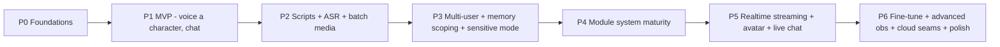

# 13 · Roadmap & Milestones

| | |
|---|---|
| **Document** | Roadmap & Milestones |
| **Doc ID** | NF-13 |
| **Version** | 0.1 (Draft) |
| **Last updated** | 2026-05-30 |
| **Related** | [01 Vision](01-vision-and-scope.md), [02 SRS](02-requirements-specification.md), and all feature docs (07–12) |
| **Traces** | Sequences delivery of FR-* / NFR-* across phases |

---

## 1. Approach

NagiFlow is built by a small team (initially solo), so the plan is **iterative and milestone-driven**: ship a thin vertical slice early, then widen. Each phase ends with concrete **exit criteria** and a runnable build. Scope is deliberately ordered so the **local-first core** and the **provider/module seams** exist before breadth is added — this avoids rework when external services are swapped in later.

Pre-1.0 the project uses **SemVer 0.x**: minor bumps may carry breaking changes, documented in a changelog; the **module API** is versioned separately so extension authors get stability signals ([06 §10](06-module-and-extension-system.md)).

---

## 2. Phases

### P0 — Foundations
**Goal:** the skeleton everything else hangs on.
- Repo scaffold; FastAPI backend + Vuetify SPA shell; brand theme.
- Config layering, **workspace** layout, **SQLite + ORM + Alembic** ([04](04-data-model-and-storage.md)).
- **Launcher MVP** (prereq checks, start both, single-terminal logs, clean shutdown — [12 §3](12-runtime-and-deployment.md)).
- **Provider/adapter interfaces** defined ([03 §6](03-system-architecture.md), [06 §5](06-module-and-extension-system.md)).

**Exit:** `nagiflow up` starts an empty-but-running app; migrations apply; provider interfaces compile with a stub provider.

### P1 — MVP (give a character a voice, and talk to it)
**Goal:** the smallest end-to-end that demonstrates the product.
- **Character management**: profile, **Big Five** + behavior mapping, **zero-shot voice** via **VoxCPM2** ([08 §3–4](08-feature-character-management.md)).
- **Single-user** local auth + **guest** session; basic chat with per-character **memory** (single user) via **Ollama** ([09](09-feature-multiuser-memory-and-privacy.md) subset).
- TTS playback of replies; **basic observability** (system + token totals) ([11](11-feature-observability.md) subset).
- Official **Ollama** and **VoxCPM2** provider modules ([06 §12](06-module-and-extension-system.md)).

**Exit:** create a character, set personality, give it a voice from a reference clip, hold a spoken text-chat; tokens are counted; runs on a typical dev machine.

### P2 — Scripts, ASR import & batch media
**Goal:** authoring and production.
- **Script management**: manual authoring, multi-speaker, per-line direction ([07 §3](07-feature-script-management.md)).
- **ASR import** (default **SenseVoice**): audio/video → timed draft → review → commit ([07 §4](07-feature-script-management.md)).
- **Batch media render**: script → assembled audio + **subtitles (SRT/VTT)** ([10 §3](10-feature-realtime-and-media-generation.md)).
- **Token/cost accounting** broadened (per character/conversation) ([11 §3](11-feature-observability.md)).
- **Default Live2D avatar renderer** for **batch video**: render a script to video by animating the character's Live2D model from emitted events ([10 §3/§5](10-feature-realtime-and-media-generation.md)).

**Exit:** import a recording into a script, correct it, render narrated audio with subtitles **and a Live2D video**; export script as JSON/SRT.

### P3 — Multi-user, memory scoping & privacy
**Goal:** safe many-user operation.
- **Multi-user / multi-character**; full **permission matrix** ([09 §3](09-feature-multiuser-memory-and-privacy.md)).
- **Memory scoping** (user_scoped / character_general / character_interaction) with namespace isolation ([09 §4](09-feature-multiuser-memory-and-privacy.md)).
- **Sensitive mode** (retrieval filter + prompt; optional output guard) ([09 §5](09-feature-multiuser-memory-and-privacy.md)).
- **Character export/import** (`.nagichar`) with privacy-safe defaults ([08 §6](08-feature-character-management.md)).
- User **data deletion** ([09 §6](09-feature-multiuser-memory-and-privacy.md)).

**Exit:** two users converse with the same character without cross-leak; sensitive mode verified to exclude other-user data at retrieval; export a character without shipping user memories.

### P4 — Module system maturity
**Goal:** real extensibility.
- **Agent Skills** (code + declarative Markdown), **Connectors**, **UI extensions**, **framework hooks** ([06 §6–9](06-module-and-extension-system.md)).
- Public **SDK** + sample modules; **permission model** enforced ([06 §11](06-module-and-extension-system.md)).
- Provider **capability flags** + graceful fallback across the app.

**Exit:** a third party builds and installs a skill + a connector from docs/SDK alone; permissions are honored; defaults still pass as ordinary modules.

### P5 — Realtime streaming, avatar & live chat
**Goal:** live VTubing.
- **WebSocket turn pipeline**: streaming LLM + **streaming TTS** + **viseme/timing** ([10 §4–5](10-feature-realtime-and-media-generation.md)).
- **Barge-in**, reconnection ([10 §4.2/4.4](10-feature-realtime-and-media-generation.md)).
- **Live-chat connectors** (Twitch/YouTube/Discord) routed as inputs with **sensitive mode default-on** ([10 §6](10-feature-realtime-and-media-generation.md)).
- **Live avatar via default Live2D renderer**: real-time Live2D animation driven by the streaming viseme/timing/expression events ([10 §5](10-feature-realtime-and-media-generation.md)).
- **Pluggable renderers**: **3D-model renderer** and **external-engine** adapters (OBS/VTube Studio) via the `AvatarRenderProvider` capability + connectors.

**Exit:** a live session where viewer chat drives the character, audio streams in near-real-time, the **default Live2D avatar** lip-syncs (with a 3D/external renderer selectable), and no viewer's info leaks to another.

### P6 — Fine-tune, advanced observability, cloud seams & polish
**Goal:** depth, scale-out seams, and release quality.
- **Voice fine-tune training** pipeline with versioning/rollback ([08 §4.1](08-feature-character-management.md)).
- **Advanced observability**: budgets/alerts, richer health/latency ([11 §3.2](11-feature-observability.md)).
- **Cloud/external seams**: storage and external DB adapters; optional vector backends ([03 §6](03-system-architecture.md), [04 §7](04-data-model-and-storage.md)).
- Packaging (pipx/Docker), docs, accessibility/i18n polish ([12 §7](12-runtime-and-deployment.md)).

**Exit:** train and activate a custom voice; set a token budget with alerts; point storage at an external backend via config; ship a packaged build.

---

## 3. Milestone summary

| Phase | Theme | Headline FR families | Exit criterion (short) |
|---|---|---|---|
| P0 | Foundations | FR-SYS-1/8/9 | `nagiflow up` runs an empty app |
| P1 | MVP | FR-CM-1/2/3/4, FR-MM-6, FR-OBS-1/3 | Voiced character you can chat with |
| P2 | Scripts/Media | FR-SM-1…9, FR-RT-5 | Import→correct→render with subtitles |
| P3 | Multi-user/Privacy | FR-MM-1…11, FR-CM-11/12 | Two users, no cross-leak; safe export |
| P4 | Modules | FR-MOD-1…11 | 3rd-party skill+connector from SDK |
| P5 | Realtime | FR-RT-1…8 | Live chat-driven, lip-synced session |
| P6 | Depth/Scale/Polish | FR-CM-5/6, FR-OBS-4/5, NFR-SCALE-* | Fine-tuned voice; budgets; external storage |

---

## 4. MVP scope cut-lines

To keep P1 small, these are explicitly **deferred** past MVP:
- Realtime streaming & barge-in (P5) — MVP chat may be request/response, not low-latency streaming.
- Multi-user isolation & sensitive mode (P3) — MVP is effectively single-user.
- Voice **fine-tuning** (P6) — MVP uses **zero-shot** cloning only.
- Connectors / live-chat / avatars (P4–P5).
- ASR import & batch media (P2).
- Budgets/alerts, cloud/external storage & DB (P6).

This sequencing front-loads the riskiest *integration* (Ollama + VoxCPM2 + memory) while leaving breadth for later.

---

## 5. Risks & mitigations

| Risk | Impact | Mitigation |
|---|---|---|
| **GPU availability** varies wildly | TTS/LLM speed; fine-tune feasibility | CPU fallbacks, smaller models, non-streaming path; detect & adapt ([10 §7](10-feature-realtime-and-media-generation.md)); fine-tune is P6/optional |
| **VoxCPM2 integration/training complexity** | Voice features slip | Wrap behind the TTS provider contract; ship zero-shot first, fine-tune later; pin versions; isolate in a module |
| **ASR diarization accuracy** | Messy script imports | Treat diarization as optional; always allow manual speaker mapping ([07 §4.1](07-feature-script-management.md)) |
| **Frontend module-federation / UI-extension complexity** | P4 slip | Start with backend skills/connectors; UI extensions can land incrementally |
| **Live2D rendering integration** (model formats, runtime, lip-sync mapping) | Avatar video/live slips | Wrap behind `AvatarRenderProvider`; ship Live2D default first, keep 3D/external as later modules; portrait/audio-only fallback always available ([10 §5/§7](10-feature-realtime-and-media-generation.md)) |
| **Cross-user privacy bugs** | Serious trust failure | Enforce at **data layer** (namespaces + retrieval filter), test explicitly in P3 ([09](09-feature-multiuser-memory-and-privacy.md)) |
| **Solo-dev bandwidth** | Everything slows | Strict phase gating; ship vertical slices; avoid premature breadth |
| **Scope creep** | Never-ship | This roadmap + cut-lines (§4) as the contract; defer to later phases by default |
| **Provider/API churn** (Ollama/VoxCPM2 changes) | Breakage | Adapter layer + capability flags + pinned versions ([06 §5](06-module-and-extension-system.md)) |

---

## 6. Testing strategy

A pragmatic pyramid sized for a small team:

| Layer | What | When |
|---|---|---|
| **Unit** | Pure logic: Big Five mapping, memory scoping/retrieval filters, config layering, validation rules | Every phase |
| **Integration** | API + DB + repositories; job lifecycle; migrations | Every phase |
| **Provider-contract** | A shared test suite each provider module must pass (LLM/TTS/ASR/etc.), incl. capability-flag honesty | P0 onward; gate official + 3rd-party modules ([06 §5.1](06-module-and-extension-system.md)) |
| **Privacy tests** | Explicit cross-user no-leak + sensitive-mode retrieval-exclusion cases | P3 (and regression thereafter) ([09](09-feature-multiuser-memory-and-privacy.md)) |
| **E2E smoke** | "Create character → chat", "import → render", "live turn" happy paths | Per phase milestone |
| **Manual media QA** | Subjective audio/voice/lip-sync quality | P1/P2/P5 |

CI runs unit+integration+contract on each change; privacy tests are mandatory gates once P3 lands.

---

## 7. Versioning & change management

- **0.x SemVer**; changelog records breaking changes (config, schema, module API).
- **Schema** changes ship with Alembic migrations + startup backup ([12 §6](12-runtime-and-deployment.md)).
- **Module API** versioned separately with a deprecation window ([06 §10](06-module-and-extension-system.md)).
- A **1.0** target is reached when P1–P5 are stable, the module API is frozen for a cycle, and privacy tests are comprehensive.

---

## 8. Notes

Timeframes are intentionally omitted — phases are sequenced by dependency and risk, not dates, which suits a solo/early-stage effort and lets the plan flex without churning the document. The ordering itself is the commitment.
