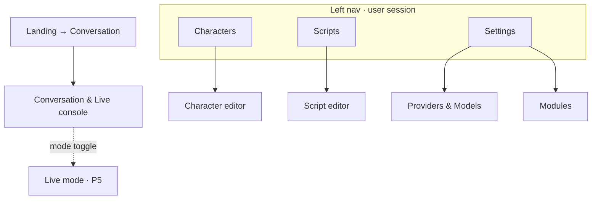

# 13 · UI / UX Design

| | |
|---|---|
| **Document** | UI / UX Design |
| **Doc ID** | NF-13 |
| **Version** | 0.1 (Draft) |
| **Last updated** | 2026-05-31 |
| **Related** | [01 Vision](01-vision-and-scope.md), [02 SRS](02-requirements-specification.md), [03 §3.4 Frontend](03-system-architecture.md), [05 API](05-api-specification.md), [06 §8 UI extensions](06-module-and-extension-system.md), feature docs [07](07-feature-script-management.md)–[12](12-feature-observability.md) |
| **Traces** | NFR-UX-1/2/3, FR-MM-2/11, FR-CM-4, FR-SM-3/5, FR-RT-2/9/10/11, FR-OBS-1/2/3, FR-MOD-4 |

---

## 1. Purpose & scope

This document specifies the **user interface and experience** of the NagiFlow SPA: design principles, information architecture, the global shell, every key screen, cross-cutting interaction patterns, the avatar/live console, the UI-extension surface, accessibility, and i18n. It builds on the **frontend architecture** ([03 §3.4](03-system-architecture.md)) — routing, Pinia stores, API/WS clients, theme, extension host — and turns it into concrete screens and flows. It does **not** redefine the API ([05](05-api-specification.md)) or backend behavior (feature docs).

Audience: frontend engineers, designers, and module authors building `ui` contributions ([06 §8](06-module-and-extension-system.md)).

---

## 2. Design principles

| Principle | Implication for the UI |
|---|---|
| **Local-first, calm** | No account walls, telemetry banners, or cloud upsells. The app feels like a tool the creator owns. |
| **Guest-first onramp** | The default landing state is a working chat with a guest-visible character — zero setup (FR-MM-2). Advanced surfaces are revealed after login, never blocking the first conversation. |
| **Progressive disclosure** | Powerful editors (Big Five, voice fine-tune, director rules) expose simple defaults first; depth lives behind "Advanced" sections so non-developers aren't overwhelmed (NFR-UX-1). |
| **Material / Vuetify consistency** | One Vuetify (MD3) component vocabulary across core and extensions (NFR-UX-2). No bespoke widgets where a standard one fits. |
| **Explainable, not magic** | Personality→behavior directives, sensitive-mode state, capability gating, and token spend are **shown**, not hidden — the user can always see *why* the system behaves as it does. |
| **Capability-aware** | The UI adapts to what the active providers advertise ([06 §5.1](06-module-and-extension-system.md)): unsupported features (voice design, streaming, diarization) are hidden or disabled with a reason, never shown broken. |
| **Status-honest** | Long work shows real progress and is cancellable; errors are actionable; degraded hardware/providers are surfaced, not silent (NFR-UX-2, NFR-REL-1). |
| **Desktop-first, responsive** | Primary target is a creator at a desktop/laptop; layouts reflow gracefully to tablet widths. Mobile is read/chat-capable, not the authoring target. |
| **Accessible & bilingual** | WCAG 2.1 AA; full **zh-Hant / en** parity (NFR-UX-3). |

---

## 3. Personas → UI priorities

(From [01 §5](01-vision-and-scope.md).)

| Persona | What the UI must make effortless |
|---|---|
| **P1 — Indie creator (Mei)** | One-screen character voicing; import a VOD → script; go live with one character. Minimal jargon. |
| **P2 — Small studio (Studio Koi)** | Multi-character management; batch render queue; cost visibility; multi-character live "show". |
| **P3 — Developer (Ren)** | Modules screen, permission consent, config forms from schema, mount points for custom panels/widgets. |
| **P4 — Guest** | Land → pick a public character → chat. A gentle, contextual "log in to do that" when reaching for more. |

---

## 4. Information architecture & navigation



The nav rail is deliberately **four destinations**: **Conversation** (chat, with a live-mode toggle), **Characters**, **Scripts**, **Settings**. Three former destinations were folded in to reduce surface:

- **Live** is not a separate page — it is a **mode toggle inside the Conversation console** (§7.5), since chat and live share one shell.
- **Observability** is not a page — system health/usage live in the always-on **system status bar** (§5).
- **Modules** and **provider/model** configuration live under **Settings** (§7.8); there is no per-character model selection.

- **Guest** sees: the landing conversation + a character picker (guest-visible only) + a persistent **"Register / Log in"** affordance that explains an account unlocks creating characters, voices, and history. Gated nav destinations prompt login on click.
- **User** sees the full left nav. **Module `nav.item` contributions** append destinations dynamically ([06 §8](06-module-and-extension-system.md), [03 §3.4](03-system-architecture.md)).
- Deep links map to the route table in [03 §3.4](03-system-architecture.md); every list→detail uses a master/detail or push-route pattern.

---

## 5. Global shell

```
┌───────────────────────────────────────────────────────────────┐
│ App bar:  ☰  NagiFlow      [global search]   🌐zh/en  ◐theme  ⓘ │
│                                  notifications🔔   user ▾        │
├──────────┬────────────────────────────────────────────────────┤
│ Nav rail │  Page content (router-view)                         │
│  Chat    │                                                     │
│  Chars   │   ┌── breadcrumb / page title / page actions ──┐    │
│  Scripts │   │                                            │    │
│  Settings│   │   content                                  │    │
│          │   └────────────────────────────────────────────┘   │
├──────────┴────────────────────────────────────────────────────┤
│ System bar:  🟢LLM 🟢TTS │ CPU 14% │ RAM 41% │ ⛁ 1.2k tok  ▲   │
└───────────────────────────────────────────────────────────────┘
```

- **App bar** — nav toggle, brand, optional global search, **locale switch** (zh-Hant/en), **theme toggle** (light/dark), info, **notifications**, and the **principal menu** (guest → **"Register / Log in"** with a one-line explainer; user → profile, logout, logout-all).
- **Nav rail** — collapsible Vuetify navigation drawer; icons + labels; active-route highlight; extension destinations grouped below core. Core destinations: **Conversation · Characters · Scripts · Settings**.
- **System status bar** — a slim, always-visible strip at the bottom of every route. It shows compact at-a-glance status: **LLM/TTS health dots** + active provider/model, **CPU/RAM** mini values, and the **token total**. Clicking it **expands a panel upward** with the detail (system resources §[12 §2.1](12-feature-observability.md), service health §2.2, token usage breakdown §3; **logs** and **jobs** panels are added later). Values refresh on a short auto-poll (manual refresh is a later optimization). This replaces the former standalone Observability page and the job tray.
- **Notifications** — transient toasts (success/info) and a small inbox for budget alerts ([12 §3.2](12-feature-observability.md)) and finished jobs.
- **Sensitive-mode indicator** — a global chip shows the effective sensitive-mode state in any conversation/live context ([09 §5](09-feature-multiuser-memory-and-privacy.md)).

---

## 6. Design system & theme

| Token group | Decision |
|---|---|
| **Framework** | Vuetify 3 (Material Design 3); theme defined centrally and consumed by extensions via the `nagiflowUI` theme bridge ([06 §8](06-module-and-extension-system.md)). |
| **Color** | A brand **violet primary** + **teal secondary** + MD3 semantic roles (surface/error/warning/success/info). **Light & dark** themes from one token set. Avatar-stage surfaces use neutral, low-distraction backgrounds. **Concrete hex palette in §6.1.** |
| **Typography** | MD3 type scale; a font stack that renders **Latin + Traditional Chinese** cleanly for zh-Hant parity. **Concrete scale & font stack in §6.1.** |
| **Spacing / density** | 4-px base grid; **comfortable** default, **compact** density option for data-dense editors (script lines, usage tables). **Concrete scale in §6.1.** |
| **Iconography** | One icon set (MDI); consistent metaphors (record ●, render ▶, job ▣, sensitive 🔒). |
| **Motion** | Subtle, purposeful (skeleton→content, drawer, toast). All motion respects `prefers-reduced-motion` (§11). |
| **Components** | Prefer Vuetify primitives: `v-data-table` (lists), `v-form`+rules (validation), `v-slider` (Big Five), `v-stepper` (wizards), `v-snackbar` (toasts), `v-expansion-panels` (progressive disclosure). |

### 6.1 Design tokens

The system is a single token set with **light** and **dark** values. Brand identity: a calm-but-creative **violet** primary (energy/imagination) with a **teal** secondary (clarity/voice) and a **rose** tertiary for highlights — fitting a VTuber authoring tool while staying professional. Values are MD3-style roles; Vuetify maps the core ones directly (see the config at the end).

> The seed colors (`primary #6C4CE0`, `secondary #0E7C86`) are deliberate, swappable starting points — change the two seeds and regenerate the tonal roles to re-skin the app.

#### Color roles

| Role | Light | Dark | Use |
|---|---|---|---|
| **primary** | `#6C4CE0` | `#CFBCFF` | Primary actions, active nav, key accents |
| on-primary | `#FFFFFF` | `#371E73` | Text/icon on `primary` fills |
| primary-container | `#E7DEFF` | `#523FA0` | Tonal buttons, selected chips |
| on-primary-container | `#21005D` | `#E7DEFF` | Text on `primary-container` |
| **secondary** | `#0E7C86` | `#54D6E2` | Voice/secondary accents, links, info-ish |
| on-secondary | `#FFFFFF` | `#00363B` | |
| secondary-container | `#B8ECF1` | `#004F58` | |
| on-secondary-container | `#00363B` | `#B8ECF1` | |
| **tertiary** | `#B0286B` | `#FFB0CE` | Highlights, badges, "new"/emphasis |
| tertiary-container | `#FFD8E6` | `#7A2950` | |
| **background / surface** | `#FCFBFF` | `#131318` | App background & cards |
| on-surface | `#1B1B21` | `#E5E1E9` | Body text/icons (≥ 4.5:1) |
| surface-variant | `#E5E1EC` | `#47464F` | Subtle fills, dividers’ field |
| on-surface-variant | `#47464F` | `#C9C5D4` | Secondary text, captions |
| surface-container-low | `#F6F3FB` | `#1B1B21` | Nav rail / job tray |
| surface-container | `#F0EDF7` | `#1F1F25` | Cards, dialogs |
| surface-container-high | `#EAE7F2` | `#2A2930` | Raised/hover surfaces |
| outline | `#79767F` | `#938F99` | Borders, focus ring base |
| outline-variant | `#C9C5D4` | `#47464F` | Hairline dividers |

#### Semantic (status) roles

| Role | Light fill / on | Dark fill / on | Container (light / dark) |
|---|---|---|---|
| **error** | `#BA1A1A` / `#FFFFFF` | `#FFB4AB` / `#690005` | `#FFDAD6` / `#93000A` |
| **warning** | `#9A6B00` / `#FFFFFF` | `#F4C44C` / `#412D00` | `#FFE08A` / `#6F5100` |
| **success** | `#1E7D43` / `#FFFFFF` | `#8BD6A0` / `#003919` | `#A6F2C0` / `#005227` |
| **info** | `#1763C7` / `#FFFFFF` | `#A9C7FF` / `#002E69` | `#D6E3FF` / `#004494` |

Status is **never color-alone** — always icon + text (§10). Service health maps: `up → success`, `degraded → warning`, `down → error` ([12 §2.2](12-feature-observability.md)); sensitive-mode chip uses `tertiary`/lock icon.

#### Avatar-stage surfaces

Intentionally neutral so the avatar pops and color-grading is honest: stage bg `#F0EDF7` (light) / `#0E0E12` (dark); a **checkerboard** option renders behind transparent PNGTuber sprites for alpha preview (§7.6).

#### Cast palette (multi-character live)

Distinct, accessible hues to tag each cast member in transcript + avatar badge ([§7.6](#76-live-session--vtubing-console-fr-rt-291011)). Use the hue as the chip fill with the listed on-color; in dark theme the renderer lightens the hue ~1 tonal step. Assigned round-robin as characters join.

| # | Hue | Hex | On-color |
|---|---|---|---|
| 1 | Violet (primary) | `#6C4CE0` | `#FFFFFF` |
| 2 | Teal | `#0E8C97` | `#FFFFFF` |
| 3 | Amber | `#C77800` | `#FFFFFF` |
| 4 | Rose | `#D6336C` | `#FFFFFF` |
| 5 | Green | `#2F9E44` | `#FFFFFF` |
| 6 | Blue | `#1C6FD6` | `#FFFFFF` |
| 7 | Purple | `#9C36B5` | `#FFFFFF` |
| 8 | Cyan | `#0CA5C4` | `#08323B` |

#### Typography

Font stacks:
- `--font-sans`: `"Inter", system-ui, "Noto Sans", "Noto Sans TC", "PingFang TC", "Microsoft JhengHei", sans-serif`
- `--font-mono`: `"JetBrains Mono", ui-monospace, SFMono-Regular, Menlo, monospace` (usage figures, token counts, code skills)

| Token | Size / line-height | Weight | Use |
|---|---|---|---|
| display-s | 36 / 44 | 700 | Landing hero, big numbers |
| headline-m | 28 / 36 | 600 | Page titles |
| headline-s | 24 / 32 | 600 | Section headers |
| title-l | 22 / 28 | 500 | Card titles, dialog titles |
| title-m | 16 / 24 | 600 | List headers, tabs |
| title-s | 14 / 20 | 600 | Dense headers |
| body-l | 16 / 24 | 400 | Primary reading text, chat |
| body-m | 14 / 20 | 400 | Default body, forms |
| body-s | 12 / 16 | 400 | Captions, hints |
| label-l | 14 / 20 | 500 | Buttons |
| label-m | 12 / 16 | 500 | Chips, badges |
| label-s | 11 / 16 | 500 | Overlines, tags |
| mono-m | 13 / 20 | 400 | Tokens/cost figures, ids |

CJK renders at the same sizes; line-height already accommodates Traditional Chinese glyph height.

#### Spacing, radius, elevation, density

- **Spacing** (4-px base): `space-0:0 · 1:4 · 2:8 · 3:12 · 4:16 · 5:20 · 6:24 · 8:32 · 10:40 · 12:48 · 16:64`.
- **Radius**: `xs:4 · sm:8 · md:12 (default card/button) · lg:16 · xl:24 · pill:9999`.
- **Elevation** (MD3 0–5 → Vuetify `elevation`): surface `0`, raised card `1`, app bar/nav `2`, menu/dialog `3`, dragging/FAB `6`.
- **Density**: `comfortable` (default, 48-px control/row height) · `compact` (36-px) for `v-data-table` editors (script lines, usage tables).
- **Focus ring**: 2-px `primary` outline at 2-px offset, always visible on keyboard focus (§10).

#### Vuetify theme config (paste-ready)

```js
// vuetify theme — core role mapping (containers/on-* roles added as custom keys)
export default {
  defaultTheme: 'light',
  themes: {
    light: {
      dark: false,
      colors: {
        primary: '#6C4CE0', 'on-primary': '#FFFFFF',
        secondary: '#0E7C86', 'on-secondary': '#FFFFFF',
        tertiary: '#B0286B', 'on-tertiary': '#FFFFFF',
        background: '#FCFBFF', surface: '#FCFBFF', 'on-surface': '#1B1B21',
        'surface-variant': '#E5E1EC', 'on-surface-variant': '#47464F',
        error: '#BA1A1A', warning: '#9A6B00', success: '#1E7D43', info: '#1763C7',
        outline: '#79767F',
      },
    },
    dark: {
      dark: true,
      colors: {
        primary: '#CFBCFF', 'on-primary': '#371E73',
        secondary: '#54D6E2', 'on-secondary': '#00363B',
        tertiary: '#FFB0CE', 'on-tertiary': '#5E1138',
        background: '#131318', surface: '#131318', 'on-surface': '#E5E1E9',
        'surface-variant': '#47464F', 'on-surface-variant': '#C9C5D4',
        error: '#FFB4AB', warning: '#F4C44C', success: '#8BD6A0', info: '#A9C7FF',
        outline: '#938F99',
      },
    },
  },
}
```

The container / `on-container` / `surface-container-*` roles above are exposed as CSS custom properties (e.g. `--nf-primary-container`) and via the `nagiflowUI` theme bridge so **UI extensions consume the same tokens** ([06 §8](06-module-and-extension-system.md), §9). Contrast targets and verification belong to §10 (WCAG AA).

---

## 7. Key screens

Each screen below lists **purpose · layout · key components · states · primary interactions**.

### 7.1 Landing / Guest chat (FR-MM-2)
- **Purpose:** zero-setup conversation; the product's first impression.
- **Layout:** centered character picker (guest-visible characters as cards: portrait, name, short bio) → on select, a chat surface.
- **States:** no-guest-visible-characters (empty state + "**register or log in** to create one"); provider down (chat disabled with reason).
- **Interactions:** send/receive turns (text + audio playback); reaching any advanced action → contextual **login upsell** dialog (§8.2 of [09](09-feature-multiuser-memory-and-privacy.md)).

### 7.2 Authentication
- **Purpose:** create/sign in to a local account; never auto-created (NFR-SEC-3).
- **Layout:** compact login / register tabs; password strength meter (Argon2id server-side — [05 §2](05-api-specification.md)).
- **Interactions:** post-login returns the user to where they were (preserve intent); "logout-all" available in profile menu.

### 7.3 Characters — list & editor (FR-CM-*)
- **List:** card/table grid (portrait, name, status chip draft/active/archived, guest-visible toggle, tags); create / duplicate / archive; search & filter.
- **Editor** — tabbed (`v-tabs`), each tab a contribution-friendly section ([06 §8](06-module-and-extension-system.md) `character.panel`):
  - **Profile** — name/aliases, portrait & **avatar bundle** upload (PNGTuber sprite set by default; Live2D/3D if a renderer module is installed), persona prompt editor with a **live preview chat** pane.
  - **Personality** — **five Big Five sliders (0–100)**; beside them a **read-only "resulting directives" panel** showing the prompt directives + param nudges the current profile produces ([08 §3.2](08-feature-character-management.md)) — the explainability surface for FR-CM-4. A "test in preview" button re-rolls the preview chat.
  - **Voice** — voice-model list (zero-shot / voice-design / fine-tuned), **active** marker, version history with **rollback**; **preview** synth box (text → audio); "Design a voice" (text description) and "Clone" (reference upload) flows gated by provider capability flags; fine-tune launches a **job**.
  - **Memory** — scoped memory inspector: filter by scope/user; view/search/edit/pin/delete; clearly labels `user_scoped` vs `character_general` vs `character_interaction`; honors viewer permission ([08 §5.4](08-feature-character-management.md)).
  - **Export / Import** — `.nagichar` packaging with **privacy-default** memory options ([08 §6.2](08-feature-character-management.md)); the "Include user-scoped memory" option is **guarded** (explicit confirm dialog, §8 destructive pattern).

### 7.4 Scripts — editor (FR-SM-*)
- **Two synchronized views** ([07 §3.1](07-feature-script-management.md)):
  - **List/script view** — vertical line list: speaker selector, text field, expandable **"direction"** area (reference audio, style, speech rate, pause). Drag-reorder. Bulk select → set speaker/style, shift timestamps. Per-line **preview** synth.
  - **Timeline view** — lines on a time axis once timestamps exist; trim/sync.
- **ASR import wizard** (`v-stepper`): upload → (probe) → transcribe progress (**job**) → **review & correct** (edit text, merge/split, **map raw speakers → characters**) → commit ([07 §4](07-feature-script-management.md)). Cancellable; failure retains the source for retry.
- **Validation panel** — issues list with severity (error blocks render/export; warning advisory) ([07 §8](07-feature-script-management.md)).
- **Produce** — render to media (line range or whole), subtitle export, **training-dataset export** ([07 §5/§6](07-feature-script-management.md)). Renders run as jobs in the tray.

### 7.5 Conversation & Live console (FR-RT-1/2/9/10/11)
Chat and live VTubing share **one shell** with a **Live-mode toggle** — chat is the default
(synchronous text+voice); live adds streaming, connectors, and broadcast controls (P5).

```
┌──────────────────────────── Conversation ──────────────────────────────┐
│ ┌── Sidebar ──────────┐ ┌──────────── Character stage ───────────────┐  │
│ │ Nagi   😊 joy 0.4   │ │                                            │  │
│ │ [switch] [🔊 auto]  │ │        PNGTuber / Live2D / 3D              │  │
│ │ [○ Live mode · P5]  │ │        (portrait / audio-only fallback)    │  │
│ │ ─── History ─────── │ │                                            │  │
│ │ ▸ Today · Nagi      │ └────────────────────────────────────────────┘  │
│ │ ▸ Yesterday · …     │ ┌──────────── Message thread ────────────────┐  │
│ │ ▸ …                 │ │ user / character bubbles · audio · caption │  │
│ │                     │ │ [ composer ......................  🎤  ▶ ] │  │
│ └─────────────────────┘ └────────────────────────────────────────────┘  │
└──────────────────────────────────────────────────────────────────────────┘
```

- **Sidebar — top (active conversation):** character identity, **current emotion** chip (label + intensity — [10 §9](10-feature-emotion-and-affect.md)), **switch character**, **autoplay voice** toggle (persisted in the UI store), and the **Live-mode** toggle (shown but disabled with a "P5" hint until live ships).
- **Sidebar — bottom (history):** the user's past conversations, newest first; click to **load** an earlier conversation; rename / delete / search.
- **Stage (right, primary):** the speaking character via the active `AvatarRenderProvider` (**PNGTuber default**; Live2D/3D/external per character — [11 §5](11-feature-realtime-and-media-generation.md)); with no avatar bundle it falls back to **portrait / audio-only**. **P1 ships the portrait fallback**; animated rendering arrives with live (P5).
- **Message thread (right, below stage):** user/character/system/tool messages, **per-message audio playback** ([11 §4.6](11-feature-realtime-and-media-generation.md)) + optional captions, composer; provider error → inline retry ([05 §3](05-api-specification.md)).
- **Chat mode (P1):** synchronous turn — text reply + synthesized audio; the emotion chip updates per reply.
- **Live mode (P5):** streaming text+audio with amplitude/viseme-driven avatar, **cast** + **TurnDirector** controls, **connectors** (YouTube/Twitch/Discord) with **sensitive mode default-ON**, barge-in/interrupt, and **OBS browser-source** output ([11 §4–6](11-feature-realtime-and-media-generation.md)). Director / latency / interrupt controls surface in a collapsible toolbar over the stage; cast members carry a color/badge tagging transcript + avatar.

### 7.6 System status bar (FR-OBS-*)
Health and usage live in the always-on **system bar** (§5), not a page. Clicking it expands a panel ([12 §2–3, §5](12-feature-observability.md)):
- **System** — CPU/RAM/disk values (GPU when detected); short trend later.
- **Services** — provider health (`up`/`degraded`/`down`) + the active provider/model.
- **Usage** — token totals + breakdowns (per character / provider / day); budget status + CSV/JSON export later.
- **Logs / Jobs** — filterable log tail and active/recent jobs (added in a later phase).
- Module `dashboard.widget` contributions append panels.

### 7.7 Settings (general · providers & models · modules)
A single **tabbed** Settings screen. Providers/models are **system-wide — there is no per-character model selection**.
- **General** — locale, theme/density, **sensitive-mode global default** (recommended ON for public/streaming), workspace info, layered **config** view (secrets from env shown as "set/unset", never values — [14 §4](14-runtime-and-deployment.md)).
- **Providers & Models** — per-capability (`llm`/`tts`/`asr`/`embedding`/`vector`/`storage`/`avatar`) **active provider + model** with a **test/health** button and capability-flag display. **P1: read-only display** of the config/env-selected provider/model; runtime switching + default/fallback ordering arrive with provider configs (P4, [05 §4.5](05-api-specification.md)).
- **Modules** — installed modules with **official vs third-party trust badge**, version, enabled toggle, `app_compat`; install from folder/archive with a **permission consent screen** (manifest `network`/`filesystem`/`subprocess`/`secrets`); auto-generated **config form** from `config_schema` (secrets write-only/masked); quarantined-on-error state ([06](06-module-and-extension-system.md)).

---

## 8. Cross-cutting interaction patterns

| Pattern | Spec |
|---|---|
| **Long jobs** | Anything that returns `202 + job` ([05 §1](05-api-specification.md)) appears in the **job tray** with live progress (poll or SSE — [05 §4.6](05-api-specification.md)) and **cancel**; completion raises a notification. Never a blocking spinner for long work (NFR-PERF-4). |
| **Streaming turns** | Render captions from `text.delta` immediately; play binary audio as it arrives; show `skill.call`/`skill.result` chips; honor `turn.assigned`/`character_id` for multi-character ([05 §5](05-api-specification.md)). |
| **Errors** | Map the **error envelope** `code`/`message`/`correlation_id` ([05 §3](05-api-specification.md)) to: inline field errors (validation `400/422`), capability/permission dialogs (`403 guest.upgrade_required` → login upsell), and toasts (`5xx`/`provider.*`) with a "copy correlation id" affordance. |
| **Permission gating** | Guest-forbidden actions are visible-but-gated; activating one opens a **"Log in to continue"** dialog rather than hiding the feature (discoverability + FR-MM-2/11). |
| **Capability-aware controls** | Hide/disable controls for features a provider doesn't advertise (e.g. no "voice design" when unsupported), with a tooltip explaining why ([06 §5.1](06-module-and-extension-system.md)). |
| **Destructive / privacy confirms** | Two-step confirm with explicit wording for: delete user data, delete character/memory, **include user-scoped memory in export**, switch embedding model (triggers re-embed). State exactly what will be lost/changed ([08 §6.2](08-feature-character-management.md), [09 §6](09-feature-multiuser-memory-and-privacy.md)). |
| **Empty / loading / offline** | Every list/editor defines an **empty state** (with the next action), **skeleton loaders**, and a **provider-unavailable** state with remediation. |
| **Autosave** | Script/character edits autosave with an `updated_at` last-write-wins guard ([07 §3.2](07-feature-script-management.md)); a subtle "saved" indicator, undo where feasible. |

---

## 9. UI extension surface

Mirrors [06 §8](06-module-and-extension-system.md). Extensions mount ES-module components into declared **contribution points**; they receive the constrained `nagiflowUI` bridge (current character/user, scoped API client, theme tokens) — never raw host internals.

| Contribution point | Host location |
|---|---|
| `nav.item` | A left-nav destination + route |
| `dashboard.widget` | A card on the observability dashboard (§7.7) |
| `character.panel` | A tab in the character editor (§7.3) |
| `script.tool` | A tool button in the script editor (§7.4) |
| `settings.section` | A panel under Settings (§7.9) |

**Rules:** extensions render within host component boundaries, call only the authenticated API (no privilege escalation), and consume host theme tokens for visual consistency. A failed/incompatible extension degrades to a placeholder, not a crash.

---

## 10. Accessibility (WCAG 2.1 AA)

- **Keyboard** — every interactive element reachable and operable; logical focus order; visible focus ring; Esc closes dialogs; the live console is keyboard-drivable (interrupt, send).
- **Contrast** — AA contrast in both themes; status never conveyed by color alone (icon + text on health/sensitive chips). The §6.1 palette was contrast-checked against WCAG 2.1; key pairs:

  | Pair | Ratio | AA (4.5 text / 3 UI) |
  |---|---|---|
  | on-surface `#1B1B21` on surface `#FCFBFF` (light body) | 16.6 | ✅ |
  | on-surface-variant `#47464F` on surface (light, secondary text) | 9.0 | ✅ |
  | white on primary `#6C4CE0` | 5.6 | ✅ |
  | white on secondary `#0E7C86` | 4.96 | ✅ (borderline) |
  | white on error `#BA1A1A` | 6.2 | ✅ |
  | white on warning `#9A6B00` | 4.6 | ✅ (borderline) |
  | white on success `#1E7D43` | 5.2 | ✅ |
  | white on info `#1763C7` | 5.8 | ✅ |
  | on-surface `#E5E1E9` on surface `#131318` (dark body) | 14.4 | ✅ |
  | primary `#CFBCFF` on surface `#131318` (dark accent) | 10.9 | ✅ |
  | on-primary `#371E73` on primary `#CFBCFF` (dark button) | 7.7 | ✅ |

  All key pairs clear **AA**. The two **borderline** fills (`secondary`, `warning`, ~4.5–5.0) are fine for button/label text and the specified on-colors; avoid them for small (<14 px) low-weight body text — use the `*-container` + `on-*-container` roles there. Re-run this check if the seed colors change.
- **Screen readers** — semantic roles/ARIA; streaming captions are an accessible live region; job progress announced politely.
- **Media** — synthesized speech always has the **text transcript** visible (captions); audio is never the only channel.
- **Motion** — honor `prefers-reduced-motion`; avatar idle motion can be reduced/disabled.

---

## 11. Internationalization

- **Languages:** Traditional Chinese (**zh-Hant**) and English (**en**) at parity (NFR-UX-3); switchable at runtime from the app bar.
- **Mechanism:** `vue-i18n` message catalogs; the **backend returns stable codes/keys**, the frontend renders the localized string ([03 §3.4/§5](03-system-architecture.md)) — no localized text hard-coded server-side.
- **Key convention:** dot-namespaced `area.screen.element`, lower-kebab segments — e.g. `characters.editor.personality.title`, `live.console.interrupt`, `common.action.save`, `common.unit.tokens`. Reserved namespaces: `error.<code>` mirrors API error codes one-to-one ([05 §3](05-api-specification.md)) so a backend `code` maps straight to a localized message; `enum.<entity>.<value>` localizes status/enum labels (e.g. `enum.job.status.running`). Keys are **stable identifiers** (never the English text); renaming a key is a breaking change.
- **Catalogs:** one file per locale (`locales/en.json`, `locales/zh-Hant.json`) with identical key sets (a CI check flags missing/extra keys). **ICU MessageFormat** for interpolation/plurals/select; never string-concatenate localized fragments.
- **Formatting:** locale-aware numbers/dates/relative-times (usage charts, job timestamps).
- **Content vs chrome:** UI chrome is localized; user-authored content (persona, scripts) and character speech are **not** translated — only the surrounding interface.
- **Typography:** font stack renders CJK + Latin without fallback boxes; no layout breakage on longer German/English vs compact CJK strings (flexible, not fixed-width labels).

---

## 12. Responsive & platform

| Breakpoint | Behavior |
|---|---|
| **Desktop (primary)** | Full nav rail + master/detail editors; multi-pane live console. |
| **Tablet** | Nav collapses to icons/drawer; editors stack panes; timeline view scrolls. |
| **Mobile (secondary)** | Chat and viewing are usable; heavy authoring (script timeline, fine-tune, live console) is intentionally degraded with a "best on desktop" notice. |

NagiFlow is a creator workstation tool; the design optimizes the desktop authoring path and keeps chat/observe usable on smaller screens.

---

## 13. State & data flow (summary)

The UI's state/clients are defined in [03 §3.4](03-system-architecture.md): per-domain **Pinia stores** (`auth`, `characters`, `scripts`, `conversations`, `modules`, `observability`), a typed REST client generated from OpenAPI, and a thin WebSocket client wrapping the live-turn protocol. Screens in §7 bind to these stores; streaming screens (§7.5/§7.6) keep transient turn state in a session-scoped store and reconcile to the persisted conversation on `turn.end`.

---

## 14. Requirements coverage

| Requirement | Where addressed |
|---|---|
| NFR-UX-1 (non-dev reaches first chat) | §2, §7.1 |
| NFR-UX-2 (Vuetify/MD3 consistency; progress; actionable errors) | §6, §8 |
| NFR-UX-3 (zh-Hant / en i18n) | §11 |
| FR-MM-2/11 (guest onramp; gated advanced ops) | §7.1, §7.2, §8 |
| FR-CM-4 (Big Five → behavior, explainable) | §7.3 (Personality) |
| FR-CM-6/9/10/11 (voice versions; memory inspect; export privacy) | §7.3 |
| FR-SM-3/5/8 (line direction; ASR import; render) | §7.4 |
| FR-RT-2/8/9 (streaming; barge-in; avatar) | §7.5, §7.6 |
| FR-RT-10/11 (multi-character cast; director) | §7.6 |
| FR-OBS-1/2/3/4 (system/health/usage/logs) | §7.7 |
| FR-MOD-4 (UI extensions) | §7.8, §9 |
| Provider capability-aware UI ([06 §5.1]) | §2, §8 |
| Error envelope mapping ([05 §3]) | §8 |
| Accessibility / motion | §10 |
