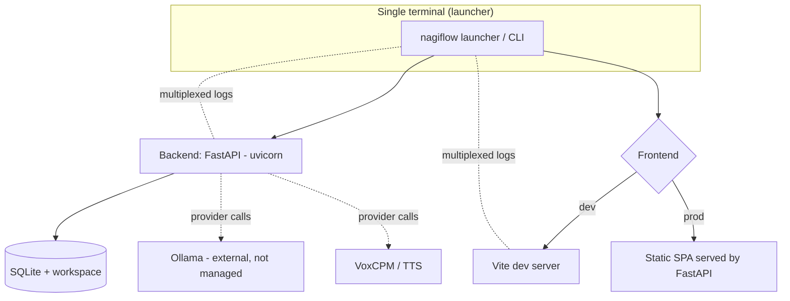
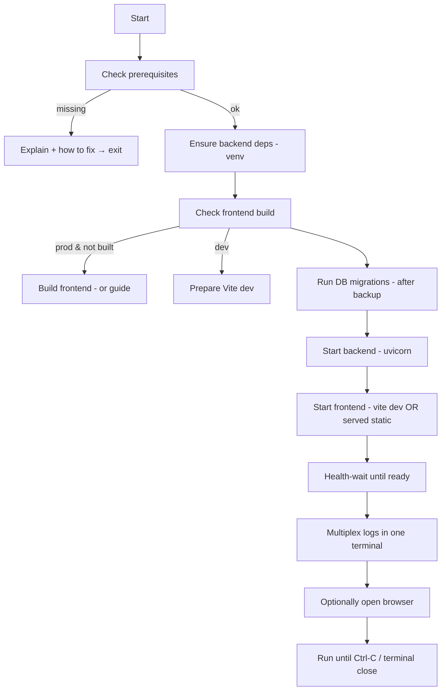
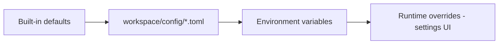

# 14 · Runtime & Deployment

| | |
|---|---|
| **Document** | Runtime & Deployment |
| **Doc ID** | NF-14 |
| **Version** | 0.1 (Draft) |
| **Last updated** | 2026-05-30 |
| **Related** | [03 Architecture](03-system-architecture.md), [04 Data](04-data-model-and-storage.md), [06 Modules](06-module-and-extension-system.md), [12 Observability](12-feature-observability.md) |
| **Traces** | FR-SYS-1 … FR-SYS-11, NFR-PORT-1/2/3, NFR-REL-1/3, NFR-UX-1 |

---

## 1. Overview

NagiFlow is **local-first** and must be trivial to start. The centerpiece is a **one-click local launcher** that checks prerequisites, builds the frontend if needed, runs backend + frontend, **shows both logs in a single terminal**, and on exit **shuts down NagiFlow's own processes but leaves external services (e.g. Ollama) running** (FR-SYS-1…5). This document specifies the launcher, runtime modes, configuration, migrations, and packaging.

---

## 2. Runtime topology

- **Dev mode** — Vite dev server (HMR) proxies API calls to the backend; two processes for a fast feedback loop.
- **Prod/local-run mode** — FastAPI serves the **built** SPA as static files on a single port; effectively one process to run (ADR-006, [03 §10](03-system-architecture.md)). Simplest for end users.

---

## 3. The one-click launcher (FR-SYS-1…5)

### 3.1 Form factor & decision

A **cross-platform launcher implemented in Python**, exposed as a `nagiflow` CLI (e.g. `nagiflow up`), with thin OS wrappers (a `.sh` and a `.bat`/`.ps1`, or a double-click shim) so non-technical users get true "one click." Python is chosen because it is already a hard dependency (the backend), giving uniform behavior across Windows/macOS/Linux without a second toolchain (NFR-PORT-1).

### 3.2 Startup sequence

1. **Check prerequisites (FR-SYS-2).** Verify required tools and versions: **Python**, **Node.js** (for building/serving the frontend), **ffmpeg** (media/ASR), and **optional** Ollama / GPU drivers. Each check reports OK/missing with a concrete remediation hint. Optional dependencies (Ollama, GPU) are reported as informational, not fatal.
2. **Ensure backend dependencies.** Create/activate a project virtual environment and verify Python packages are installed (install if managed by the launcher).
3. **Check/build frontend (FR-SYS-3).** In prod mode, detect whether the SPA is built; if not, build it (or, if Node is missing, clearly explain). In dev mode, prepare the Vite dev server.
4. **Migrate (FR-SYS-10).** Back up the SQLite DB to `backups/`, then run Alembic migrations to current head ([04 §4](04-data-model-and-storage.md)).
5. **Start processes.** Launch the backend (uvicorn) and the frontend (vite dev, or rely on FastAPI's static serving in prod), as **child processes in a managed process group**.
6. **Health-wait.** Poll backend health until ready before declaring "up" (and before opening the browser).
7. **Single-terminal logs (FR-SYS-4).** Capture child stdout/stderr and **interleave** them into the one terminal with clear, colored prefixes (`[backend]`, `[frontend]`), so the operator watches everything in one place ([12 §4](12-feature-observability.md)).
8. **Open browser (optional, NFR-UX-1).** Offer to open the app URL.

### 3.3 Shutdown semantics (FR-SYS-5 — the subtle part)

On **Ctrl-C** or **terminal close**, the launcher performs a **graceful shutdown of NagiFlow's own children only**:

- Send `SIGINT`/`SIGTERM` to the **backend and frontend** process group; wait; escalate to `SIGKILL` if a child ignores the deadline.
- **Do not** stop **external services** such as **Ollama** — NagiFlow did not start them and other apps may depend on them. Only processes NagiFlow spawned are torn down.
- Cross-platform note: POSIX uses process groups + signals; **Windows** lacks POSIX signals, so the launcher uses Windows-appropriate mechanisms (e.g. `CTRL_BREAK_EVENT` to a new process group / `taskkill` on the child tree). Terminal-close is handled via the OS's child-process semantics plus an exit hook (NFR-PORT-1).

This precisely satisfies "on terminal exit, automatically shut down frontend+backend but not external services like Ollama."

### 3.4 Failure handling (NFR-REL-1)

- Missing **required** prerequisite → stop with a clear message and remediation; never start a half-broken stack.
- A child that exits unexpectedly is reported in the terminal; the launcher can optionally restart it (configurable) or shut the rest down cleanly.
- Port conflicts are detected and reported with guidance.

---

## 4. Configuration management (FR-SYS-6/7/8/9/11)

Layered configuration, highest precedence last:

| Layer | Holds |
|---|---|
| **Defaults** | Local-first defaults (SQLite, Ollama, VoxCPM, ports). |
| **Workspace config** | `config/app.toml`, `config/providers.toml` — committed to the workspace, human-editable ([04 §2](04-data-model-and-storage.md)). |
| **Environment** | Deployment-specific values and **secrets** (provider/connector credentials). |
| **Runtime** | Admin changes via the settings UI, persisted back to workspace config where appropriate. |

- **Secrets are never committed.** Credentials come from env (or an OS secret store) and are redacted in logs ([12 §4](12-feature-observability.md)). NagiFlow never writes secrets into the repo or the shareable workspace config (NFR-SEC-2).
- **Provider/connector selection** is config-driven so swapping Ollama→another LLM, or VoxCPM→another TTS, is configuration, not code ([06](06-module-and-extension-system.md), FR-SYS-8/9).

---

## 5. Dev vs. prod modes

| Aspect | Dev | Prod / local-run |
|---|---|---|
| Frontend | Vite dev server + HMR | Built static SPA served by FastAPI |
| Processes | Backend + Vite (2) | Single FastAPI process |
| API access | Vite proxy → backend | Same origin |
| Reload | Hot reload both | Restart to update |
| Use | Development | End-user "just run it" |

ADR-006 ([03 §10](03-system-architecture.md)) records the choice to have FastAPI serve the built SPA in prod for one-process simplicity.

---

## 6. Migrations & data safety (FR-SYS-10, NFR-REL-3)

- **Migrate on startup** to the current schema head, **after** a timestamped DB backup to `backups/` ([04 §4](04-data-model-and-storage.md)).
- SQLite runs in **WAL** mode for resilience; backups capture a consistent snapshot.
- Migrations are forward-only with tested upgrade paths; a failed migration aborts startup with the backup intact (no partial-state launch).

---

## 7. Packaging & distribution (NFR-PORT-2)

| Channel | Status | Notes |
|---|---|---|
| **Source + launcher** | Primary (now) | Clone, run `nagiflow up`; launcher handles the rest. |
| **pip/pipx app** | Planned | `pipx install nagiflow` for the CLI/launcher. |
| **Docker / Compose** | Planned/optional | Containerize backend (+ built frontend); Ollama/TTS as separate, user-managed services to preserve the "don't manage external services" principle. |
| **Desktop shim** | Possible later | Double-click wrapper around the launcher for non-technical users. |

Distribution keeps the **local-first** stance: external heavyweight services (Ollama, GPU TTS) remain the user's to run; NagiFlow orchestrates against them but never assumes ownership (FR-SYS-5).

---

## 8. Cross-platform support (NFR-PORT-1/2/3)

- **OS** — Windows, macOS, Linux. Platform differences are isolated in the launcher (signals/process trees) and in optional GPU probing ([12 §2.1](12-feature-observability.md)).
- **Hardware tiers** — runs CPU-only (lighter models, possibly non-streaming TTS) or with a GPU (faster, streaming, fine-tune training). Capabilities are detected and the UI adapts ([11 §7](11-feature-realtime-and-media-generation.md)). A **CUDA-enabled NVIDIA GPU is optional but recommended**: the in-process VoxCPM TTS is impractically slow on CPU (minutes per reply), so voicing needs GPU-enabled torch — otherwise disable reply synthesis and run text-only ([08 §4.2](08-feature-character-management.md)).
- **Paths/encoding** — workspace paths are handled portably; the DB stores **storage keys**, not absolute paths, so a workspace can move between machines ([04 §2](04-data-model-and-storage.md)).

---

## 9. Requirements coverage

| Requirement | Where addressed |
|---|---|
| FR-SYS-1 (one-click launcher) | §3 |
| FR-SYS-2 (prereq/tool/package checks) | §3.2 |
| FR-SYS-3 (frontend build check) | §3.2 |
| FR-SYS-4 (single-terminal logs) | §3.2, [12 §4] |
| FR-SYS-5 (shutdown app, not external svcs) | §3.3, §7 |
| FR-SYS-6 (workspace + SQLite default) | §4, [04] |
| FR-SYS-7 (storage/DB abstracted, pluggable) | §4, §7 |
| FR-SYS-8 (LLM default Ollama + seams) | §4 |
| FR-SYS-9 (TTS default VoxCPM + seams) | §4 |
| FR-SYS-10 (migrations on start + backup) | §6 |
| FR-SYS-11 (layered config + secrets) | §4 |
| Dev/prod modes; packaging (supporting detail) | §5, §7 |
| NFR-PORT-1/2/3 | §3.3, §8 |
| NFR-REL-1/3 | §3.4, §6 |
| NFR-UX-1 | §3.2 |
