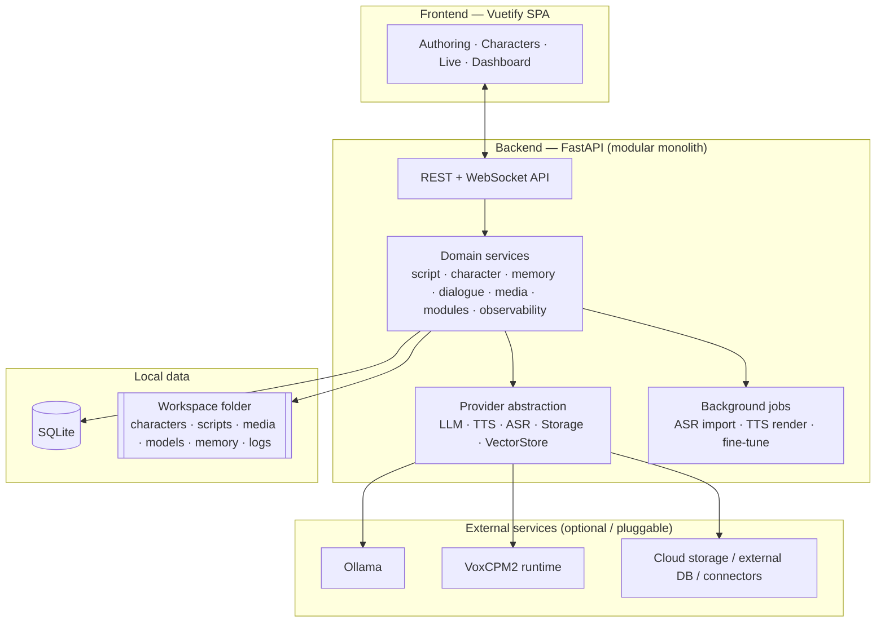

# NagiFlow

**A local-first, modular platform for building, voicing, and live-streaming AI VTubers.**

| | |
|---|---|
| **Project** | NagiFlow |
| **Document set version** | 0.1 (Draft) |
| **Last updated** | 2026-05-30 |
| **Status** | Design / pre-implementation |

---

## 1. What NagiFlow is

NagiFlow is a tool for creators of **AI VTubers**. It unifies the full content lifecycle of a virtual character into a single, locally-runnable application:

1. **Authoring** — write and manage scripts (dialogue, characters, timing, voice direction), or import existing audio/video and turn it into a script via speech recognition.
2. **Embodiment** — create and manage characters: identity, personality (Big Five), a fine-tunable voice, and a personal memory bank.
3. **Production** — generate multimedia content (voice and video) from scripts; video is rendered by a built-in **Live2D** avatar renderer (pluggable to 3D/external engines).
4. **Interaction** — run live, streaming conversations between characters and users for VTubing and real-time engagement.

NagiFlow is built to run on a creator's own machine by default, with everything extensible through modules so it can grow into cloud and third-party services without changing its core.

## 2. Core capabilities

| # | Capability | Summary |
|---|---|---|
| 1 | **Script management** | Author scripts (lines, character, timestamp, reference audio, style guidance, speech rate). Import audio/video → script via ASR. Use scripts to render media or as training data. |
| 2 | **Character management** | One place to define a character: profile, Big Five personality, fine-tunable voice model, and a memory bank. Export/import characters as portable packages. |
| 3 | **Modularity** | Developers extend NagiFlow through modules: Agent Skills, Connectors, framework hooks, and UI extensions. The default LLM and TTS integrations ship as official example modules. |
| 4 | **Multi-user / multi-character** | Many characters and many users. A character keeps memories scoped to each user (and memories from interacting with other characters). A *sensitive mode* prevents a character from revealing other users' information. Guests can use basic features without logging in. |
| 5 | **Observability** | Inspect local system resources, external service health, and total token spend. |

## 3. Design principles

NagiFlow defaults to **local, lightweight services**, while leaving clean seams for connecting to external services through self-developed modules.

| Area | Default | Pluggable toward |
|---|---|---|
| Backend | **FastAPI** | — (core) |
| Frontend | **Vuetify** (Vue 3 SPA) | — (core) |
| Startup | **One-click local launcher** (env checks, build check, unified logs, graceful shutdown) | — (core) |
| Data | Local **workspace folder** + **SQLite** | Cloud storage, external databases |
| LLM | Local **Ollama** | Other LLM providers/APIs |
| TTS | **OpenBMB / VoxCPM2** | Other speech engines/services |
| ASR (for script import) | Local model (e.g. SenseVoice) | Other ASR providers |

## 4. Technology stack at a glance

- **Backend:** Python, FastAPI (ASGI / async), SQLAlchemy + SQLite (WAL), Alembic migrations, WebSocket/SSE streaming, background job runner.
- **Frontend:** Vue 3 + Vuetify (Material Design 3), Pinia state, Vite build.
- **AI defaults:** Ollama (LLM), VoxCPM2 (TTS, 48 kHz, voice design + controllable cloning), SenseVoice-class ASR.
- **Extensibility:** Provider/adapter pattern + module system (Python backend contributions + optional frontend bundles).
- **Media tooling:** ffmpeg for audio extraction/assembly.

> NagiFlow integrates third-party open-source components (e.g. VoxCPM2 under Apache-2.0). The NagiFlow project license is to be finalized; see [docs/13](docs/13-roadmap-and-milestones.md).

## 5. High-level architecture

See **[docs/03 — System Architecture](docs/03-system-architecture.md)** for the full picture.

## 6. Documentation index

Read in order for a full understanding, or jump to the area you need. These documents follow a standard product → requirements → design → delivery flow.

| Doc | Title | What it covers |
|---|---|---|
| [01](docs/01-vision-and-scope.md) | **Vision & Scope** | Problem, vision, goals, personas, value, success metrics, scope boundaries. |
| [02](docs/02-requirements-specification.md) | **Requirements Specification (SRS)** | Functional & non-functional requirements, user stories, key use cases, external interfaces. |
| [03](docs/03-system-architecture.md) | **System Architecture** | Architecture style, container/component views, orchestration pipeline, key flows, ADRs. |
| [04](docs/04-data-model-and-storage.md) | **Data Model & Storage** | Workspace layout, SQLite schema, ER model, vector/memory storage, packaging/backup. |
| [05](docs/05-api-specification.md) | **API Specification** | REST conventions, auth model, endpoint catalog, WebSocket protocol, errors. |
| [06](docs/06-module-and-extension-system.md) | **Module & Extension System** | Module types, manifest, lifecycle, SDK, Agent Skills, Connectors, UI extensions, security. |
| [07](docs/07-feature-script-management.md) | **Feature: Script Management** | Authoring, ASR import pipeline, media generation, training-data export. |
| [08](docs/08-feature-character-management.md) | **Feature: Character Management** | Profile, Big Five mapping, voice models & fine-tune, memory bank, export/import. |
| [09](docs/09-feature-multiuser-memory-and-privacy.md) | **Feature: Multi-user, Memory & Privacy** | User classes, permission matrix, memory scoping, sensitive mode, guest mode. |
| [10](docs/10-feature-realtime-and-media-generation.md) | **Feature: Realtime & Media Generation** | Batch media pipeline, streaming interaction, live-chat connectors, avatar/viseme output. |
| [11](docs/11-feature-observability.md) | **Feature: Observability** | System resources, service health, token/cost accounting, logging. |
| [12](docs/12-runtime-and-deployment.md) | **Runtime & Deployment** | One-click launcher design, configuration, dev vs prod, packaging. |
| [13](docs/13-roadmap-and-milestones.md) | **Roadmap & Milestones** | Phased plan, MVP, risks, testing strategy, release strategy. |
| [14](docs/14-glossary.md) | **Glossary** | Terms, acronyms, references. |

## 7. Intended audience

- **Product / project owner** — docs 01, 02, 13.
- **Backend engineers** — docs 03, 04, 05, 06, 07–12.
- **Frontend engineers** — docs 03 (§frontend), 05, 06 (§UI extensions), and the UX notes within feature docs.
- **Module developers** — docs 06, 05, 14.

## 8. Document conventions

- Requirements are identified as `FR-<area>-<n>` (functional) and `NFR-<area>-<n>` (non-functional); feature docs trace back to these IDs.
- Priorities use **MoSCoW** (Must / Should / Could / Won't-for-now).
- Diagrams use Mermaid; schemas use illustrative Python/SQL/JSON.
- "Provider" and "adapter" are used interchangeably for pluggable external-service integrations.
